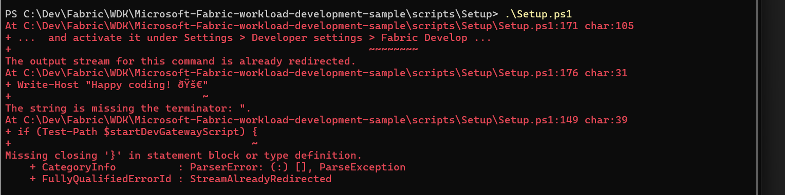

# Detailed Setup Guide

Once you have access to the code (either in Codespaces or locally) by following the [Getting Started guide](get-started.md), follow these steps:

> [!TIP]
> If you don't want to follow the steps manually, ask GitHub Copilot to help you do the work. The Starter-Kit repository is AI-enabled and Copilot can guide you through the setup process interactively. Try this prompt: **"Help me get started with this repository and run the HelloWorld sample."**

## Step 1: Run the setup script

The setup script automates most configuration (app registration, defaults, etc.).

```pwsh
# From the repo root
pwsh ./scripts/Setup/Setup.ps1 -WorkloadName "Org.MyWorkload"
```

**Setup script notes:**
- WorkloadName must follow the pattern Organization.WorkloadName. For development, use `Org.[YourWorkloadName]`.
- If reusing an existing Microsoft Entra app, ensure SPA redirect URIs are configured as described in the repositories manual setup guide.
- On macOS/Linux, use `pwsh` to run scripts.
- Make sure that the PowerShell execution policy is set to Unrestricted and the files are unblocked if you're getting asked if the PowerShell files should be started.
- Follow the guidance the Script provides to get everything setup

The Setup script can be run several times. If values are already present, you're asked if they should be overwritten. If you want to overwrite everything, use the Force parameter.

> [!NOTE]
> If you encounter setup errors, see the [PowerShell setup error](#powershell-setup-error) in the troubleshooting section below.

> [!TIP]
> If you have issues with the automated setup script, you can follow the [Manual Setup Guide](./setup-manual.md) for step-by-step manual configuration.

## Step 2: Start the development environment

Run the dev server (front end + APIs) and register your local instance with Fabric via DevGateway.

```pwsh
# Terminal 1: start local dev server
pwsh ./scripts/Run/StartDevServer.ps1

# Terminal 2: start DevGateway to register your local instance with Fabric
pwsh ./scripts/Run/StartDevGateway.ps1
```

## Step 3: Enable developer features in Fabric

Navigate to the Fabric portal and configure the required settings:

**3.1 Configure tenant settings in Admin Portal:**

Head to the Admin Portal settings and enable the following tenant settings:
- Capacity admins and contributors can add and remove additional workloads
- Workspace admins can develop partner workloads
- Users can see and work with additional workloads not validated by Microsoft
  
 :::image type="content" source="./media/setup-guide/setup-1.png" alt-text="Screenshot of tenant settings." lightbox="./media/setup-guide/setup-1.png":::

**3.2 Turn on Fabric Developer Mode:**

Navigate to the Fabric Developer Settings and enable the Fabric Developer Mode:

:::image type="content" source="./media/setup-guide/setup-2.png" alt-text="Screenshot of Fabric developer mode." lightbox="./media/setup-guide/setup-2.png":::

You're now ready to create your first Hello World Item in Fabric.

## Step 4: Test the HelloWorld item

You can access the workload from the Workload Hub (look for your workload name) or navigate directly. Then create a Hello World item.

**Steps:**

1. **Open Fabric Workload Hub**: Locate your workload (for example, `Org.MyWorkload`).
   - **Direct navigation**: `https://app.fabric.microsoft.com/workloadhub/detail/<WORKLOAD_NAME>?experience=fabric-developer`
   - Replace `<WORKLOAD_NAME>` with your actual workload name (e.g., `Org.MyWorkload`)

2. **Create a new item**: Select the Hello World item type and choose your development workspace.

3. **Verify functionality**: The editor opens; confirm the item works as expected and appears like a native artifact in the workspace.

Congratulations! You created your first item from your development environment.

## Step 5: Start coding

Now that you're all set up, you can start creating your own custom items. Follow our comprehensive guide to learn how to create custom Fabric items:

📖 **[Creating Custom Fabric Items Guide](./tutorial-create-new-fabric-item.md)** - This guide provides two approaches for creating items:

- **AI-Assisted Approach**: Use GitHub Copilot for interactive guidance (recommended for new developers)
- **Manual Scripted Approach**: Use automated PowerShell scripts for quick setup (recommended for experienced developers)

**Quick start options:**
- Update the existing HelloWorld editor: `Workload/app/items/HelloWorldItem/HelloWorldItemEditor.tsx`
- Or scaffold a new item with the script: `./scripts/Setup/CreateNewItem.ps1`

Happy coding! 🚀

## Best practices

- **Fork the repository**: Fork the [Starter-Kit](https://aka.ms/fabric-extensibility-starter-kit) repository and use your fork as the base of your project.
- **Keep in sync**: Keep your fork in sync with upstream to pick up improvements.
- **Maintain project structure consistency**: Preserve the Starter-Kit's project structure and organization patterns to ensure compatibility with future updates and maintain code clarity.
- **Regular Starter-Kit integration**: Regularly integrate code changes from the Starter-Kit into your project to benefit from bug fixes, new features, and security updates. Set up a process to review and merge upstream changes on a regular basis (monthly or quarterly).
- **Validate manifests early**: Validate your workload manifest early and follow least-privilege permissions.
- **Use dev containers**: Use a dev container or Codespaces for a consistent, disposable environment.
- **Use provided scripts**: Use the provided scripts (Setup, StartDevServer, StartDevGateway) to automate setup and daily workflow.

## Troubleshooting common issues

### PowerShell setup error

If you encounter an error during setup script execution, ensure you have the latest PowerShell installed and configured in the environment you run the script.



### Script execution policy error

If you encounter: `cannot be loaded because the execution policy is unrestricted`:

```pwsh
Set-ExecutionPolicy -ExecutionPolicy RemoteSigned -Scope CurrentUser
```

### Port 5173 is in use

If the DevServer can't start on port 5173, find and terminate the process:

```pwsh
# Find process using port
Get-Process -Id (Get-NetTCPConnection -LocalPort 5173).OwningProcess

# Terminate process
Stop-Process -Id <ProcessId> -Force
```

### Dependencies errors

If you encounter errors about missing dependencies:

```pwsh
# From Workload folder
cd Workload
npm install
```

### DevGateway authentication issues

If authentication fails when starting DevGateway:

1. Verify the app registration redirect URIs in Microsoft Entra
2. Check that tenant settings allow the required developer features
3. Ensure you're signed in to the correct tenant in DevGateway

For comprehensive troubleshooting information, refer to the [Starter-Kit Repository README](https://aka.ms/fabric-extensibility-starter-kit).

## Important Notes

### New Chrome Local Network Access Restrictions

Google has introduced new Local Network Access (LNA) restrictions in Chrome that **will break local development** with the [DevServer](./tools-register-local-web-server.md). These restrictions prevent websites from accessing local network resources without explicit user permission.

**Action Required for Local Development**: You must change your Chrome configuration to continue developing workloads locally:

1. Navigate to `chrome://flags/#local-network-access-check` in Chrome
2. Set the flag to "Disabled"
3. Restart Chrome

**Why this is needed**: The new restrictions block communication between your workload running in Fabric and the local DevGateway server, which is essential for the development workflow.

**Additional Resources**:

- [Local Network Access - Chrome Developers](https://developer.chrome.com/blog/local-network-access) - Official Chrome documentation on Local Network Access changes

> [!IMPORTANT]
> Without disabling this flag, local development with the DevGateway will not work in Chrome. This configuration change is only needed for development environments.

## Next steps

- Learn the [architecture](architecture.md) and how the host, your app, and Fabric services interact
- Read the [Manifest Overview](manifest-overview.md) for schema and best practices
- Understand the [Workload manifest](manifest-workload.md) structure and configuration
- Develop with the [DevGateway](tools-register-local-workload.md) for local testing
- [Publish your workload](publishing-overview.md) when you're ready to share it broadly
