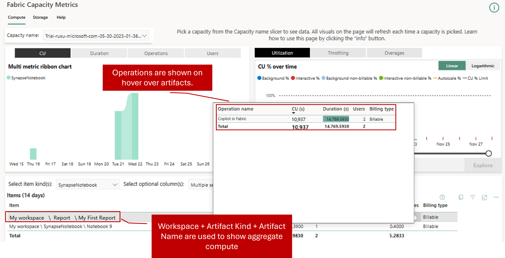

# Copilot in Fabric (preview) consumption

This page contains information on how the Fabric Copilot usage is billed and reported. Copilot usage is measured by the number of tokens processed. Tokens can be thought of as pieces of words. Approximately 1,000 tokens are about 750 words. Prices are calculated per 1,000 tokens, and input and output tokens are consumed at different rates.

> [!NOTE]
> The Copilot for Fabric billing will become effective on March 1st, 2024, as part of your existing Power BI Premium or Fabric Capacity.

## Consumption rate
Requests to Copilot consume Fabric Capacity Units. This table defines how many capacity units (CU) are consumed when Copilot is used. For example, when user using [Copilot for Power BI](/power-bi/create-reports/copilot-introduction), [Copilot for Data Factory](./copilot-fabric-data-factory.md), or [Copilot for Data Science and Data Engineering](./copilot-notebooks-overview.md).

| **Operation in Metrics App** | **Description** | **Operation Unit of Measure** | **Consumption rate** |
|---|---|---|---|
|Copilot in Fabric |The input prompt |Per 1,000 Tokens |400 CU seconds|
|Copilot in Fabric |The output completion |Per 1,000 Tokens|1,200 CU seconds|

## Monitor the usage  
The [Fabric Capacity Metrics app](../enterprise/metrics-app-compute-page.md) displays the total capacity usage for Copilot operations under the name "Copilot in Fabric." Additionally, Copilot users are able to view a summary of their billing charges for Copilot usage under the invoicing item "Copilot in Fabric."

## Capacity utilization type 

Fabric Copilots are classified as "background job" as the capacity utilization type to handle a higher volume of Copilot requests during peak hours.  

Fabric is designed to provide lightning-fast performance by allowing operations to access more CU (Capacity Units) resources than are allocated to capacity. Fabric smooths or averages the CU usage of an "interactive job" over a minimum of 5 minutes, "background job" over a 24-hour period. According to the [Fabric throttling policy](../enterprise/throttling.md), the first phase of throttling begins when a capacity consumed all its available CU resources for the next 10 minutes.  

For example, assume each Copilot request has 2,000 input tokens and 500 output tokens. The price for one Copilot request = (2,000 * 400+500 * 1,200)/1,000 = 1,400 CU seconds = 23.33 CU minutes.  

Copilot is a background job, each Copilot request (~24 CU minute job) consume only one CU minute of each hour of a capacity. For a customer on F64 who has 64 * 24 CU Hours (1,536) in a day and each Copilot job consume (24 CU mins / 60 mins) = 0.4 CU Hours. Customers can run over 3.8k requests before they exhaust the capacity, but then everything shuts down.  

## Region mapping 

Fabric Copilot is powered by Azure Open AI large language models that are currently deployed to [limited data centers](../data-science/ai-services/ai-services-overview.md#available-regions). However, customers can [enable cross-geo process tenant settings](../admin/service-admin-portal-copilot.md) to use Copilots by processing their data in another region where the Azure Open AI service is available. This region could be outside of the user's geographic region, compliance boundary, or national cloud instance. While performing region mapping, we prioritize data residency as the foremost consideration and attempt to map to a region within the same geographic area whenever feasible. 

The cost of Fabric Capacity Units can vary depending on the region. Regardless of the consumption region where GPU capacity is utilized, customers are billed based on the Fabric Capacity Units pricing in their billing region. For example, if a customer's requests are mapped from `region 1` to `region 2`, with `region 1` being the billing region and `region 2` being the consumption region, the customer is charged based on the pricing in `region 1`.

## Changes to Copilot in Fabric consumption rate

Consumption rates are subject to change at any time. Microsoft uses reasonable efforts to provide notice via email or through in-product notification. Changes shall be effective on the date stated in Microsoft’s Release Notes or Microsoft Fabric Blog. If any change to a Copilot in Fabric Consumption Rate materially increases the Capacity Units (CU) required to use Copilot in Fabric, customers can use the cancellation options available for the chosen payment method.

## Next steps

- [Overview of Copilot in Fabric (preview)](./copilot-fabric-overview.md)
- [Copilot in Fabric: FAQ](copilot-faq-fabric.yml)
- [AI services in Fabric (preview)](../data-science/ai-services/ai-services-overview.md)
