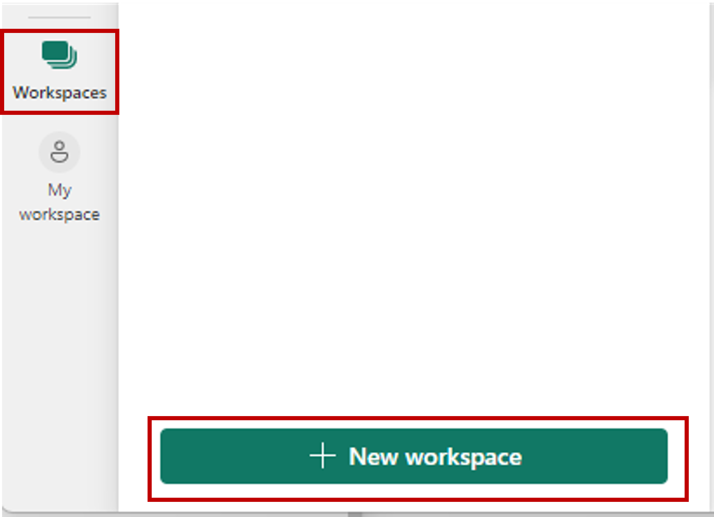
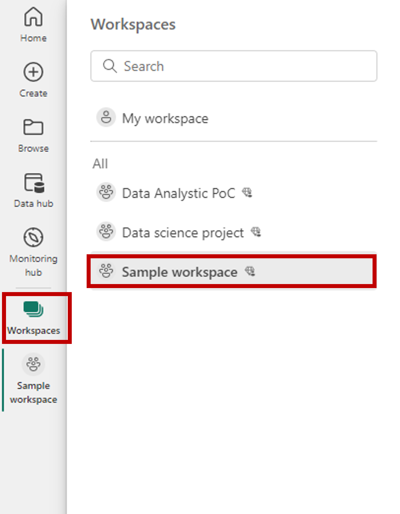
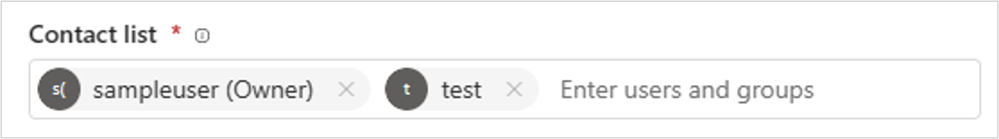

# Create a workspace

This article explains how to create *workspaces*, spaces to collaborate with colleagues, in [!INCLUDE [product-name](../includes/product-name.md)]. In workspaces, you create collections of items such as lakehouses, warehouses, and reports. For more background, see the [Workspaces](workspaces.md) article.

:::image type="content" source="media/create-workspaces/fabric-sample-workspace.png" alt-text="Screenshot of a workspace.":::

## Quickly create a workspace

1. Select **Workspaces** > **New workspace**.
   
     

2. Give the workspace a unique name. If the name isn't available, edit it to come up with a name that's unique. Select **Apply**.
   
     

3. [!INCLUDE [product-name](../includes/product-name.md)] creates the workspace and opens it. You see it in the list of workspaces where you can find all the workspaces you have access to.

## Optional and advanced settings
Here are some optional and advanced settings for your workspace. They're explained in more detail in this section.

- **Description:** Add a description to provide more details about this workspace.
- **Workspace image:** Upload a Workspace image by selecting the upload button. Files can be .png or .jpg format. File size has to be less than 45 KB.
- **Domain (Preview):** Assign your workspace to a domain.
  
Expand **Advanced** and you see advanced setting options:

**Contact list**

Contact list is a place where you can put the names of people as contacts for information about the workspace. Accordingly, people in this contact list receive system email notifications for workspace level changes. 

By default, the first workspace admin who created the workspace is the contact. You can add other users or groups according to your needs. Enter the name in the input box directly, it helps you to automatically search and match users or groups in your org.

**License mode**

Different license mode provides different sets of feature for your workspace. After the creation, you can still change the workspace license type in workspace settings, but some migration effort is needed. 

**Default storage format**

Power BI datasets can store data in a highly compressed in-memory cache for optimized query performance, enabling fast user interactivity. With Premium capacities, large datasets beyond the default limit can be enabled with the Large dataset storage format setting. When enabled, dataset size is limited by the Premium capacity size or the maximum size set by the administrator. Learn more about large dataset storage format [here](https://learn.microsoft.com/en-us/power-bi/enterprise/service-premium-large-models#enable-large-models).

**Template apps** 
  
[Power BI Template apps](https://learn.microsoft.com/en-us/power-bi/connect-data/service-template-apps-overview) are developed for sharing outside your organization. If you check this option, a special type of workspace (template app workspace) will be created and it is not possible to revert it back to a normal workspace after creation.
  
**Dataflow storage(preview)** 

Data used with Power BI is stored in internal storage provided by Power BI by default. With the integration of dataflows and Azure Data Lake Storage Gen 2 (ADLS Gen2), you can store your dataflows in your organization's Azure Data Lake Storage Gen2 account. Learn more [here](https://learn.microsoft.com/en-us/power-bi/transform-model/dataflows/dataflows-azure-data-lake-storage-integration#considerations-and-limitations).

## Give users access to your workspace

Now that you've created the workspace, you'll want to add other users to *roles* in the workspace, so you can collaborate with them. See these articles for more information:

- [Give users access to a workspace](give-access-workspaces.md)
- [Roles in workspaces](roles-workspaces.md)

## Pin workspaces

Quickly access your favorite workspaces by pinning them to the top of the workspace flyout list. 

1. Open the workspace flyout from the nav pane and hover over the workspace you want to pin. Select the **Pin to top** icon.

    

1. The workspace is added in the **Pinned** list.

    

1. To unpin a workspace, select the unpin button. The workspace is unpinned.

    

## Next steps
* Read about [workspaces](workspaces.md)
