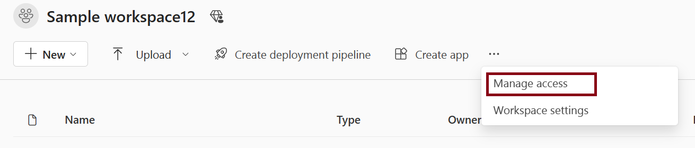

# Give users access to workspaces

After you [create a workspace](create-workspaces.md) in [!INCLUDE [product-name](../includes/product-name.md)], or if you have an admin or member role in a workspace, you can give others access to it by adding them to the different roles. Workspace creators are automatically admins. For an explanation of the different roles, see [Roles in workspaces](roles-workspaces.md).

> [!NOTE]
> To enforce row-level security (RLS) on Power BI items for [!INCLUDE [product-name](../includes/product-name.md)] Pro users who browse content in a workspace, assign them the Viewer Role.
> 
> After you add or remove a user or a group for workspace access, the permission change only takes effect the next time the user logs into [!INCLUDE [product-name](../includes/product-name.md)].

## Give access to your workspace

1. Because you have the Admin or Member role in the workspace, on the command bar of workspace page, you see **Manage Access**. Sometimes this entry could be in the contextual menu.

    

    

2. Select **Add people or groups**
   
   

3. Enter name or email, select a [role](roles-workspaces.md), select **Add**. You can add security groups, distribution lists, Microsoft 365 groups, or individuals to these workspaces as admins, members, contributors, or viewers. Members can only add others to the member, contributor, or viewer roles.

   
   

4. You can view and modify access later if needed. Use search box to search people or groups who already have access of this workspace. To modify access, select drop down and select role.
   
   

## Next steps

* Read about [the workspace experience](workspaces.md).
* [Create workspaces](create-workspaces.md).
* [Roles in workspaces](roles-workspaces.md)
