# What is a Fabric taskflow?

A Fabric taskflow is a visualization of the logical structure of your work in the workspace. Fabric provides a range of pre-defined, end-to-end taskflows based on industry best practices that are intended to make it easier to get started with your project. In addition, you can customize the taskflows to suit your specific needs and requirements. This enables you to create a tailored solution that meets your unique business needs and goals.

With taskflows, you can understand how items are connected and work together in your workspace.  This makes it easier for you to navigate your workspace, even as it becomes more complex over time. Moreover, you can easily standardize your team's work and keep your design and development work in sync to boost the team's collaboration and efficiency.  

## Terms

* **Taskflow**: A taskflow is a collection of connected tasks that represent relationships in a process or collection of processes that complete an end-to-end data solution.

* **Task**: A task is a unit of process in the taskflow. On a task, it provides task type and item recommendations to help you select the appropriate item and allows you to create and attach items to tasks, as well as to navigate items.

## Task types

Each task has a task type that classifies the task based on its key capabilities in the data process flow. The predefined task types are:

| Task type | Description |
|:--------|:----------|
| **General** | Create tasks customized to your project needs and associate available item types with them. |
| **Get data** | Ingest both batch and real-time data into a single location within your Fabric workspace. |
| **Store data** | Organize, query, and store your ingested data in an easily retrievable format. |
| **Prepare data** | Prepare your data for analysis or modeling by addressing issues with the data, such as duplicates, missing values, formatting, etc. |
| **Analyze and train data** | Analyze and use your newly structured data to build and train machine learning models to make decisions and predictions. |
| **Track data** | Take actions, such as sending automated emails or notifications, on the insights that your data provides. |
| **Visualize data** | Present your data as rich visualizations and insights that can be shared with others. |

* **Get data**: Ingest both batch and real-time data into a single location within your Fabric workspace.
* **Clean and transform data**: Prepare your data for analysis or modeling by addressing issues with the data, such as duplicates, missing values, formatting, etc.
* **Store and query data**: Organize, query, and store your ingested data in an easily retrievable format.
* **Analyze and model data**: Analyze and use your newly structured data to build and train machine learning models to make decisions and predictions.
* **Visualize data**: Present your data as rich visualizations and insights that can be shared with others.
* **Respond to data**: Take actions, such as sending automated emails or notifications, on the insights that your data provides.
* **General**: Create tasks customized to your project needs and associate available item types with them.

## Set up Taskflow in workspace

Open the workspace, you can see the **Taskflow(preview)** tab in workspace page, where you can build taskflow and manage items. You can also click the **All items and folders** and back to the item list view.  

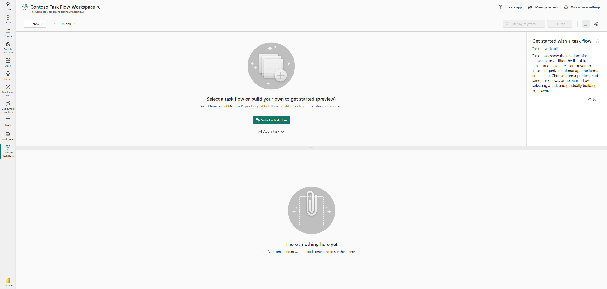

To build a taskflow, you can either select a taskflow from one of pre-designed taskflows or add a task to start building one yourself.  

## Start with pre-designed Taskflows

In the Taskflow default page, you can see the option of **Select a** **taskflow**

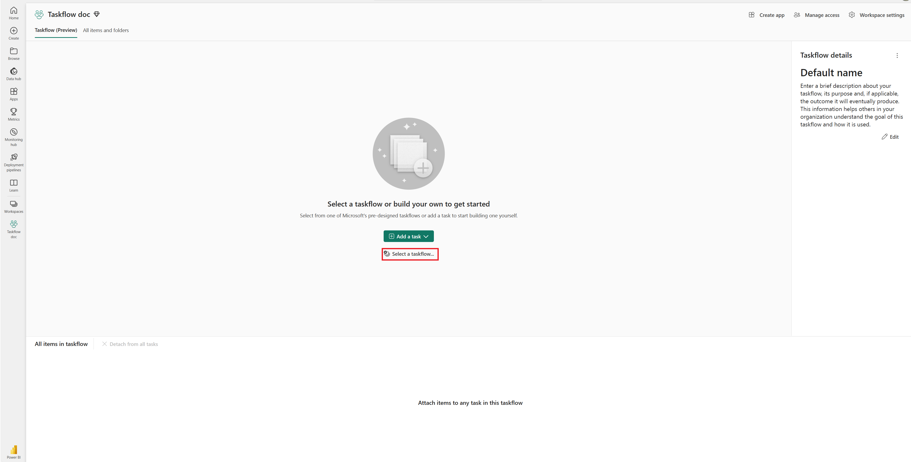

By clicking it, you can open and browse the pre-designed taskflows provided by Microsoft. It lists 8 taskflows with descriptions about each taskflow and item types used in the each taskflow, which gives a high level view of the taskflows and how it is used. 

The layout and content are listed here and discussed in more detail later.

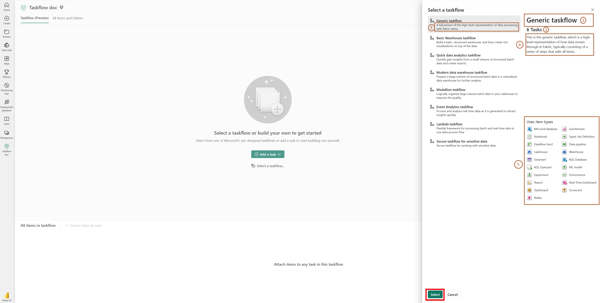

1. Takflow name 
1. Briefly description of the use case of taskflow 
1. Total number of tasks in this taskflow 
1. More detailed description of the taskflow and how it is used
1. Item types that are used in taskflow 

You can select one which can best fit your project needs by clicking **Select.** And the selected taskflow is applied into the taskflow canvas.

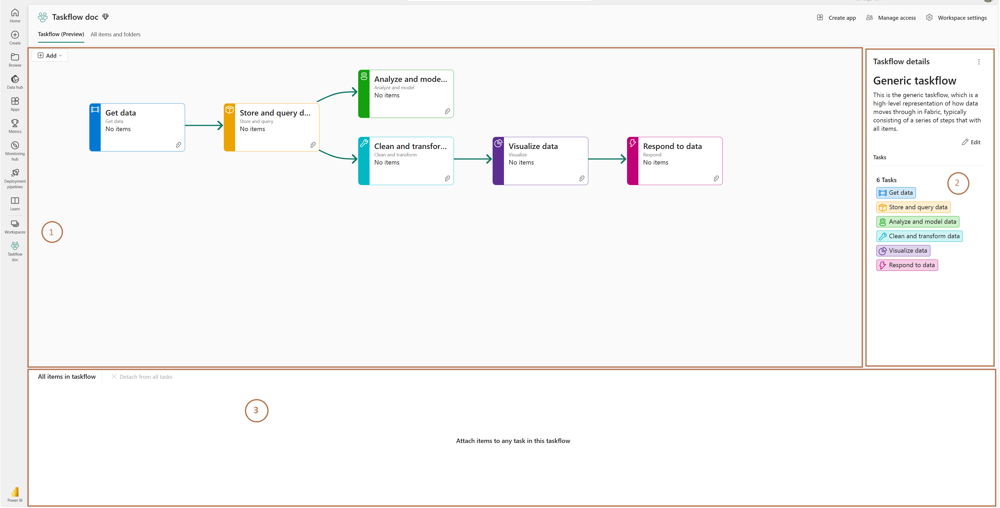

The layout of the taskflow view is :

1. Canvas: The canvas contains a graph view of tasks and all interactions of taskflow 
1. Taskflow details pane: detailed information of the taskflow, including name, description, total number of tasks and task list
1. Item list: which includes items that are attached with tasks in this taskflow

You can also update the taskflow name and description in taskflow details pane by clicking **Edit** .

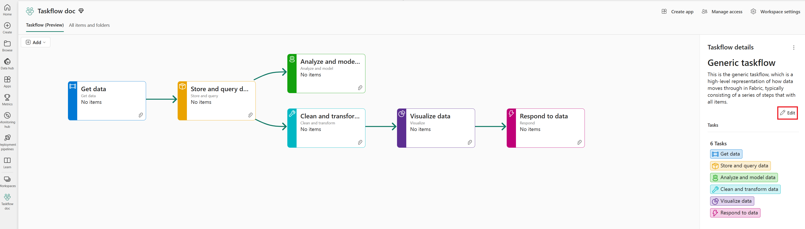

The details section is in editing mode now. You can edit name and description and save the update by clicking **Save** . 

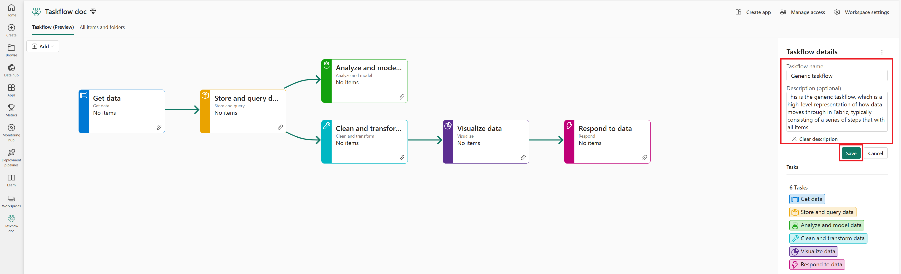

## Start with a custom Taskflow

If you already have a clear view of your taskflow, or none of the pre-designed taskflows fit with your needs, you can choose to build a custom taskflow by selecting a task type and adding a task directly into a canvas. 

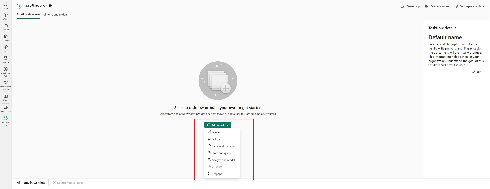

The task is added into the canvas then. And the taskflow is initiated in this workspacenow.  Click **Edit** to update taskflow name and decriptions to help other members in this workspace to understand the taskflow and your project.

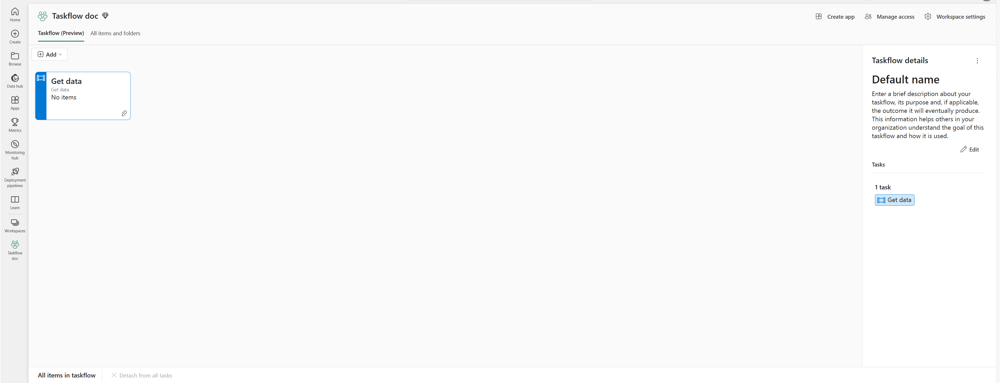

You can continue to add other tasks, link tasks and manage tasks on canvas, which will be discussed in more detail later.

## Task management in Taskflow

When you select a task by clicking on it, you can see the **Task details**. 

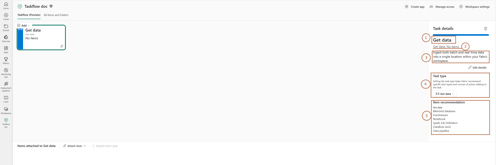

There are 5 parts in the Task details pane:

1. Task name, identifying a task and providing a clear indication of its intended use
1. This is an overview of task type and the number of items attached to it.
1. Task description, it provides a detailed explanation of the task and its intended use.
1. Task type, by configuring and selecting task type, the specific category of the recommended items are different.
1. Item recommendation: recommended items vary depending on the selected task type.

### Update task details and type

**When adding a task, the system task type and its associated description are assigned as the default name and description** **to the task. You can update the task name and description by clicking** **Edit details.**

**The details section is in editing mode now. You can edit name and description and save the update by clicking** **Save .** 

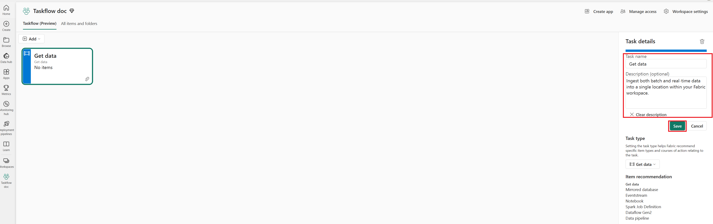

To update or reset the task type for an existing task, simply click on the dropdown menu and choose a new type.

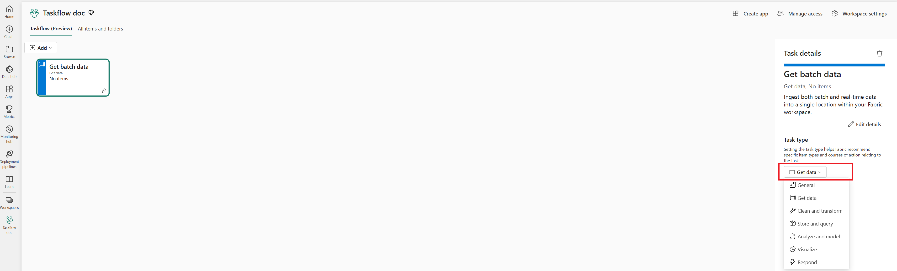

### Add tasks

To add more tasks into canvas, you can click **Add** and select a task type in the drop-down list. 

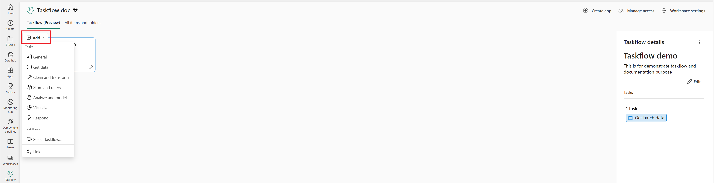

The task of the selected task type is added into the canvas. You can also update the name and description of the task.  

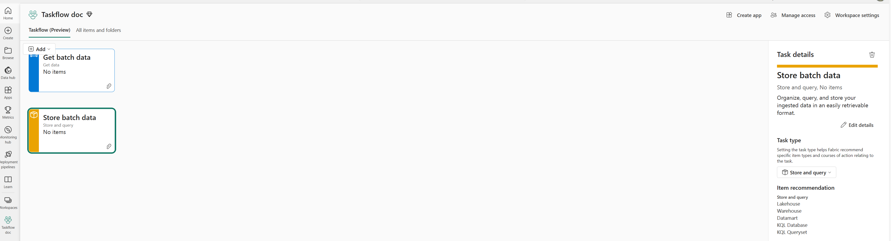

Repeat the previous steps and add more tasks into the canvas.

### Link tasks

Currently, the tasks are arranged vertically and separately on the canvas.

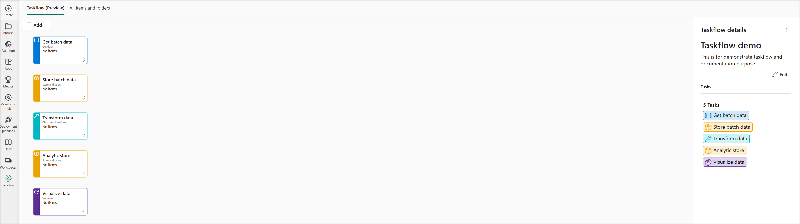

To link tasks on the canvas, you can click **Add** and select **Link**.

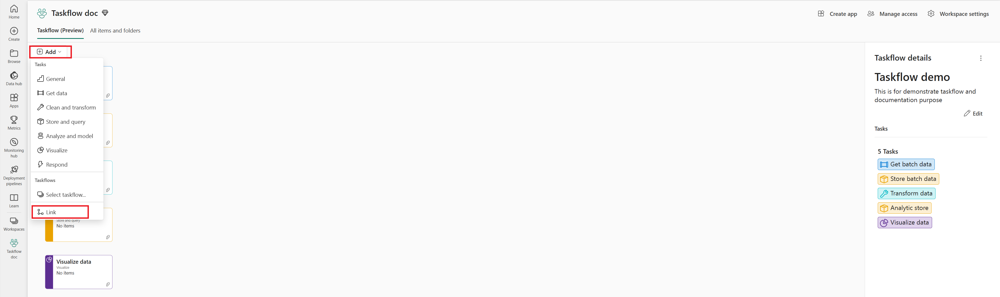

In the new dialog box, choose the **Start task** and **End task** options accordingly, then click on **Add** to create the link.

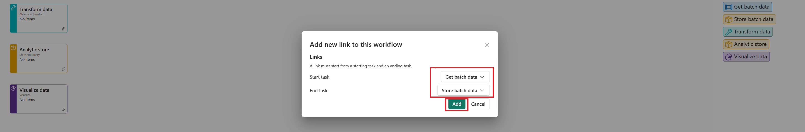

Repeat this step to add links between other tasks.

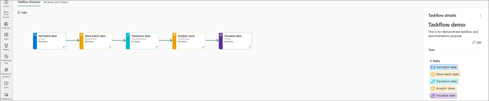

By selecting and clicking on a link on the canvas, you can view the **Link details** and update the link or delete the link as needed.

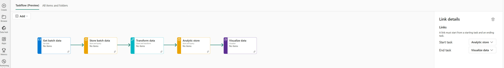

### Delete a task

To delete a task, first select it by clicking on it. Then, in the Task Details pane, you can find the **Delete** button to remove the task.

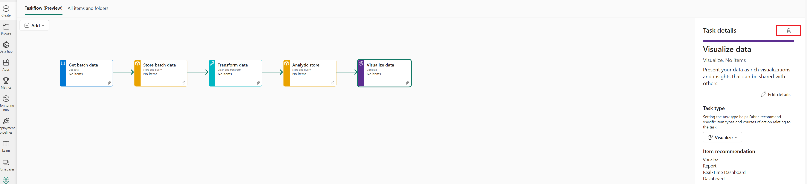

## Attach and detach items with a task

Once the taskflow is set up, you can attach items to individual tasks for logically structuring and organizing your work.  You can choose to create a new item or attach existing items from the many already saved to the workspace. 

### Create an item on a task

To create a new item for a specific task, first select the task by clicking on it. Then, click on the clip icon located on the task, and select **New item** to open the item creation panel for creating a new item.

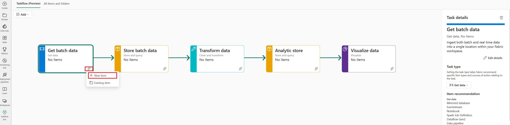

Alternatively, you can click the **Attach item** in the header of the bottom list to select **New item** and open the item creation panel.

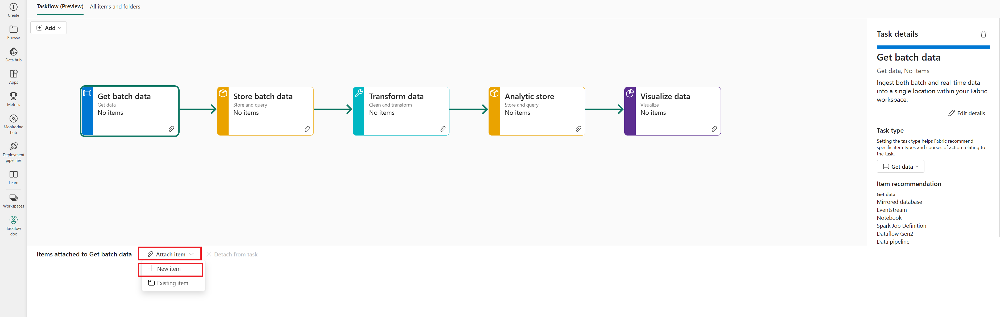

The recommended items are displayed by default in the creation panel. If the item you need is not listed, you can select 'All items' in the display option to view the full list of the items.  In the creation panel, select the item and create the item. Once the item is created, it is listed in the bottom list of the page. The task also shows that it has one item attached to it.

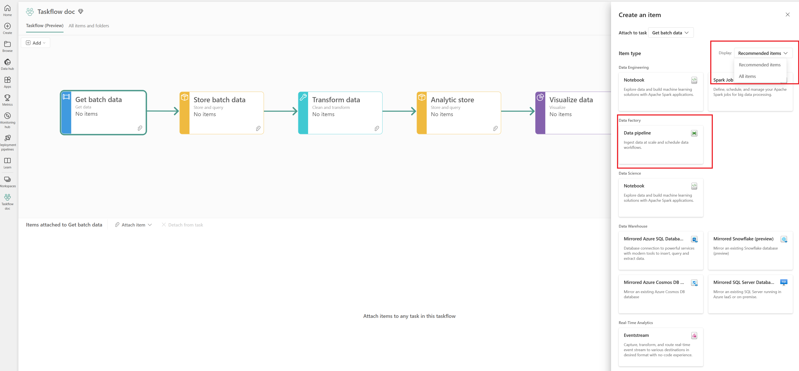

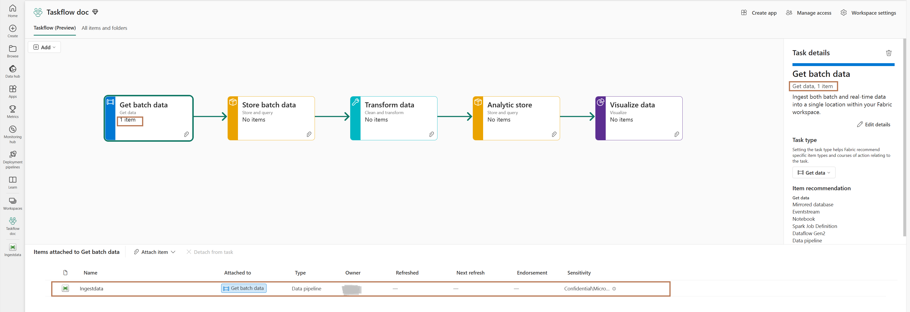

### Attach existing items to a task

To attach existing items, you can either click on the clip icon on task or click the **Attach item** in the header of the bottom list, and select **Existing item**. 

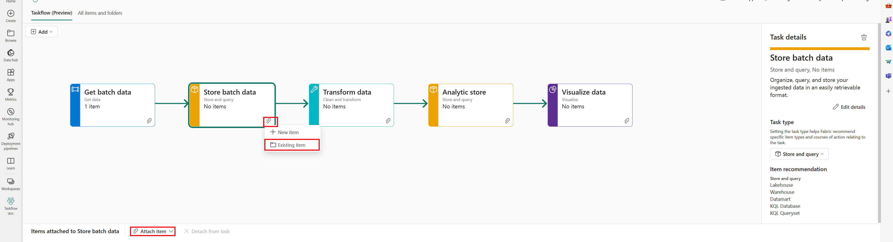

In the dialog box, select one or multiple items at once and click **Select** to attach selected items to the task. 

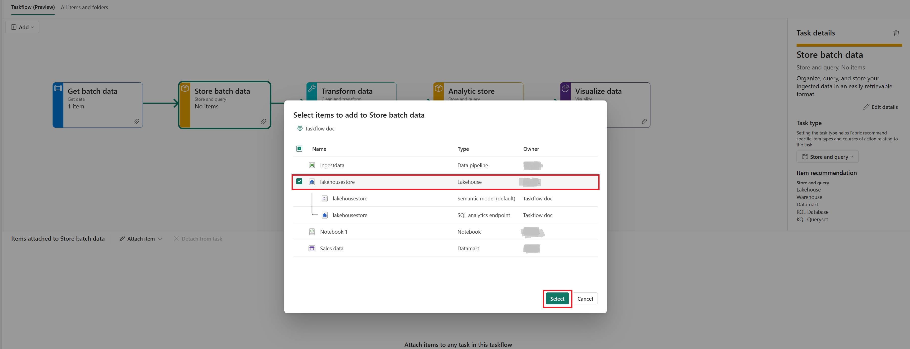

You can see the selected items are attached to the task and listed in the bottom list. 

### Detach items from task

You can detach items from a selected task or detach items from all tasks. 

#### Detach items from a task

To detach item(s) from a task, first select the task you want to remove the item from. Second, select the item(s) in the bottom list. Then, click on **Detach from task** in the list header to detach the item(s) from the task

#### Detach items from all tasks

You can also detach multiple items that are attached to different tasks at once. When no step is selected in the taskflow, you can view all the items in the taskflow.  Select the items and click **Detach from all tasks** button to detach items from tasks. 

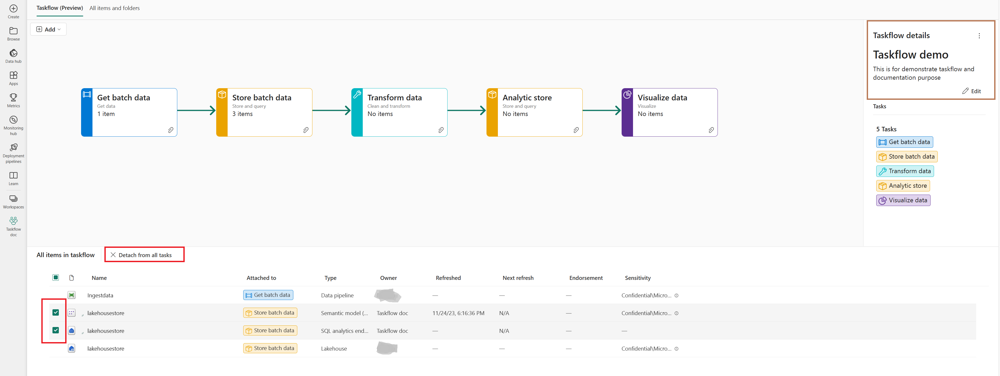

## Navigate items with Taskflow

With items attached to the tasks, you can use taskflow to quickly understand how items in the workspace work together and get a clear view of your work in the workspace. 

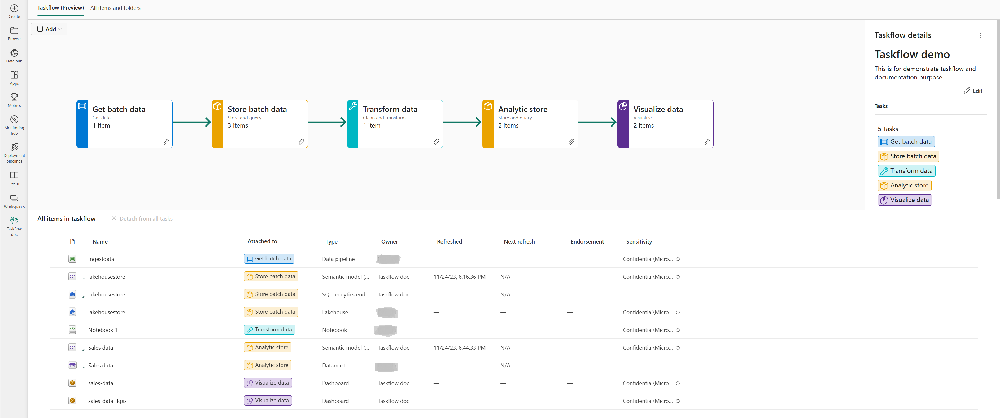

Clicking on each task in the taskflow, you can only view the items attached to the task. 

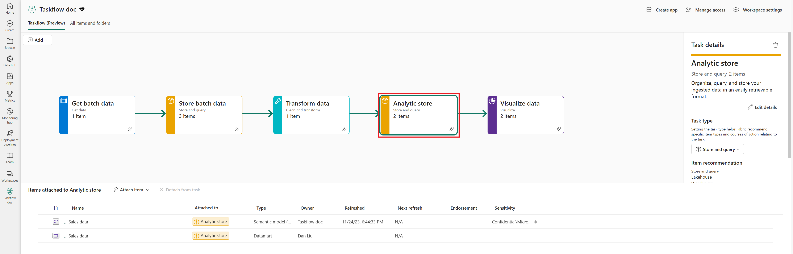

## Delete a Taskflow

Deleting the taskflow will only delete all the tasks and any associations between the items and the tasks. 

To delete a taskflow, first click on a blank area of the canvas to ensure that no tasks are selected. This will make the taskflow pane visible. Next, locate the '...' in the top right corner of the pane and click on it. Then select **Delete** **taskflow** to delete the taskflow

Click **Delete** to delete the taskflow from current workspace. 

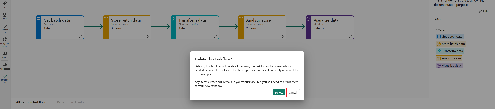

## Private preview limitations

The private preview of external data sharing has certain limitations that you should be aware of.

* Please note that tasks’ positions cannot be saved on canvas. Whenever a new task is added, all tasks on the canvas will be reset to their default positions.
* Keyboard interactions are not supported.
* Dragging link on the canvas is not supported.
* Creation of Report and Dataflow Gen2 from tasks are not supported in taskflow. 

## Related content