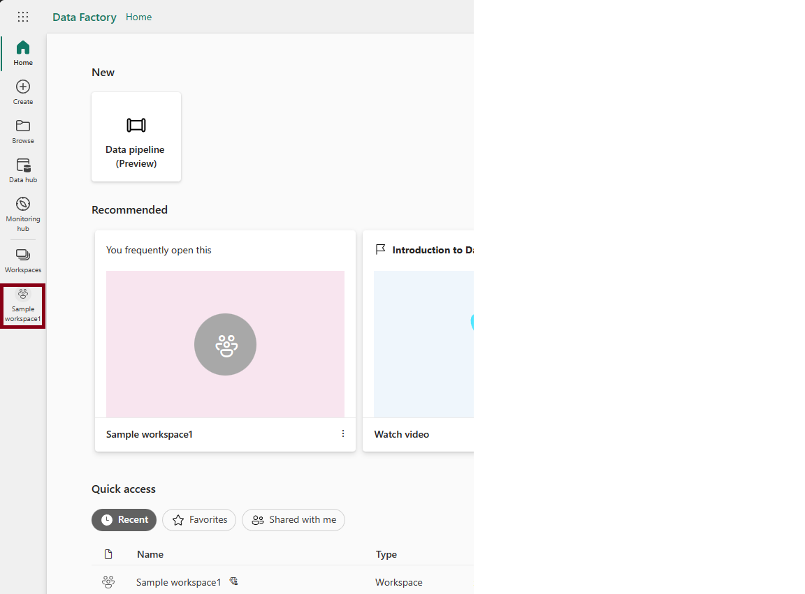

# Workspaces in Microsoft Fabric and Power BI

*Workspaces* are places to collaborate with colleagues to create collections of items such as lakehouses, warehouses, and reports, and to create task flows. This article describes workspaces, how to manage access to them, and what settings are available.

Ready to get started? Read [Create a workspace](create-workspaces.md).

:::image type="content" source="media/workspaces/fabric-workspace-page.png" alt-text="Screenshot showing a workspace with folders." lightbox="media/workspaces/fabric-workspace-page.png":::

## Work with workspaces

Here are some useful tips about working with workspaces.

- **Pin workspaces** to the top of the workspace flyout list to quickly access your favorite workspaces. Read more about [pinning workspaces](create-workspaces.md#pin-workspaces).
- **Use granular workspace roles** for flexible permissions management in the workspaces: Admin, Member, Contributor, and Viewer. Read more about [workspace roles](roles-workspaces.md).
- **Create folders in the workspace**: Organize and manage artifacts in the workspace. Read more about [creating folders in workspaces](workspaces-folders.md).
- **Navigate to current workspace** from anywhere by selecting the icon on left nav pane. Read more about [current workspace](#current-workspace) in this article.
- **Workspace settings**: As workspace admin, you can update and manage your workspace configurations in [workspace settings](#workspace-settings).
- **Manage a workspace in Git**: Git integration in Microsoft Fabric enables Pro developers to integrate their development processes, tools, and best practices straight into the Fabric platform. Learn how to [manage a workspace with Git](../cicd/git-integration/git-get-started.md).
- **Contact list**: Specify who receives notification about workspace activity. Read more about [workspace contact lists](#workspace-contact-list) in this article.

## Current workspace

After you select and open to a workspace, this workspace becomes your current workspace. You can quickly navigate to it from anywhere by selecting the workspace icon from left nav pane.

## Workspace settings

Workspace admins can use workspace settings to manage and update the workspace. The settings include general settings of the workspace, like the basic information of the workspace, contact list, OneDrive, license, Azure connections, storage, and other experiences' specific settings.

To open the workspace settings, you can select the workspace in the nav pane, then select **More options (...)** > **Workspace settings** next to the workspace name.

:::image type="content" source="media/workspaces/open-workspace-settings.png" alt-text="Screenshot showing Open workspace settings in the nav pane.":::

You can also open it from the workspace page.

:::image type="content" source="media/workspaces/open-in-workspace.png" alt-text="Screenshot showing Open workspace settings in workspace." lightbox="media/workspaces/open-in-workspace.png":::

### Workspace contact list

The Contact list feature allows you to specify which users receive notification about issues occurring in the workspace. By default, the one who created the workspace is in the contact list. You can add others to that list while [creating workspace](create-workspaces.md#contact-list) or in workspace settings after creation. Users or groups in the contact list are also listed in the user interface (UI) of the workspace settings, so workspace users know whom to contact.

:::image type="content" source="media/workspaces/contact-list-workspace-settings.png" alt-text="Screenshot of contact list setting options.":::

### Microsoft 365 and OneDrive

The Workspace OneDrive feature allows you to configure a Microsoft 365 Group whose SharePoint document library is available to workspace users. You create the Group outside of [!INCLUDE [product-name](../includes/product-name.md)] first, with one available method being from OneDrive. Read about creating a [OneDrive shared library](https://support.microsoft.com/office/create-a-new-shared-library-from-onedrive-for-work-or-school-345c8599-05d8-4bf8-9355-2b5cfabe04d0).

> [!NOTE]
> Creating Microsoft 365 Groups may be restricted in your environment, or the ability to create them from your OneDrive site may be disabled. If this is the case, speak with your IT department.

[!INCLUDE [product-name](../includes/product-name.md)] doesn't synchronize permissions between users or groups with workspace access, and users or groups with Microsoft 365 Group membership. A best practice is to [give access to the workspace](give-access-workspaces.md) to the same Microsoft 365 Group whose file storage you configured. Then manage workspace access by managing membership of the Microsoft 365 Group.

You can configure OneDrive in workspace settings by typing in the name of the Microsoft 365 group that you created earlier. Type just the name, not the URL. [!INCLUDE [product-name](../includes/product-name.md)] automatically picks up the OneDrive for the group.

:::image type="content" source="media/workspaces/add-onedrive-info.png" alt-text="Screenshot of adding OneDrive info.":::

### License mode

By default, workspaces are created in your organization's shared capacity. When your organization has other capacities, workspaces including My Workspaces can be assigned to any capacity in your organization. You can configure it while creating a workspace or in **Workspace settings -> Premium**. Read more about [licenses](../enterprise/licenses.md).

:::image type="content" source="media/workspaces/license-mode-workspace-settings.png" alt-text="Screenshot of license mode in workspace settings.":::

### Azure connections configuration

Workspace admins can configure dataflow storage to use Azure Data Lake Gen 2 storage and Azure Log Analytics (LA) connection to collect usage and performance logs for the workspace in workspace settings.

:::image type="content" source="media/workspaces/azure-connection.png" alt-text="Screenshot showing Azure resource configuration." lightbox="media/workspaces/azure-connection.png":::

With the integration of Azure Data Lake Gen 2 storage, you can bring your own storage to dataflows, and establish a connection at the workspace level. Read [Configure dataflow storage to use Azure Data Lake Gen 2](/power-bi/transform-model/dataflows/dataflows-azure-data-lake-storage-integration) for more detail.  

After the connection with Azure Log Analytics (LA), activity log data is sent continuously and is available in Log Analytics in approximately 5 minutes. Read [Using Azure Log Analytics](/power-bi/transform-model/log-analytics/desktop-log-analytics-overview) for more detail.

### System storage

System storage is the place to manage your semantic model storage in your individual or workspace account so you can keep publishing reports and semantic models. Your own semantic models, Excel reports, and those items that someone has shared with you, are included in your system storage.

In the system storage, you can view how much storage you  have used and free up the storage by deleting the items in it.

Keep in mind that you or someone else may have reports and dashboards based on a semantic model. If you delete the semantic model, those reports and dashboards don't work anymore.

:::image type="content" source="media/workspaces/system-storage.png" alt-text="Screenshot showing Manage your storage." lightbox="media/workspaces/system-storage.png":::

### Remove the workspace

As an admin for a workspace, you can delete it. When you delete the workspace, everything contained within the workspace is deleted for all group members, and the associated app is also removed from AppSource.

In the Workspace settings pane, select **Other** > **Remove this workspace**.

:::image type="content" source="media/workspaces/remove-workspace.png" alt-text="Screenshot showing deleting workspace." lightbox="media/workspaces/remove-workspace.png":::

> [!WARNING]
> If the workspace you're deleting has a workspace identity, that workspace identity will be irretrievably lost. In some scenarios this could cause Fabric items relying on the workspace identity for trusted workspace access or authentication to break. For more information, see [Delete a workspace identity](../security/workspace-identity.md#deleting-the-identity).

## Administering and auditing workspaces

Administration for workspaces is in the [!INCLUDE [product-name](../includes/product-name.md)] admin portal. [!INCLUDE [product-name](../includes/product-name.md)] admins decide who in an organization can create workspaces and distribute apps. Read about [managing users' ability to create workspaces](../admin/portal-workspace.md#create-workspaces-new-workspace-experience) in the "Workspace settings" article.

Admins can also see the state of all the workspaces in their organization. They can manage, recover, and even delete workspaces. Read about [managing the workspaces themselves](../admin/portal-workspaces.md) in the "Admin portal" article.

### Auditing

[!INCLUDE [product-name](../includes/product-name.md)] audits the following activities for workspaces.

| Friendly name | Operation name |
|---|---|
| Created [!INCLUDE [product-name](../includes/product-name.md)] folder | CreateFolder |
| Deleted [!INCLUDE [product-name](../includes/product-name.md)] folder | DeleteFolder |
| Updated [!INCLUDE [product-name](../includes/product-name.md)] folder | UpdateFolder |
| Updated [!INCLUDE [product-name](../includes/product-name.md)] folder access| UpdateFolderAccess |

Read more about [[!INCLUDE [product-name](../includes/product-name.md)] auditing](/power-bi/admin/service-admin-auditing).

## Considerations and limitations

Limitations to be aware of:

- Workspaces can contain a maximum of 1,000 semantic models, or 1,000 reports per semantic model.
- Certain special characters aren't supported in workspace names when using an XMLA endpoint. As a workaround, use URL encoding of special characters, for example, for a forward slash **/**, use **%2F**.
- A user or a [service principal](/power-bi/enterprise/service-premium-service-principal) can be a member of up to 1,000 workspaces.

## Related content

* [Create workspaces](create-workspaces.md)
* [Give users access to workspaces](give-access-workspaces.md)
