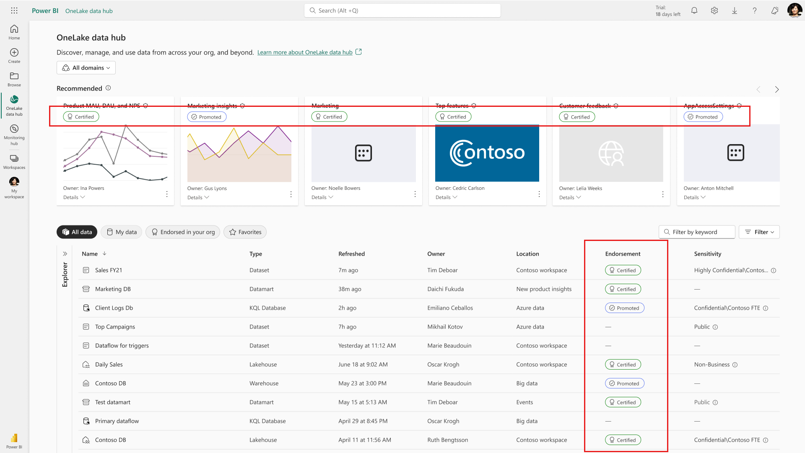

# Endorsement

Organizations often have large numbers of Microsoft Fabric items available for sharing and reuse by their Fabric users. Identifying trustworthy, authoritative items can be difficult. Endorsement is a way to make it easier for users to find the high-quality items they need. Endorsed items are clearly labeled, both in Fabric and in other places where users look for Fabric items (such for Power BI semantic models in Excel). Endorsed items are also given priority in some searches, and you can sort for endorsed items for in some lists.

There are two kinds of endorsement: **promotion** and **certification**.

* **Promotion**: Promotion enables users to highlight items that they think are valuable, worthwhile, and ready for others to use. It encourages the collaborative spread of content within the organization.

    Any content owner, or any member with write permissions the item, can simply promote the item when they think it's good enough for sharing.

    [Learn how to promote your items](../get-started/endorsement-promote-certify.md#promote-items).

* **Certification**: Certification means that the item meets the organization's quality standards and can be regarded as reliable and authoritative, and is ready for use across the organization.

    Only a [select group of reviewers (defined by the Fabric administrator)](../admin/endorsement-setup.md) is authorized to certify items. Item owners who wish to see their item certified and aren't authorized to certify it themselves need to follow their organization's guidelines about getting it certified.

    Learn how to [certify items](../get-started/endorsement-promote-certify.md#certify-items) or [request certification](../get-started/../get-started/endorsement-promote-certify.md#request-item-certification).

    **Certification is available only if a Fabric administrator has [enabled and configured](../admin/endorsement-setup.md) it for your organization**.

    > [!NOTE]
    > Certification enablement and configuration can be delegated to domain administrators, making it possible to specify a different set of reviewers for each domain. For more information, see [Set up item certification](../admin/endorsement-setup.md).

The following image illustrates how endorsed, promoted, and certified semantic models are clearly identified when you're searching for an item.

## Types of items that can be endorsed

All Fabric items can be endorsed except for Power BI dashboards.

## Related content

* [Promote or certify Fabric content](../get-started/endorsement-promote-certify.md)
* [Enable certification for your organization](../admin/endorsement-setup.md) (Fabric admins)
