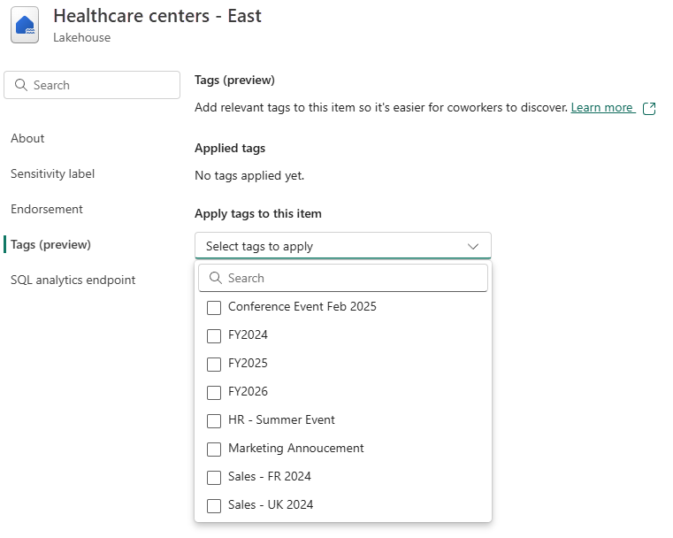
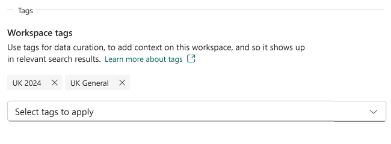

# Apply tags in Microsoft Fabric

This article describes how to apply tags to items and workspaces in Microsoft Fabric.

For more information about tags, see [Tags in Microsoft Fabric](tags-overview).

## Prerequisites

- You must have write permissions on an item to apply tags to it or remove tags from it.
- You must be a workspace admin to apply tags to a workspace or remove tags from it. Non-admin workspace members (Viewer, Member, Contributor) can view workspace tags but can't modify them.

## Apply tags to an item

1. Open the item's settings and go to the **Tags** tab.

1. Select the **Select tags to apply** drop-down to display the list of available tags. Choose the tags that are relevant for your item. You can select more than one tag. An item can have up to 10 tags. Tags already applied to the item are listed under **Applied tags**.

   
   
         > [!NOTE]
   > If the **Select tags to apply** drop-down is disabled, you don't have permission to apply tags to the item.
   
3. When done, close the settings pane. For Power BI items, select **Save** or **Apply**.

## Remove tags from an item

1. Open the item's settings and go to the **Tags** tab.

   All the tags applied to the item appear under **Applied tags**.

   
   
2. Select the **X** next to the names of the tags you want to remove from the item.

3. When done, close the settings pane. For Power BI items, select **Save** or **Apply**.

## Apply tags to a workspace

1. Open the workspace settings and go to the **Tags** panel.

1. Select the **Select tags to apply** drop-down to display the list of available tags. Choose the tags that are relevant for your workspace. You can select more than one tag. A workspace can have up to 10 tags. Tags already applied to the workspace are listed under **Applied tags**.

   > [!NOTE]
   > If the drop-down is disabled, you might not have workspace admin permissions.
   
3. When done, close the settings pane.

## Remove tags from a workspace

1. Open the workspace settings and go to the **Tags** panel.

   All the tags applied to the workspace appear under **Applied tags**.

   <!--  -->

2. Select the **X** next to the names of the tags you want to remove from the workspace.

3. When done, close the settings pane.

## Apply or remove tags using APIs

Tags can be applied or removed programmatically using public REST APIs:

1. For items, use the [Update Item](/en-us/rest/api/fabric/core/items/update-item) API to apply or remove tags from an item.
2. For workspaces, use the [Apply Workspace Tags](/en-us/rest/api/fabric/core/workspaces/apply-workspace-tags) and [Unapply Workspace Tags](/en-us/rest/api/fabric/core/workspaces/unapply-workspace-tags) APIs to add or remove tags from a workspace.

## Related content

- [Tags overview](tags-overview)
- [Create and manage a set of tags](tags-define)

- [Fabric REST Admin APIs for tags](/en-us/rest/api/fabric/admin/tags)

