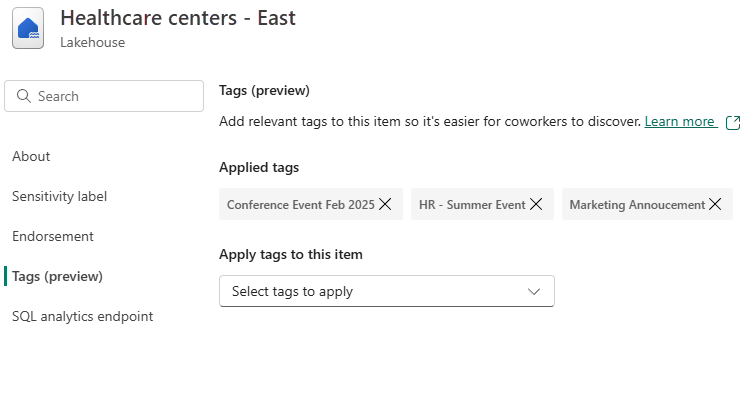

# Apply tags to items and workspaces in Microsoft Fabric

This article describes how to apply tags to items and workspaces in Microsoft Fabric.

For more information about tags, see [Tags in Microsoft Fabric](tags-overview.md).

## Prerequisites

- You must be a workspace admin to apply tags to a workspace or remove tags from it. Non-admin workspace members (Viewer, Member, Contributor) can view workspace tags but can't modify them.
- You must have Write or Contributor permissions on an item to apply or remove tags from it.

## Apply tags to a workspace

1. Open the workspace settings and go to the **Tags** section.

   :::image type="content" source="media/tags-apply/workspace-tags-setting.png" alt-text="Screenshot showing the workspace tags setting.":::

1. Use the **Select tags to apply** dropdown list to select one or more tags for your workspace. A workspace can have up to 10 tags.

   > [!NOTE]
   > If the drop-down is disabled, you might not have workspace admin permissions.
   
1. When done, close the settings pane.

## Remove tags from a workspace

1. Open the workspace settings and go to the **Tags** section.

   You'll see all tags currently applied to the workspace.

1. Select the **X** next to the names of the tags you want to remove from the workspace.

1. When done, close the settings pane.

## Apply tags to an item

1. Open the item's settings and go to the **Tags** tab.

1. Use the **Select tags to apply** dropdown list to select one or more tags for your item. An item can have up to 10 tags.

    :::image type="content" source="media/tags-apply/choose-tags.png" alt-text="Screenshot showing how to choose tags to apply to an item.":::

    > [!NOTE]
    > If the **Select tags to apply** drop-down is disabled, you might not have Write or Contributor permissions on the item.
   
1. When done, close the settings pane. For Power BI items, select **Save** or **Apply**.

## Remove tags from an item

1. Open the item's settings and go to the **Tags** tab.

   All the tags applied to the item appear under **Applied tags**.

   

1. Select the **X** next to the names of the tags you want to remove from the item.

1. When done, close the settings pane.

<!--
## Apply or remove tags using APIs

You can apply or remove tags programmatically using REST APIs:

- For workspaces, use the [Apply Workspace Tags](/rest/api/fabric/core/workspaces/apply-workspace-tags) and [Unapply Workspace Tags](/rest/api/fabric/core/workspaces/unapply-workspace-tags) APIs to add or remove tags from a workspace.
- For items, use the [Apply Tags](/rest/api/fabric/core/tags/apply-tags) and [Unapply Tags](/rest/api/fabric/core/tags/unapply-tags) APIs to add or remove tags from an item.
-->
## Related content

- [Tags overview](tags-overview.md)
- [Create and manage a set of tags](tags-define.md)
- [Fabric REST Admin APIs for tags](/rest/api/fabric/admin/tags)
