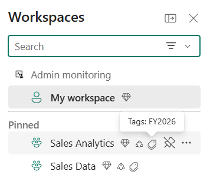

# Tags in Microsoft Fabric

Tags in Microsoft Fabric let you apply additional metadata to workspaces and items, making it easier to categorize, organize, and discover data.

Tags are configurable text labels, such as *Sales – FR 2025*, *HR – Summer Event*, or *FY 2025*, that admins define at the tenant or [domain](domains.md) level.

## How tags work

Here's how tags flow from definition to discovery:

1. **Admins [define tags](tags-define.md).** Fabric admins create tenant-level tags; Fabric or domain admins create domain-level tags.
   - **Tenant-level tags** are available across all items and workspaces in the tenant. They're suitable for broad classifications, compliance, or security labels that apply universally across your organization.
   - **Domain-level tags** are available only for items and workspaces assigned to that domain. If a workspace isn't assigned to a domain, only tenant-level tags are available. Domain-level tags let domain owners implement more targeted governance policies that reflect the needs of their area. A domain-level tag can't duplicate a tenant-level tag name, but the same name can exist across different domains.
   
2. **Workspace admins [apply tags to workspaces](tags-apply.md#apply-tags-to-a-workspace).** Workspace tags let you tag at a broad level without tagging each item individually. They're useful for cost attribution, governance reporting, and policy enforcement. A workspace can have up to 10 tags, counted independently from item tags. Non-admin members (Viewer, Member, Contributor) can view workspace tags but can't modify them.

3. **Data owners [apply tags to items](tags-apply.md).** Users with Write or Contributor permissions can apply up to 10 tags per item. Available tags include tenant-level tags and, if the item's workspace is assigned to a domain, that domain's tags.

4. **Users [discover content by tag](#how-tags-enhance-data-discoverability).** Once tags are applied, users can filter or search for relevant content across the catalog, workspace list, and other surfaces.

5. **Admins [govern at scale](metadata-scanning-overview.md).** Use the metadata scanning (scanner) APIs to programmatically fetch tag associations for items and workspaces and feed them into downstream governance solutions.

## How tags enhance data discoverability

Once tags are applied, they enhance visibility across multiple surfaces:

### Workspace tags

- **Workspace list:** A tag icon appears next to the workspace name in the workspaces list panel. Hover to view applied workspace tags.

  

- **Workspace list filtering:** Filter workspaces by applied tags in the workspaces list panel and OneLake Catalog Explorer.

  
  
- **Workspace view:** Workspace tag names appear directly in the workspace screen.

  
  
### Item tags

- **Item list views:** A tag icon appears next to the item name. Hover to view applied tags.

  
  
- **Workspace item list:** Filter items list by assigned tag.

  
  
- **Item details:** Tags are shown in the OneLake Catalog item details pane of each item.

  
  
- **Flyout card:** When editing an item, select the item name or sensitivity label to view tags.

  
  
- **Lineage view:** Tags appear in workspace lineage and item-level lineage views.

  
  
- **Global search:** Search by tag name in global search to find all relevant results, along with other metadata like item owner and location.

  
  
### Tags in APIs

- **Tag management APIs**: Use the [Fabric REST Admin APIs for tags](/rest/api/fabric/admin/tags) to create, update, delete, and list tags at the tenant and domain levels.

- **Workspace APIs**: Use the [Apply Workspace Tags](/rest/api/fabric/core/workspaces/apply-workspace-tags) and [Unapply Workspace Tags](/rest/api/fabric/core/workspaces/unapply-workspace-tags) APIs to add or remove tags from a workspace. The [List Workspaces](/rest/api/fabric/core/workspaces/list-workspaces) (User and Admin) APIs return applied workspace tag IDs and names.

- **Item APIs**: Use the [Apply Tags](/rest/api/fabric/core/tags/apply-tags) and [Unapply Tags](/rest/api/fabric/core/tags/unapply-tags) APIs to add or remove tags from individual items. Use the [List Tags](/rest/api/fabric/core/tags/list-tags) API to retrieve applied tag IDs and names for an item.

- **Scanner API**: The [metadata scanning](metadata-scanning-overview.md) (scanner) APIs include tag data, so governance and discovery solutions can retrieve tag assignments at scale for both items and workspaces.

  For every applicable item and workspace returned in a scan, the payload includes a `tags` field containing a list of applied tag IDs. Use the [List Tags](/rest/api/fabric/admin/tags/list-tags) API to resolve the IDs to tag names.

  

## Considerations and limitations

### Limits

- A maximum of 10,000 unique tags can be created in a tenant.
- An item or workspace can have a maximum of 10 tags applied to it at a time. Workspace and item tag limits are counted independently.
- There's no limit on the number of tagged items or workspaces.

### Propagation and visibility

- After you apply a tag to an item, the icon might take several hours to appear next to the item name. It might also take time before the item appears in global search results when you use the tag name as a search term.
- Workspace tags are visible only where other workspace metadata is visible to you.
- When a workspace is moved to a different domain, existing domain-level tags remain applied. However, those tags might not be available in the new domain, so you can't reapply them if removed.

## Related content

- [Create and manage a set of tags](tags-define.md)
- [Apply tags](tags-apply.md)
- [Microsoft Fabric REST Admin APIs for tags](/rest/api/fabric/admin/tags)