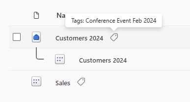
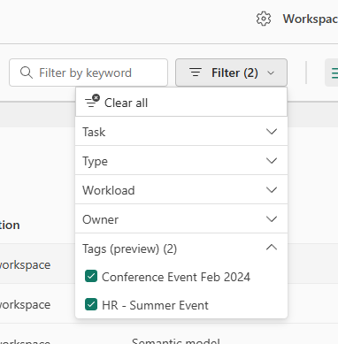
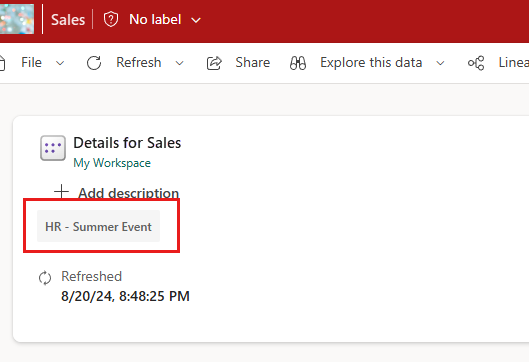
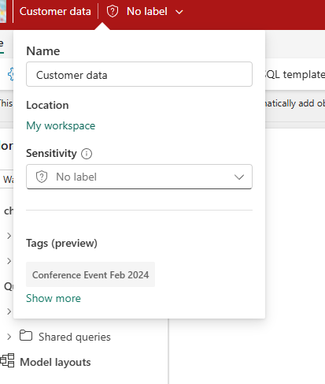
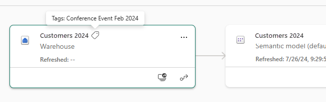
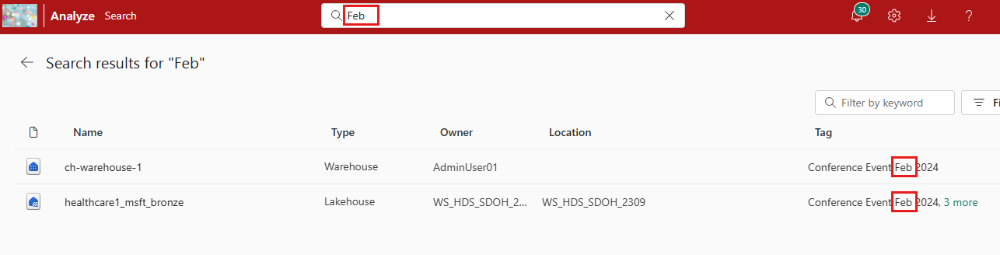
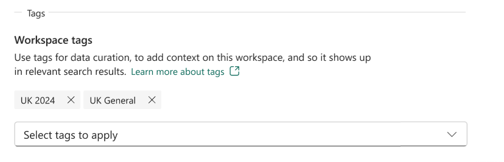
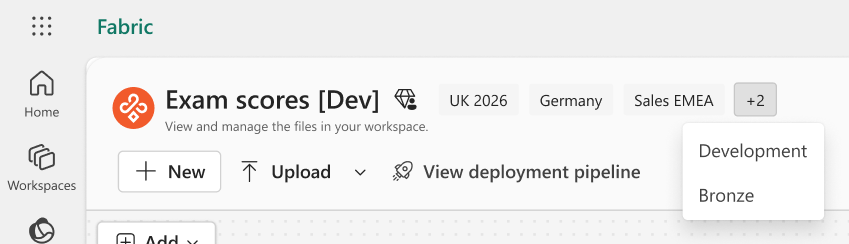
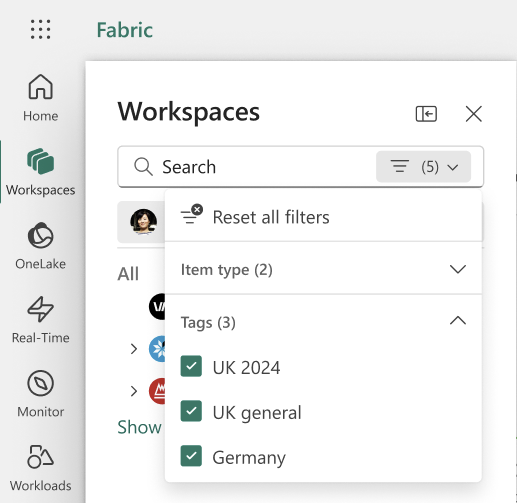
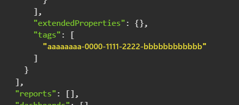

# Tags in Microsoft Fabric

Tags in Microsoft Fabric let you apply additional metadata to items and workspaces, making it easier to categorize, organize, and discover data. Tags are configurable text labels, such as _Sales – FR 2025_, _HR – Summer Event_, or _FY 2025_, that can be applied at both the tenant and [domain](domains.md) levels, offering flexibility in how assets are governed across your organization. Data and content owners can then apply these tags to their Fabric items and workspaces, helping users find the data and content they need.

Tags are an important component of Fabric's data mesh architecture. They let you add details at the item and workspace levels, across workspaces and domains.

- **Tenant and domain admins [create tags](tags-define.md).**

  - **Tenant-level tags** are defined by Fabric administrators and are available for use across all items and workspaces throughout the entire tenant. These tags are suitable for broad classifications, compliance, or security labels that apply universally across your organization.

  - **Domain-level tags** can be defined by Fabric or domain administrators and are specific to particular domains within your Fabric environment. These tags are available only for items and workspaces within that domain. Domain-level tags let domain owners implement more targeted governance policies that reflect the needs of their area. A tag created at the domain level can't be duplicated at the tenant level. However, it can be duplicated on other domains.

- **Data owners apply tags to items.** Data owners, who best know how to categorize their own data, [apply tags to items](tags-apply.md). An item can have up to 10 tags applied to it. When data owners apply tags, they can choose from the list of available tenant-level tags and, if the item resides in a workspace assigned to a domain, the domain-level tags associated with that domain.

- **Workspace admins apply tags to workspaces.** Workspace admins can [apply tags at the workspace level](tags-apply.md#apply-tags-to-a-workspace), so you don't have to tag each item individually. Workspace tags are useful for cost attribution, governance reporting, and policy enforcement. A workspace can have up to 10 tags, counted independently from per-item tags. Non-admin workspace members (Viewer, Member, Contributor) can view workspace tags but can't modify them.

- **Users use tags for discoverability.** Once tags are applied to items and workspaces, users in the organization can use them to [filter or search for the most relevant content](#how-tags-enhance-data-discoverability).

- **Admins use tags for governance.** Admins can use the [metadata scanning (scanner)](metadata-scanning-overview.md) APIs to programmatically fetch tag associations for both items and workspaces at scale and use them in downstream governance and discovery solutions.

## How tags enhance data discoverability

Once tags are applied, they enhance visibility across multiple surfaces.

### Item tags

- **Item list views:** A tag icon appears next to the item name. Hover to view applied tags.

  
  
- **Workspaces:** Filter items list by assigned tag.

  
  
- **Item details:** Tags are shown in the OneLake Catalog item details pane of each item.

  
  
- **Flyout card:** When editing an item, select the item name or sensitivity label to view tags.

  
  
- **Lineage view:** Tags appear in workspace lineage and item-level lineage views.

  
  
- **Global search:** Search by tag name in global search to find all relevant results, accompanied by other metadata such as item owner and location.

  
  
### Workspace tags

- **Workspace settings:** Workspace admins can assign and manage tags in the workspace settings panel. Non-admins can view applied tags in read-only mode.

  
  
- **Workspace list:** A tag icon appears next to the workspace name in the workspaces list panel. Hover to view applied workspace tags.

- **Workspace view:** Workspace tag names are displayed directly in the workspace screen.

  
  
- **Workspace list filtering:** Filter workspaces by applied tags in the workspaces list panel and OneLake Catalog Explorer.

  
  
### Tags in APIs

- **Tag management APIs**: Use the [Fabric REST Admin APIs for tags](/en-us/rest/api/fabric/admin/tags) to create, update, delete, and list tags at the tenant and domain levels.

- **Item APIs**: Use the [Apply Tags](/en-us/rest/api/fabric/core/tags/apply-tags) and [Unapply Tags](/en-us/rest/api/fabric/core/tags/unapply-tags) APIs to add or remove tags from individual items. Use the [List Tags](/en-us/rest/api/fabric/core/tags/list-tags) API to retrieve applied tag UUIDs and names for an item.

- **Workspace APIs**: Use the [Apply Workspace Tags](/en-us/rest/api/fabric/core/workspaces/apply-workspace-tags) and [Unapply Workspace Tags](/en-us/rest/api/fabric/core/workspaces/unapply-workspace-tags) APIs to add or remove tags from a workspace. The [List Workspaces](/en-us/rest/api/fabric/core/workspaces/list-workspaces) (User and Admin) APIs return applied workspace tag UUIDs and names.

- **Scanner API**: Tags are included in [metadata scanning](/en-us/fabric/governance/metadata-scanning-overview) (scanner) APIs so that governance and discovery solutions can retrieve tag assignments at scale for both items and workspaces.

  For every applicable item and workspace returned in a scan, the payload includes a `tags` field containing a list of applied tag UUIDs. Use the [List Tags](/en-us/rest/api/fabric/admin/tags/list-tags) API to resolve the UUIDs to tag names.

  
  
## Considerations and limitations

- A maximum of 10,000 unique tags can be created in a tenant.

- An item or workspace can have a maximum of 10 tags applied to it at any one time. Workspace and item tag limits are counted independently.

- There is no limit on the number of tagged items or workspaces.

- After you apply a tag to an item, the icon might take several hours to appear next to the item name, and before you can find the item in global search using the tag name as a search term.

- Workspace tags are visible only where other workspace metadata is visible to you.
