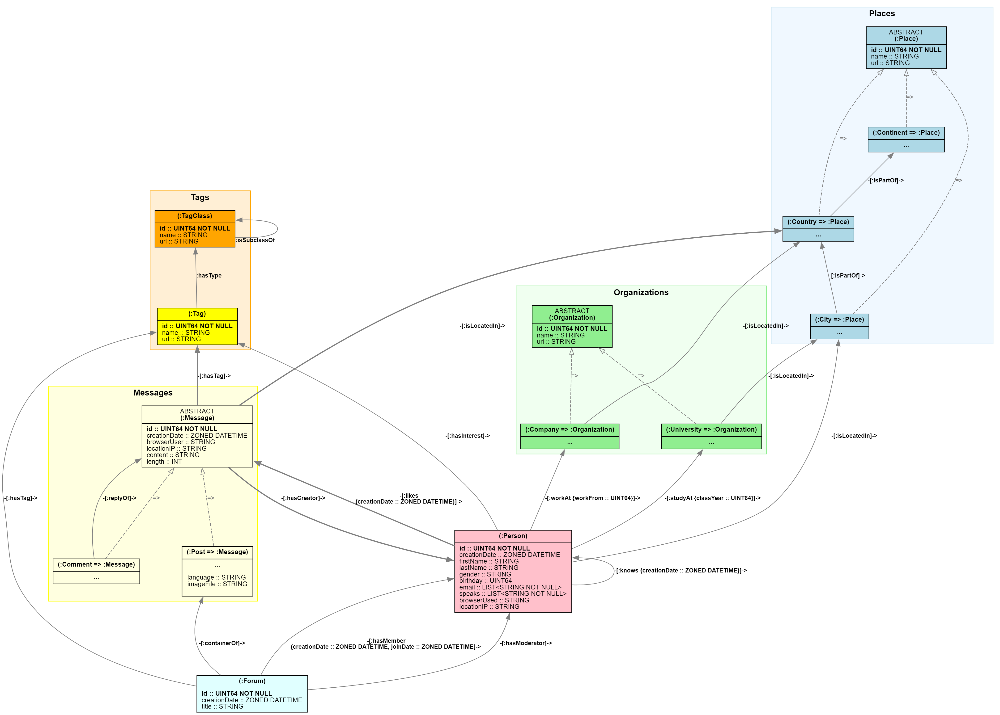

# GQL language guide

GQL (Graph Query Language) is the ISO-standardized query language for graph databases. It helps you query and work with graph data efficiently. The same international working group that oversees SQL develops GQL, so you'll see familiar syntax if you already know SQL.

This guide serves both newcomers learning GQL fundamentals and experienced users seeking advanced techniques and comprehensive reference information.

> [!NOTE]
> The official International Standard for GQL is [ISO/IEC 39075 Information Technology - Database Languages - GQL](https://www.iso.org/standard/76120.html).

## What makes GQL special

GQL is designed specifically for graph data, making it natural and intuitive to work with connected information. Unlike SQL, which works with tables and joins, GQL lets you describe the shape of data relationships using visual patterns that mirror how you think about connected data.

Here's a simple query that shows GQL's visual approach:

```gql
MATCH (person:Person)-[:knows]-(friend:Person)
WHERE person.age > 25 AND friend.age > 25
RETURN person.name, friend.name
```

This query finds friends (people who know each other) who're both older than 25. The pattern `(person:Person)-[:knows]-(friend:Person)` visually shows the relationship structure you're looking for—much like drawing a diagram of your data.

## GQL fundamentals

Before diving into queries, understand these core concepts that form the foundation of GQL:

- **Graphs** store your data as nodes (entities) and edges (relationships) with labels and properties
- **Graph types** act like schemas, defining what nodes and edges can exist in your graph
- **Constraints** are additional restrictions imposed by graph types on graphs
- **Queries** use statements like `MATCH`, `FILTER`, and `RETURN` to process data and show results
- **Patterns** describe the graph structures you want to find using intuitive visual syntax
- **Expressions** perform calculations and comparisons on your data, similar to SQL expressions
- **Predicates** are boolean value expressions that are used to filter data 
- **Value types** define what kinds of values you can process and store

## Understanding graph data

To work effectively with GQL, you need to understand how graph data is structured. This foundation will help you write better queries and model your data effectively.

### Nodes and edges: the building blocks

In GQL, you work with labeled property graphs. A graph consists of two types of elements:

**Nodes** typically represent the entities (the "nouns") in your system—things like people, organizations, posts, or products. They're independent objects that exist in your domain. Nodes are sometimes also called vertices.

**Edges** represent relationships between entities (the "verbs")—how your entities connect and interact. For example, which people know each other, which organization operates in which country, or who purchased which product. Edges are sometimes also called relationships.

Every graph element has these characteristics:

- An **internal ID** that uniquely identifies it
- **One or more labels**—descriptive names like `Person` or `knows`. Edges always have exactly one label in graph for Microsoft Fabric.
- **Properties**—name-value pairs that store data about the element

### How graphs are structured

Each edge connects exactly two nodes: a source and a destination. This creates the graph's structure and shows how entities relate to each other. Edge direction matters—a `Person` who `follows` another `Person` creates a directed relationship.

GQL graphs are always well-formed, meaning every edge connects two valid nodes. If you see an edge in a graph, both its endpoints exist in the same graph.

### Graph models and graph types

The structure of a graph in Microsoft Fabric is described by its **graph model**, which acts like a database schema for your application domain. Graph models define:

- Which nodes and edges can exist
- What labels and properties they can have
- How nodes and edges can connect

Graph models also ensure data integrity through constraints, especially **node key constraints** that specify which properties uniquely identify each node.

> [!NOTE] 
> Graph models can be specified using GQL standard syntax, in which case they're called [graph types](gql-graph-types.md).

## A practical example: social network

Throughout this documentation, we use a social network example to illustrate GQL concepts. Understanding this domain will help you follow the examples and apply similar patterns to your own data.



### The social network entities

Our social network includes these main kinds of nodes, representing entities of the domain:

**People** have personal information like names, ages, and birthdays. They live in cities and form social connections.

**Places** form a geographic hierarchy:
- **Cities** like "New York" or "London"  
- **Countries/regions** like "United States" or "United Kingdom"
- **Continents** like "North America" or "Europe"

**Organizations** where people spend time:
- **Universities** where people study
- **Companies** where people work

**Content and discussions:**
- **Forums** with titles that contain posts
- **Posts** with content, language, and optional images
- **Comments** that reply to posts or other comments
- **Tags** that categorize content and represent interests

### How everything connects

The connections between entities make the network interesting:
- People know each other (friendships)
- People work at companies or study at universities
- People create posts and comments
- People like posts and comments
- People have interests in specific tags
- Forums contain posts and have members and moderators

Domain relationships are represented by graph edges. This rich network creates many opportunities for interesting queries and analysis.

> [!div class="nextstepaction"]
> [View complete schema specification](gql-schema-example.md)

## Your first GQL queries

Now that you understand graph basics, let's see how to query graph data using GQL. These examples build from simple to complex, showing you how GQL's approach makes graph queries intuitive and powerful.

### Basic query structure

Basic GQL queries all follow a simple pattern: a sequence of statements that work together to find, filter, and return data. Most queries start with `MATCH` to find patterns in the graph and end with `RETURN` to specify what data you want back.

Here's a simple query:

```gql
MATCH (n:Person)-[:knows]-(m:Person)
FILTER n.age = m.age
RETURN count(*) AS same_age_friends
```

This query works step by step:

1. **`MATCH`** finds all pairs of `Person` nodes that know each other
2. **`FILTER`** keeps only the pairs where both people have identical ages
3. **`RETURN`** counts how many such friend pairs exist

> [!TIP]
> Filtering can also be performed directly as part of a pattern (e.g., in `MATCH`) by appending a `WHERE` clause

### How statements work together

Statements in GQL work like a pipeline—each statement transforms the data from the previous statement. This makes queries easy to read because the execution order matches the reading order.

**Linear statement composition:**

In GQL, statements execute sequentially, where each statement processes the output from the previous statement. This creates a clear data flow that's easy to understand and debug:

```gql
-- Data flows: Match → Let → Filter → Order → Limit → Return
MATCH (p:Person)-[:workAt]->(c:Company)     -- Input: graph, Output: person-company pairs
LET revenue = c.annual_revenue              -- Input: pairs, Output: pairs + revenue
FILTER revenue > 1000000                    -- Input: pairs + revenue, Output: filtered pairs  
ORDER BY revenue DESC                       -- Input: filtered pairs, Output: sorted pairs
LIMIT 5                                     -- Input: sorted pairs, Output: top 5 pairs
RETURN p.name, c.name, revenue              -- Input: top 5 pairs, Output: result table
```

This linear composition ensures predictable execution and makes complex queries easier to understand step-by-step.

> [!TIP]
> GQL supports C-style `//` line comments, SQL-style `--` line comments, and C-style `/* */` block comments.

**Example with multiple statements:**

```gql
MATCH (p:Person)-[:workAt]->(c:Company)
LET fullName = p.firstName || ' ' || p.lastName  
FILTER c.name = 'Contoso'
ORDER BY fullName
LIMIT 10
RETURN fullName, c.location
```

This pipeline:
1. Finds people who work at companies
2. Creates full names by combining first and last names
3. Keeps only Contoso employees  
4. Sorts by full name
5. Takes the first 10 results
6. Returns names and company locations

### Variables connect your data

Variables (like `p`, `c`, and `fullName` above) carry data between statements. When you reuse a variable name, GQL automatically ensures it refers to the same data, creating powerful join conditions. Variables are sometimes also called binding variables.

Variables can be categorized in different ways.

As **pattern variables:**
- Always bound by matching [graph patterns](gql-graph-patterns.md).
- **Element variables** - **Node variables** or **edge variables** that bind to individual graph element reference values
- **Path variables** - bind to path values representing matched paths

According to their **degree of reference:**
- **Regular variables** - default case
- **Group list variables** - bind to lists of element reference values matched by variable-length patterns (see [Advanced Aggregation Techniques](#advanced-aggregation-techniques))

### Understanding query results

When you run a query, you get back:

- **A result table** with the data from your `RETURN` statement
- **Status information** showing whether the query succeeded

**Success status codes:**

| GQLSTATUS | Message                                      | When                                     |
|-----------|----------------------------------------------|------------------------------------------|
| 00000     | note: successful completion                  | Success with at least one row            |
| 00001     | note: successful completion - omitted result | Success with no table (currently unused) |
| 02000     | note: no data                                | Success with an empty table              |

Other status codes indicate errors or warnings that prevented the query from completing successfully.
See the [list of GQLSTATUS codes](#gqlstatus-codes) for details.

## Essential concepts and statements

This section covers the core building blocks you need to write effective GQL queries. Each concept builds toward practical query writing skills.

### Graph patterns: finding structure

Graph patterns are the heart of GQL queries. They let you describe the data structure you're looking for using intuitive, visual syntax that looks like the relationships you want to find.

**Simple patterns:**

```gql
(p:Person)-[:knows]->(f:Person)  -- Person knows another person
(:City)-[:isPartOf]->(:Country)  -- City is part of a country  
```

**Bounded variable-length patterns:**

```gql
(:Person)-[:knows]->{1,3}(:Person)  -- Friends up to 3 degrees away
```

**TRAIL patterns for cycle-free traversal:**

Use `TRAIL` patterns to prevent cycles during graph traversal, ensuring each node or edge is visited at most once:

```gql
-- Find paths without visiting the same person twice
MATCH TRAIL (start:Person)-[:knows]->{1,4}(end:Person)
WHERE start.name = 'Alice' AND end.name = 'Bob'

-- Find shortest acyclic paths in social networks
MATCH TRAIL (p:Person)-[e:knows]->{,5}(celebrity:Person WHERE celebrity.fame > 9000)
RETURN p.name, celebrity.name, count(e) AS distance
```

**Variable-length edge binding:**

In variable-length patterns, edge variables capture different information based on context:

```gql
-- Edge variable 'e' binds to a single edge for each result row
MATCH (p:Person)-[e:knows]->(friend:Person)
RETURN p.name, e.since, friend.name  -- e refers to one specific relationship

-- Edge variable 'edges' binds to a LIST of all edges in the path
MATCH (p:Person)-[edges:knows]->{2,4}(friend:Person)  
RETURN p.name, friend.name, char_length(edges) AS path_length  -- edges is a list
```

This distinction is crucial for understanding what data variable-length patterns return.

**Complex patterns with multiple relationships:**

```gql
MATCH (p:Person), (p)-[:workAt]->(c:Company), (p)-[:lives]->(city:City)
```

This pattern finds people along with both their workplace and residence, showing how one person connects to multiple other entities.

**Variable reuse creates powerful joins:**

```gql
-- Find coworkers: people who work at the same company
(c:Company)<-[:workAt]-(x:Person)-[:knows]-(y:Person)-[:workAt]->(c)
```

The reuse of variable `c` ensures both people work at the **same** company, creating an automatic join constraint. This is a key pattern for expressing "same entity" relationships.

**Label expressions for flexible matching:**

```gql
(:Person|Company)-[:isLocatedIn]->(p:City|Country)  -- OR with |
(:Place&City)                                       -- AND with &  
(:Person&!Company)                                  -- NOT with !
```

Label expressions let you match multiple node types in a single pattern, making your queries more flexible and reducing duplication.

> [!IMPORTANT]
> **Critical insight**: Variable reuse in patterns creates structural constraints. This is how you express complex graph relationships like "friends who work at the same company" or "people in the same city."

> [!div class="nextstepaction"]
> [Learn comprehensive pattern syntax and advanced techniques](gql-graph-patterns.md)

### Core statements

GQL provides specific statement types that work together to process your graph data step by step. Understanding these statements is essential for building effective queries.

#### `MATCH` statement

**Syntax:**

```gql
MATCH <graph pattern>, <graph pattern>, ... [ WHERE <predicate> ]
```

The `MATCH` statement finds graph patterns and forms the foundation of most queries. Understanding its capabilities enables sophisticated graph analysis.

**Basic matching:**

```gql
MATCH (p:Person)-[:workAt]->(c:Company)
WHERE c.name = 'Microsoft'
```

**Pattern predicates with WHERE:**

You can add filtering conditions directly to patterns using `WHERE` clauses. This provides inline filtering during pattern matching:

```gql
-- Filter nodes during pattern matching
MATCH (p:Person WHERE p.age > 30)-[:workAt]->(c:Company WHERE c.revenue > 1000000)

-- Filter edges during pattern matching  
MATCH (p:Person)-[w:workAt WHERE w.start_date > DATE('2020-01-01')]->(c:Company)

-- Combine pattern filtering with statement-level WHERE
MATCH (p:Person WHERE p.department = 'Engineering')-[:workAt]->(c:Company)
WHERE c.location = 'Seattle'
```

Pattern-level `WHERE` clauses are evaluated during pattern matching, potentially improving performance by reducing intermediate results.

**Multiple pattern matching with shared variables:**

```gql
MATCH (p:Person)-[:workAt]->(c:Company), 
      (p)-[:lives]->(city:City),
      (c)-[:locatedIn]->(city)
WHERE p.age > 30
```

This finds people over 30 who work at companies in the same city where they live.

**How matching works in detail:**

- If input columns overlap with pattern variables, they're joined using equality
- Input rows without matching patterns are discarded (inner join behavior)
- The `WHERE` clause filters matches after pattern matching completes
- Multiple patterns in one `MATCH` must share at least one variable

> [!IMPORTANT]
> **Restriction**: If this `MATCH` isn't the first statement, at least one input variable must join with a pattern variable. Multiple patterns must have one variable in common.

#### `LET` statement

**Syntax:**

```gql
LET <variable> = <expression>, <variable> = <expression>, ...
```

The `LET` statement creates computed variables and enables data transformation within your query pipeline.

**Basic variable creation:**

```gql
LET fullName = p.firstName || ' ' || p.lastName
```

**Complex calculations:**

```gql
LET totalCompensation = p.salary + p.bonus + p.equity,
    performanceScore = (p.reviewScore * 0.7) + (p.goalCompletion * 0.3)
```

**Key behaviors:**

- Expressions are evaluated for every input row
- Results become new columns in the output table
- Variables can only reference existing variables from previous statements
- Multiple assignments in one `LET` are evaluated in parallel (no cross-references)

#### `FILTER` statement  

**Syntax:**

```gql
FILTER [ WHERE ] <predicate>
```

The `FILTER` statement provides precise control over which data proceeds through your query pipeline.

**Basic filtering:**

```gql
FILTER p.age > 25 AND p.department = 'Engineering'
```

**Complex logical conditions:**

```gql
FILTER (p.department = 'Engineering' AND p.level >= 'Senior') 
  OR (p.department = 'Sales' AND p.quota_achievement > 1.2)
  OR p.executive_level = TRUE
```

**Null-aware filtering patterns:**

```gql
FILTER p.manager_id IS NOT NULL           -- Has a manager
  AND p.direct_reports > 0               -- Manages others
  AND coalesce(p.performance_rating, 0) >= 3.5  -- Good performance or no rating
```

> [!CAUTION]
> Remember that conditions involving null values return `UNKNOWN`, which filters out those rows. Use explicit `IS NULL` checks when you need null-inclusive logic.

#### `ORDER BY` statement

**Syntax:**

```gql
ORDER BY <expression> [ ASC | DESC ], <expression> [ ASC | DESC ], ...
```

**Multi-level sorting with computed expressions:**

```gql
ORDER BY p.department ASC,               -- Primary: by department
         p.level DESC,                   -- Secondary: by level (highest first)
         p.salary DESC,                  -- Tertiary: by salary (highest first)
         p.hire_date ASC                 -- Final: by tenure (longest first)
```

**Null handling in sorting:**

```gql
ORDER BY coalesce(p.performance_rating, 0) DESC  -- Treat NULL as 0
```

**Sorting behavior details:**

- Expressions are evaluated for each row, then rows are ordered by results
- Multiple sort keys create hierarchical ordering
- `NULL` is always treated as the smallest value in comparisons
- `ASC` (ascending) is the default order

#### `OFFSET` and `LIMIT` statements

**Syntax:**

```gql
  OFFSET <offset> [ LIMIT <limit> ]
| LIMIT <limit>
```

**Common patterns:**

```gql
-- Basic top-N query
ORDER BY p.salary DESC
LIMIT 10                                 -- Top 10 highest paid

-- Manual pagination for large result sets
ORDER BY p.employee_id                   -- Consistent ordering
OFFSET 100 LIMIT 25                      -- Page 5 (records 101-125)
```

> [!IMPORTANT]
> For predictable pagination results, always use `ORDER BY` before `OFFSET` and `LIMIT` to ensure consistent row ordering across queries.

#### `RETURN`: basic results

**Syntax:**

```gql
RETURN [ DISTINCT ] <expression> [ AS <alias> ], <expression> [ AS <alias> ], ...
[ ORDER BY <expression> [ ASC | DESC ], <expression> [ ASC | DESC ], ... ]
[ OFFSET <offset> ]
[ LIMIT <limit> ]
```

The `RETURN` statement produces your query's final output by specifying which data appears in the result table.

**Basic output:**

```gql
RETURN p.name, p.age, c.name AS company
```

**Using aliases for clarity:**

```gql
RETURN p.firstName AS first_name, 
       p.lastName AS last_name,
       c.name AS company_name
```

**Combine with sorting and top-k:**

```gql
RETURN p.name, p.age AS age, c.name AS company
ORRDER BY age ASC
LIMIT 10
```

**Duplicate handling with DISTINCT:**

```gql
-- Remove duplicate combinations
RETURN DISTINCT p.department, p.location, p.job_level
ORDER BY p.department, p.location, p.job_level

-- Distinct counting
RETURN count(DISTINCT p.manager_id) AS unique_managers,
       count(DISTINCT p.department) AS departments
```

#### `RETURN` with `GROUP BY`: grouped results

**Syntax:**

```gql
RETURN [ DISTINCT ] <expression> [ AS <alias> ], <expression> [ AS <alias> ], ...
GROUP BY <variable>, <variable>, ...
[ ORDER BY <expression> [ ASC | DESC ], <expression> [ ASC | DESC ], ... ]
[ OFFSET <offset> ]
[ LIMIT <limit> ]
```

Use `GROUP BY` to group rows by shared values and compute aggregate functions within each group.

**Basic grouping with aggregation:**

```gql
MATCH (p:Person)-[:workAt]->(c:Company)
RETURN c.name, 
       count(*) AS employee_count,
       avg(p.age) AS avg_age
GROUP BY c.name
ORDER BY employee_count DESC
```

**Multi-column grouping:**

```gql
LET department = p.department
LET location = p.location
RETURN department,
       location,
       count(*) AS employee_count,
       avg(p.salary) AS avg_salary,
       min(p.hire_date) AS first_hire,
       max(p.performance_rating) AS best_performance
GROUP BY department, location
ORDER BY avg_salary DESC
LIMIT 10
```

> [!NOTE]
> For advanced aggregation techniques including horizontal aggregation over variable-length patterns, see [Advanced Aggregation Techniques](#advanced-aggregation-techniques).

### Data types: working with values

GQL supports rich data types for storing and manipulating different kinds of information in your graph.

**Basic value types:**

- **Numbers**: `INT64`, `UINT64`, `DOUBLE` for calculations and measurements
- **Text**: `STRING` for names, descriptions, and textual data
- **Logic**: `BOOL` with three values: TRUE, FALSE, and UNKNOWN (for null handling)
- **Time**: `ZONED DATETIME` for timestamps with timezone information
- **Collections**: `LIST<T>` for multiple values, `PATH` for graph traversal results
- **Graph elements**: `NODE` and `EDGE` for referencing graph data

**Abstract node types:**

Graph types can define abstract node types that serve as base types for inheritance but cannot be instantiated directly:

```gql
-- Abstract base type (cannot be instantiated)
NODE TYPE Person ABSTRACT (
  id INT64,
  name STRING
)

-- Concrete types that inherit from abstract base
NODE TYPE Employee : Person (
  employee_id STRING,
  department STRING
)

NODE TYPE Customer : Person (
  customer_id STRING,
  membership_level STRING
)
```

Abstract types enable polymorphic queries where you can match against the base type to find all subtypes:

**Example literals:**

```gql
42                                     -- Integer
"Hello, graph!"                        -- String  
TRUE                                   -- Boolean
ZONED_DATETIME('2024-01-15T10:30:00Z') -- DateTime with timezone
[1, 2, 3]                              -- List of integers
```

**Critical null handling patterns:**

```gql
-- Equality with NULL always returns UNKNOWN
5 = NULL                              -- Returns UNKNOWN (not FALSE!)
NULL = NULL                           -- Returns UNKNOWN (not TRUE!)

-- Use IS NULL for explicit null testing
p.nickname IS NULL                    -- Returns TRUE if nickname is null
p.nickname IS NOT NULL                -- Returns TRUE if nickname has a value

-- COALESCE for null-safe value selection
coalesce(p.nickname, p.firstName, '???')  -- First non-null value
```

**Three-valued logic implications:**

```gql
-- In FILTER statements, only TRUE values pass through
FILTER p.age > NULL                  -- Removes rows where age is null
FILTER NOT (p.age > NULL)            -- Also removes rows (NOT UNKNOWN = UNKNOWN)

-- Use explicit null handling for inclusive filtering
FILTER p.age > 25 OR p.age IS NULL   -- Includes null ages
```

> [!CAUTION]
> Three-valued logic means `NULL = NULL` returns `UNKNOWN`, not `TRUE`. This affects filtering and joins. Always use `IS NULL` for null tests.

> [!div class="nextstepaction"]
> [Learn comprehensive type system details](gql-values-and-value-types.md)

### Expressions: transforming and analyzing data

Expressions let you calculate, compare, and transform data within your queries. They're similar to expressions in SQL but have been extended with additional features for the handling of graph data.

**Common expression types:**

```gql
p.age > 25                          -- Comparison  
p.firstName || ' ' || p.lastName    -- String concatenation
count(*)                            -- Aggregation
p.name IN ['Alice', 'Bob']          -- List membership
coalesce(p.nickname, p.firstName)   -- Null handling
```

**Complex predicate composition:**

```gql
-- Combine conditions with proper precedence
FILTER (p.age >= 18 AND p.age <= 65) AND (p.status = 'ACTIVE' OR p.vip = TRUE)

-- Use parentheses for clarity and correctness
FILTER p.department = 'Engineering' AND (p.level >= 'Senior' OR p.experience > 5)
```

**String pattern matching:**

```gql
-- Pattern matching with different operators
p.email CONTAINS '@company.com'      -- Substring search
p.name STARTS WITH 'John'            -- Prefix matching  
p.code ENDS WITH '_TEST'             -- Suffix matching

-- Case-insensitive operations
upper(p.name) = 'ALICE'              -- Convert to uppercase for comparison
```

**Built-in functions by category:**

- **Aggregate**: `count()`, `sum()`, `avg()`, `min()`, `max()` for summarizing data
- **String**: `char_length()`, `upper()`, `lower()`, `trim()` for text processing  
- **Graph**: `nodes()`, `edges()`, `labels()` for analyzing graph structures
- **General**: `coalesce()` for handling null values gracefully

**Operator precedence for complex expressions:**

1. Property access (`.`)
2. Multiplication/Division (`*`, `/`)  
3. Addition/Subtraction (`+`, `-`)
4. Comparison (`=`, `<>`, `<`, `>`, `<=`, `>=`)
5. Logical AND (`AND`)
6. Logical OR (`OR`)

> [!TIP]
> **Performance tip**: Use parentheses to make precedence explicit. Complex expressions are easier to read and debug when grouping is clear.

> [!div class="nextstepaction"]
> [Learn comprehensive expression syntax and all built-in functions](gql-expressions.md)

## Advanced query techniques

This section covers sophisticated patterns and techniques for building complex, efficient graph queries. These patterns go beyond basic statement usage to help you compose powerful analytical queries.

### Complex multi-statement composition

Understanding how to compose complex queries efficiently is crucial for advanced graph analytics.

**Multi-step pattern progression:**

```gql
-- Build complex analysis step by step
MATCH (company:Company)
MATCH (company)<-[:workAt]-(employee:Person)
MATCH (employee)-[:lives]->(city:City)
LET avgSalary = avg(employee.salary)
FILTER avgSalary > 75000
RETURN company.name, city.name, avgSalary, count(employee) AS employeeCount
ORDER BY avgSalary DESC
```

This query progressively builds complexity: find companies, their employees, employee locations, calculate average salaries, filter high-paying companies, and summarize results.

**Use of horizontal aggregation:**

```gql
-- Find people and their minimum distance to celebrities
MATCH (p:Person)
MATCH TRAIL (p)-[e:knows]->{,5}(c:Person WHERE c.fame > 9000)
LET p_name = p.lastName || ', ' || p.firstName
LET c_name = c.lastName || ', ' || c.firstName
LET distanceToCelebrity = count(e)
RETURN p_name, c_name, min(distanceToCelebrity) AS minCelebrityDistance 
GROUP BY p_name, c_name
ORDER BY minCelebrityDistance DESC
```

### Variable scope and advanced flow control

Variables connect data across query statements and enable complex graph traversals. Understanding advanced scope rules helps you write sophisticated multi-statement queries.

**Variable binding and scoping patterns:**

```gql
-- Variables flow forward through subsequent statements
MATCH (p:Person)                     -- Bind p
LET fullName = p.firstName || ' ' || p.lastName  -- p available, bind fullName
FILTER fullName CONTAINS 'Smith'     -- Both p and fullName available
RETURN p.id, fullName                -- Both still available initially but `RETURN` will discard `p`
```

**Variable reuse for joins across statements:**

```gql
-- Multi-statement joins using variable reuse
MATCH (p:Person)-[:workAt]->(:Company)          -- Find people with jobs
MATCH (p)-[:lives]->(:City)                     -- Same p: people with both job and residence
MATCH (p)-[:knows]->(friend:Person)             -- Same p: their social connections
```

**Critical scoping rules and limitations:**

```gql
-- ✅ Forward references work
MATCH (p:Person)
LET adult = p.age >= 18              -- Can reference p from previous statement

-- ❌ Backward references don't work  
LET adult = p.age >= 18              -- Error: p not yet defined
MATCH (p:Person)

-- ❌ Variables in same statement can't reference each other
LET name = p.firstName || ' ' || p.lastName,
    greeting = 'Hello, ' || name     -- Error: name not visible yet

-- ✅ Use separate statements for dependent variables
LET name = p.firstName || ' ' || p.lastName
LET greeting = 'Hello, ' || name     -- Works: name now available
```

**Variable visibility in complex queries:**

```gql
-- Variables remain visible until overridden or query ends
MATCH (p:Person)                     -- p available from here
LET department = p.department        -- department available from here  
MATCH (p)-[:manages]->(e:Person)     -- p still refers to original person
                                     -- e is new variable for managed employee
RETURN p.name AS manager, e.name AS employee, department
```

> [!CAUTION]
> Variables in the same statement can't reference each other (except in graph patterns). Use separate statements for dependent variable creation.

### Advanced Aggregation Techniques

GQL supports two distinct types of aggregation for analyzing data across groups and collections: vertical aggregation with `GROUP BY` and horizontal aggregation over variable-length patterns.

#### Vertical aggregation with GROUP BY

Vertical aggregation (covered in [`RETURN` with `GROUP BY`](#return-with-group-by-grouped-results)) groups rows by shared values and computes aggregates within each group:

```gql
MATCH (p:Person)-[:workAt]->(c:Company)
RETURN c.name, 
       count(*) AS employee_count, 
       avg(p.age) AS avg_age
GROUP BY c.name
```

This creates one result row per company, aggregating all employees within each group.

#### Horizontal aggregation with group list variables

Horizontal aggregation computes aggregates over collections from variable-length patterns. When you use variable-length edges, the edge variable becomes a **group list variable** that holds all edges in each matched path:

```gql
-- Group list variable 'edges' enables horizontal aggregation
MATCH (p:Person)-[edges:knows]->{2,4}(friend:Person)
RETURN p.name, 
       friend.name,
       size(edges) AS degrees_of_separation,
       avg(edges.strength) AS avg_connection_strength,
       min(edges.creationDate) AS oldest_connection
```

**Key differences:**
- **Vertical aggregation** groups rows and summarizes across groups
- **Horizontal aggregation** summarizes elements within individual path collections
- Group list variables only come from variable-length edge patterns

#### Variable-length edge binding contexts

Understanding how edge variables bind in variable-length patterns is crucial:

**During pattern matching (singleton context):**
```gql
-- Edge variable 'e' refers to each individual edge during filtering
MATCH (p:Person)-[e:knows WHERE e.strength > 0.8]->{2,4}(friend:Person)
-- 'e' is evaluated for each edge in the path during matching
```

**In result expressions (group context):**
```gql
-- Edge variable 'edges' becomes a list of all qualifying edges
MATCH (p:Person)-[edges:knows]->{2,4}(friend:Person)
RETURN size(edges) AS path_length,           -- Number of edges in path
       edges[0].creationDate AS first_edge,  -- First edge in path
       avg(edges.strength) AS avg_strength   -- Horizontal aggregation
```

#### Combining vertical and horizontal aggregation

You can combine both aggregation types in sophisticated analysis patterns:

```gql
-- Find average connection strength by city pairs
MATCH (p1:Person)-[:livesIn]->(c1:City)
MATCH (p2:Person)-[:livesIn]->(c2:City)
MATCH (p1)-[edges:knows]->{1,3}(p2)
RETURN c1.name AS city1,
       c2.name AS city2,
       count(*) AS connection_paths,              -- Vertical: count paths per city pair
       avg(size(edges)) AS avg_degrees,           -- Horizontal then vertical: path lengths
       avg(avg(edges.strength)) AS avg_strength   -- Horizontal then vertical: strengths
GROUP BY c1.name, c2.name
```

> [!TIP]
> Horizontal aggregation always takes precedence over vertical aggregation. To convert a group list into a regular list, use `collect_list(edges)`.

> [!NOTE]  
> For detailed aggregate function reference, see [GQL expressions and functions](gql-expressions.md#aggregate-functions).

### Performance patterns and query optimization

These patterns help you write efficient queries that scale well with large graphs.

**Efficient pattern ordering:**

```gql
-- ✅ Start with selective patterns
MATCH (c:Company)                    -- Start with smaller node set
WHERE c.name = 'Microsoft'           -- Apply filters early
MATCH (c)<-[:workAt]-(p:Person)      -- Then expand to related nodes

-- ❌ Avoid starting with large, unfiltered sets
MATCH (p:Person)                     -- Large initial set
MATCH (p)-[:workAt]->(c:Company)     -- Expensive expansion
WHERE c.name = 'Microsoft'           -- Filter applied late
```

**Strategic use of aggregation:**

```gql
-- Group and aggregate early to reduce data volume
MATCH (p:Person)-[:workAt]->(c:Company)
LET department = p.department
RETURN department, 
       count(*) AS employee_count,
       avg(p.salary) AS avg_salary
GROUP BY department
ORDER BY avg_salary DESC
LIMIT 10
```

**Minimize variable carrying:**

```gql
-- ✅ Only keep variables you need
MATCH (p:Person)-[:workAt]->(c:Company)
LET companyInfo = c.name || ' (' || c.location || ')'
RETURN p.name, companyInfo           -- Only return what's needed

-- ❌ Carrying unnecessary graph elements
RETURN p, c                          -- Carries full node structures
```

### Error handling strategies

Understanding common error patterns helps you write robust queries.

**Handle missing data gracefully:**

```gql
-- Use COALESCE for missing properties
LET displayName = coalesce(p.nickname, p.firstName, 'Unknown')
LET contact = coalesce(p.email, p.phone, 'No contact info')
```

<!-- **Validate data expectations:**

```gql
-- Check for required relationships
MATCH (p:Person)
FILTER EXISTS((p)-[:workAt]->(:Company))  -- Only people with jobs
```
-->

**Use explicit null checks:**

```gql
-- Be explicit about null handling
FILTER p.salary IS NOT NULL AND p.salary > 50000
-- Instead of just: FILTER p.salary > 50000
```

## Additional information

### GQLSTATUS codes

The following GQLSTATUS codes are used by graph in Microsoft Fabric:

| GQLSTATUS | Message                                                       |
|-----------|---------------------------------------------------------------|
| 00000     | note: successful completion                                   |
| 00001     | note: successful completion - omitted result                  |
| 02000     | note: no data                                                 |
| 22000     | error: data exception                                         |
| 42000     | error: syntax error or access rule violation                  |
| G2000     | error: graph type violation                                   |

### Reserved words

GQL reserves certain keywords that you can't use as identifiers like variables, property names, or label names. See [GQL reserved words](gql-reference-reserved-terms.md) for the complete list.

If you need to use reserved words as identifiers, escape them with backticks: `` `match` ``, `` `return` ``.

To avoid escaping reserved words, use these naming conventions:
- For single-word identifiers, append an underscore: `:Product_`
- For multi-word identifiers, use camelCase or PascalCase: `:MyEntity`, `:hasAttribute`, `textColor`

## Related content

**Further details on key topics:**
- [GQL graph patterns](gql-graph-patterns.md) - Comprehensive pattern syntax and advanced matching techniques
- [GQL values and value types](gql-values-and-value-types.md) - Complete type system reference and value handling
- [GQL expressions and functions](gql-expressions.md) - All expression types and built-in functions
- [GQL graph types](gql-graph-types.md) - Graph types and constraints
- [Social network schema example](gql-schema-example.md) - Complete working example of graph schema

**Quick references:**
- [GQL abridged reference](gql-reference-abridged.md) - Syntax quick reference
- [GQL reserved words](gql-reference-reserved-terms.md) - Complete list of reserved keywords


**Graph for Microsoft Fabric:**
- [Graph data models](graph-data-models.md) - Understanding graph concepts and modeling
- [Graph and relational databases](graph-relational-databases.md) - Differences and when to use each
- [Try Microsoft Fabric for free](/fabric/fundamentals/fabric-trial)
- [End-to-end tutorials in Microsoft Fabric](/fabric/fundamentals/end-to-end-tutorials)