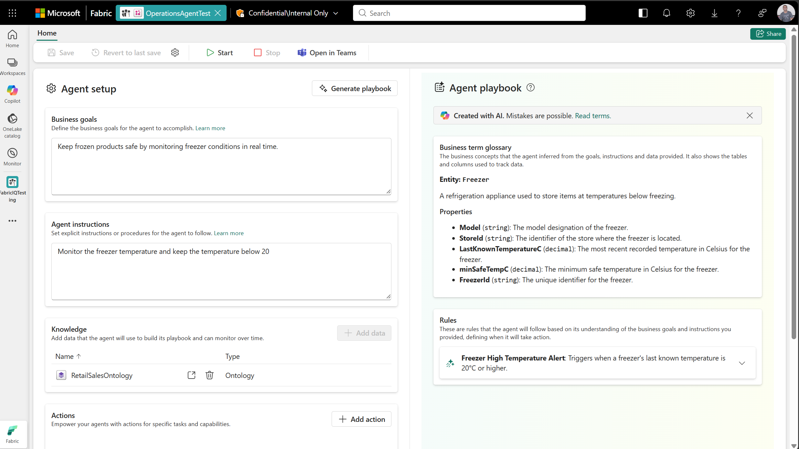

# Ontology (preview) tutorial: Create operations agent

Ontology (preview) integrates with [operations agent (preview)](https://learn.microsoft.com/fabric/real-time-intelligence/operations-agent) to continuously monitor your ontology, surface insights against your business goals, and recommend actions, all grounded in the ontology's entity types and relationships.

[!INCLUDE [Fabric feature-preview-note](../../includes/feature-preview-note.md)]

## Prerequisites

In addition to completing the previous tutorial parts, make sure you meet the [operations agent prerequisites](https://learn.microsoft.com/fabric/real-time-intelligence/operations-agent#prerequisites), including the Microsoft Teams account and tenant settings for operations agent, Microsoft Copilot, and Azure OpenAI.

## Create operations agent with ontology (preview) source

Follow these steps to create a new operations agent that monitors your ontology (preview) item. For full details on each setup field, see [Create an operations agent](https://learn.microsoft.com/fabric/real-time-intelligence/operations-agent#create-an-operations-agent).

1. In your Fabric workspace, select **+ New item** and create a new **Operations agent (preview)** item named *RetailOntologyOpsAgent*.

1. On the **Agent setup** page, fill in the following:

    * **Business goals**: Describe what the agent should optimize. For example: *Keep frozen products safe by monitoring freezer conditions in real time.*
    * **Instructions**: Add guidance for the agent's behavior. For example: *Monitor the freezer temperature and keep the temperature below 20.*
    * **Knowledge source**: Select **Add** and choose your *RetailSalesOntology* item.
    * **Actions** (optional): Define one or more actions the agent can recommend, such as *NotifyStoreOperatoins* with parameters like *StoreId* and *FreezerId*. If you add an action, configure it with an activator and Power Automate flow as described in [Configure an operations agent](https://learn.microsoft.com/fabric/real-time-intelligence/operations-agent#configure-an-operations-agent).

1. Save the agent to generate its **playbook**. Review the concepts and rules in the playbook and confirm they reference the expected ontology entity types (such as *Store*, *Product*, *Freezer*) and properties.

1. Select **Start** in the toolbar to start the agent.

## Receive notifications in Teams

Install the **Fabric Operations Agent** Teams app so the agent can contact you when it detects matching conditions in your ontology data. For details, see [Receive messages from an operations agent](https://learn.microsoft.com/fabric/real-time-intelligence/operations-agent#receive-messages-from-an-operations-agent).

When a recommendation arrives, review the context (which references ontology entity types, not raw tables), adjust any action parameters if needed, then select **Yes** to approve or **No** to reject.

## Next steps

In this tutorial, you created an operations agent grounded in your ontology and started receiving proactive, ontology-aware recommendations.

* [Operations agent overview](https://learn.microsoft.com/fabric/real-time-intelligence/operations-agent)
* [Operations agent limitations](https://learn.microsoft.com/fabric/real-time-intelligence/operations-agent-limitations)
