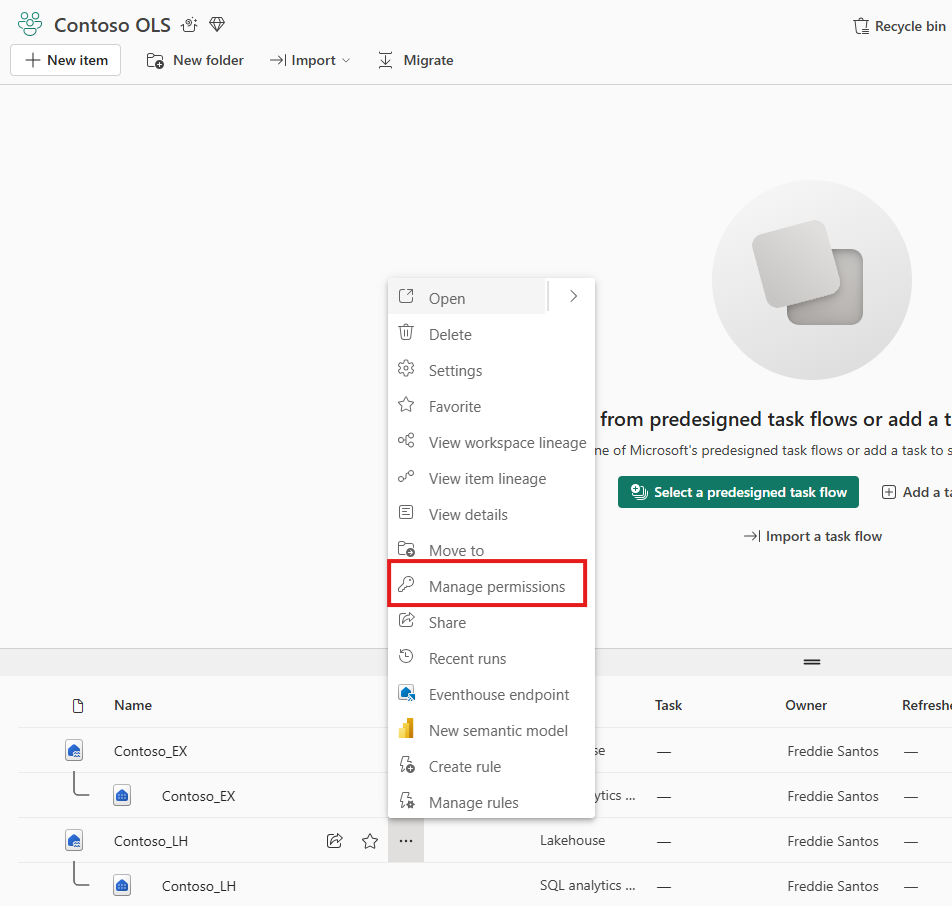
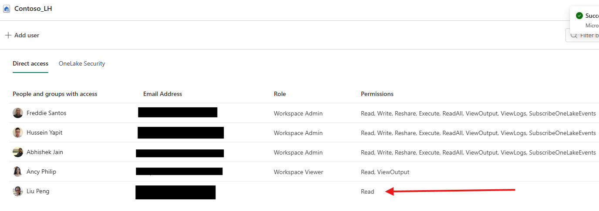
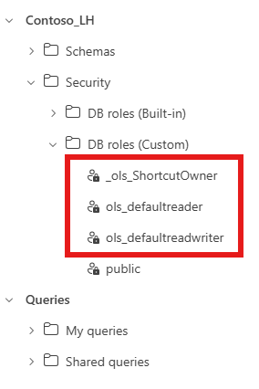
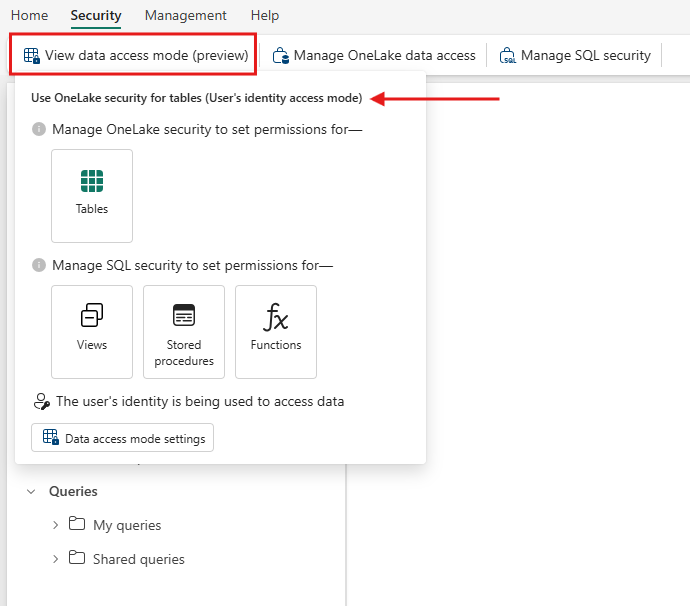
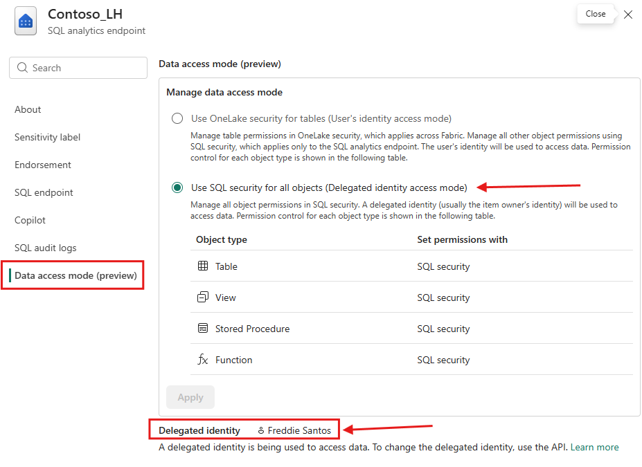
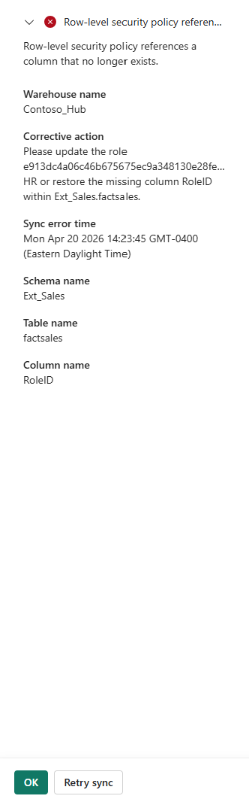
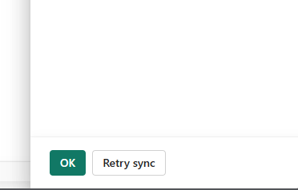

# Troubleshoot OneLake security for SQL analytics endpoints

This article provides step-by-step troubleshooting procedures and answers to common questions about OneLake security in the SQL analytics endpoint. Use this guide when you encounter unexpected access behavior, synchronization delays, or errors described in the [OneLake security for SQL analytics endpoints](./sql-analytics-endpoint-onelake-security.md) article.

The guide is organized in two sections:

- [**Troubleshooting guide**](#troubleshoot-onelake-security-for-sql-analytics-endpoints) — multi-step diagnostic procedures for complex issues that require systematic validation.
- [**Frequently asked questions**](#frequently-asked-questions) — quick answers, validation checks, and workarounds for specific limitations.

## Troubleshooting guide

### 1. User can't query a table in user identity mode

Use this procedure when an end user receives an access error or empty result set when querying a table that they should be able to read.

**Step 1:** Confirm the user has Fabric Read permission on the lakehouse.

The one-to-one identity mapping requirement means the user must have explicit Read access on the consumer lakehouse, not just membership in a OneLake security role.

- Open the lakehouse, select **Manage permissions** , and verify the user appears with at least Read permission.
- If the user is missing, add them directly or share the item with Read permission.



**Step 2:** Confirm the user's Object ID matches exactly at producer and consumer.

Nested or effective group membership isn't resolved across the producer → consumer boundary.

- If the OneLake security role references a **user** (for example, user@contoso.com), that same user must be directly granted Fabric Read on the consumer lakehouse.
- If the OneLake security role references a **group** , that same group must be directly granted Fabric Read on the consumer lakehouse. Granting the permission to an individual member of the group doesn't satisfy the match.

**Step 3:** Verify the user's workspace role and whether the table is a shortcut.

OneLake security filtering is designed for users accessing data as **Viewers** or through read-only item sharing. Users with **Admin, Member, or Contributor (AMC)** roles have data access granted by default at the workspace level, which means OneLake security policies may not be fully aligned or applied to them in the same way as Viewers.

Check the user's workspace role and whether the table being queried is a shortcut:

- **If the user is a Viewer (or has read-only sharing):** OneLake security filtering should apply. Continue to Step 4 to check sync status.
- **If the user has an AMC role and the table is** ***not*** **a shortcut:** Their elevated workspace access typically grants them broader visibility to the data than OneLake security rules would enforce on a Viewer. This behavior is expected, not a misconfiguration. If you need OneLake security to govern this user's access, either grant them access through Viewer-level or read-only sharing instead of AMC, or accept that data-level rules won't apply consistently to AMC users.
- **If the user has an AMC role and the table** ***is*** **a shortcut-backed table:** Enforcement may still apply, because shortcut access is evaluated against the source's OneLake security rules. The user's elevated role on the consumer workspace doesn't grant them elevated access at the producer. Verify the user has the required access at the source artifact, using the same Object ID match described in Step 2.
- **Other cases where AMC users may be filtered:** If security sync failed to apply roles correctly, AMC users who are members of affected roles can experience restricted access. Also, RLS configured in user identity mode is enforced for all users including AMC.

**Step 4:** Check security sync status.

Recent changes to OneLake security roles can take up to 5 minutes to propagate to the SQL analytics endpoint. You can speed this up and verify the sync directly in the UI.

- **Speed up propagation:** Select the **Metadata sync** button in the SQL analytics endpoint toolbar, or refresh the page. Either action triggers an immediate sync instead of waiting for the periodic cycle.
- **Verify the sync is working:** In **Object Explorer** , expand **Security** → **Roles** → **Database Roles** . Confirm that custom roles prefixed with OLS\_ are present. Each OLS\_ role corresponds to a OneLake security role that security sync has translated and applied to the SQL analytics endpoint.
- **If no OLS\_ roles appear after 5 minutes:** Security sync hasn't processed the OneLake roles yet. Continue to Step 5 to check for broken references, or see [Security sync appears stuck](#4-security-sync-appears-stuck) for deeper diagnostics.
- **If OLS\_ roles are present but the user still cannot query:** The sync is working, and the issue is likely in the user's role membership or identity match. Re-verify Steps 1 and 2.


**Step 5:** Validate that the role references aren't broken.

A role that references a deleted or renamed column or table puts the database into an error state in user identity mode.

- Compare the column and table names referenced in the OneLake security role to the current schema.
- If a column or table was renamed or dropped, update the role in the OneLake security panel of the lakehouse where the role was created.

### 2. Query works in Spark but returns different rows in SQL analytics endpoint

Use this procedure when the same data returns different results between engines.

**Step 1:** Identify the access mode of the SQL analytics endpoint.

Open the SQL analytics endpoint and check the **Security** tab for the current OneLake access mode.



**Step 2:** If the endpoint is in delegated identity mode, expect divergence.

Delegated mode doesn't honor OneLake security roles. Security rules defined in OneLake (which Spark enforces) don't apply when the same data is queried through the SQL analytics endpoint in delegated mode.

- To align SQL results with Spark, replicate the filtering using SQL constructs (RLS, CLS, DDM, GRANT/REVOKE) at the SQL engine layer.
- Alternatively, switch the endpoint to **user identity mode** so the end user's identity is passed through to OneLake and OneLake security rules are evaluated.

**Step 3:** If the endpoint is in user identity mode, verify role propagation.

First, confirm the OneLake security roles have synced to the SQL analytics endpoint. In **Object Explorer** , expand **Security** → **Roles** → **Database Roles** and check that the expected OLS\_-prefixed roles are present. If they're missing, see [Security sync appears stuck](#4-security-sync-appears-stuck) .


To verify which roles the user is a member of, run the following T-SQL against the SQL analytics endpoint:


```
SELECT

r.name AS RoleName,

m.name AS MemberName,

m.type\_desc AS MemberType

FROM sys.database\_role\_members drm

JOIN sys.database\_principals r

ON drm.role\_principal\_id = r.principal\_id

JOIN sys.database\_principals m

ON drm.member\_principal\_id = m.principal\_id

WHERE r.name = 'YourRoleName';
```


### 3. Shortcut query fails in delegated mode

Use this procedure when a query against a shortcut-backed table fails in delegated mode.

**Step 1:** Check whether the source table has OneLake-level security rules.

In delegated mode, shortcuts are blocked when the source table has any Row-Level Security (RLS), Column-Level Security (CLS), or Object-Level Security (OLS) defined in OneLake security. This is by design, to prevent the item owner from surfacing filtered data to unauthorized end users.

- Open the producer lakehouse and review its OneLake security roles.
- If data-level rules exist on the source, the shortcut can't be used in delegated mode.

**Step 2:** Choose a resolution path.

- **If you need OneLake-based filtering to apply:** Switch the consumer endpoint to **user identity mode** . The end user's identity is then passed to OneLake and evaluated against the source's security rules.
- **If you need delegated mode for SQL compatibility:** Remove the OneLake-level security rules at the source and reimplement equivalent filtering in SQL at the consumer endpoint using RLS, CLS, or DDM.

**Step 3:** Verify item owner permissions.

If the source table has no OneLake security rules but the query still fails, verify the item owner of the SQL analytics endpoint has sufficient OneLake access to read the source.

- Check the owner of the Lakehouse or SQL analytics endpoint.
- Confirm the owner has Fabric Read permission on both the source and destination artifacts.
- The owner can't be a service principal—if it is, reassign ownership to a user or group account.


### 4. Security sync appears stuck

Use this procedure when role changes made in OneLake security aren't reflected in the SQL analytics endpoint after more than 5 minutes.

**Step 1:** Check for broken policy references.

A policy referencing a deleted or renamed column, table, or invalid CLS allow list blocks metadata sync until corrected. An invalid CLS rule denies all access to the affected resource until the column name is restored or the rule is updated—see [My CLS policy shows "column doesn't exist" errors](#rls-and-cls-constraints) for how to identify and resolve this.

- Review recent schema changes (column renames, table renames, dropped columns) against existing OneLake security roles.
- Open the OneLake security panel of the source lakehouse and fix or remove any affected rules.


**Step 2:** Check for role complexity issues.

Highly complex roles—particularly with many intersections and union semantics using RLS—can cause security sync to fail.

- Simplify the role by splitting it into multiple smaller roles.
- Reduce the number of nested or overlapping expressions.

**Step 3:** Trigger a sync retry.

Security sync has a retry backoff that may temporarily pause automatic attempts after repeated errors. You have three ways to trigger a retry:

- **Metadata sync button:** Select the **Metadata sync** button in the SQL analytics endpoint toolbar to force an immediate sync.
- **Refresh the page:** Refreshing the SQL analytics endpoint page triggers a fresh sync attempt.

**Modify a role:** Modify an existing OneLake security role or create a new one. Either action resumes synchronization.

After triggering a retry, verify the result in **Object Explorer** under **Security** → **Roles** → **Database Roles** . If the expected OLS\_-prefixed roles now appear, security sync has successfully translated the OneLake security roles.



**Step 4:** If sync still fails, contact Microsoft Support.

Collect the following before opening a ticket: workspace ID, lakehouse/SQL analytics endpoint item ID, the OneLake security role names involved, the approximate time of the last successful sync, and any SQL error messages surfaced in the client.

### 5. Access changes in delegated mode aren't taking effect

Use this procedure when permission or security changes affecting the item owner (or the producer of a shortcut source) don't appear to propagate at the consumer in delegated mode.

This scenario is common when a shortcut-backed table at the consumer previously had full access, and the producer then introduces a new OneLake security role, filter, or restriction that narrows what the item owner can read at the source. Because delegated mode accesses OneLake using the item owner's cached storage access token, end users at the consumer may continue to see the previously visible data until the token refreshes.

***Step 1:** Determine which permission layer changed.*

- SQL GRANT/REVOKE or a SQL-defined security policy at the consumer: Changes apply on the next query execution. No cache delay.
- **Item owner's OneLake permissions at the producer (for shortcut-backed tables):** The item owner's storage access token is cached at the consumer. Previously issued tokens may remain valid until they expire, so users can continue to see restricted data for up to **30–60 minutes** .
- **New OneLake security role or filter created at the producer (affecting a shortcut source):** The restriction is evaluated against the item owner's identity when the storage access token is refreshed. Until the token refreshes, end users at the consumer may continue to see the full dataset—even though the producer now restricts the owner's access.
- **OneLake security membership changes (users added to or removed from existing roles at the producer):** These changes affect the enforcement path directly and aren't delayed by the consumer's storage token cache.

***Step 2:** Wait for token expiration.*

For owner-permission or producer-side policy changes on shortcut-backed tables, wait up to 30–60 minutes for the cached storage token to expire and be reissued against the new state.

***Step 3:** Force token refresh if the wait is unacceptable.*

If you can't wait for the token to expire, you can trigger a faster refresh by:

- **Pausing and resuming the Fabric capacity** that hosts the artifact. This clears backend caches and is the safest forced-refresh option.
- **Switching the consumer endpoint to user identity mode and back to delegated mode.** This invalidates cached tokens


> [!IMPORTANT]
> Both changes have significant side effects: switching modes or pausing the capacity removes existing SQL connections on any SQL Analytics Endpoint or Data Warehouse on the Workspace.


## Frequently asked questions

#### Permissions and identity

**Q: A user is in a OneLake security role but gets "no permission on the artifact" errors. Why?**

The user must have Fabric Read permission on the consumer artifact using the **same Object ID** that is referenced in the OneLake security role. Add the user (or group) directly to the lakehouse permissions. Nested group membership doesn't count.

**Q: I added a user to a group that already has access. Why can't they query?**

The consumer doesn't resolve nested or effective group membership. The identity granted at the producer must be recognized at the consumer as the same literal principal. Either grant Fabric Read to the user directly at the consumer, or ensure the group itself (not its members) is granted Fabric Read at the consumer.

**Q: Can I use a mail-enabled security group or distribution list?**

No. These identity types aren't supported. Use a standard security group or grant access to users directly.

**Q: Can the lakehouse owner be a service principal?**

No. Security sync doesn't work when the lakehouse owner is a service principal. Reassign ownership to a user or security group account.

**Q: Does the lakehouse owner need a specific workspace role?**

Yes. The owner must be a member of the Admin, Member, or Contributor workspace roles. Otherwise, security isn't applied to the SQL analytics endpoint.

#### Access modes and enforcement

**Q: Who does OneLake security filtering apply to?**

OneLake security policies (RLS, CLS, OLS) are designed to filter data for users accessing through **Viewer** role or **Read** permission sharing. Users with Admin, Member, or Contributor (AMC) roles have data access at the workspace level and generally see data unfiltered on local tables.

Important exceptions where filtering can still apply to AMC users:

- **Shortcut-backed tables** : Enforcement is evaluated at the producer (source). An AMC user at the consumer doesn't gain elevated access at the source—if their identity isn't granted at the producer, the shortcut can still deny or filter them.
- **RLS in user identity mode** : RLS rules configured in user identity mode are enforced for all users, including AMC roles. This is intentional.
- **Security sync failure cases** : If sync fails to apply roles correctly, AMC users who are members of affected roles may experience restricted access until the sync is resolved.

**Q: An Admin user sees unfiltered data on a local table but filtered data on a shortcut. Is that correct?**

Yes. Local tables grant AMC users broad visibility by design through their workspace role. Shortcut-backed tables are evaluated against the producer's OneLake security rules, and the consumer's AMC role doesn't grant them elevated access at the source. If the AMC user's identity isn't granted at the producer, the shortcut filters or denies them.

**Q: Why does the same user see different data in Spark versus SQL analytics endpoint?**

If the endpoint is in **delegated identity mode** , OneLake security roles aren't honored—only SQL permissions apply. To get consistent filtering across engines, either switch the endpoint to user identity mode, or replicate the OneLake rules as SQL RLS/CLS/DDM.

**Q: I have two OneLake security roles on the same table. One applies RLS; the other grants full access. RLS isn't working. Why?**

When a user is a member of multiple OneLake security roles on the same source, the **most permissive role wins—the broader role overrides the RLS restriction. Keep restrictive and permissive roles mutually exclusive if you need RLS to apply.

**Q: Can I use T-SQL GRANT/REVOKE to control table access in user identity mode?**

No. In user identity mode, table access is governed entirely by OneLake security. SQL GRANT/REVOKE on tables is ignored. You can still use SQL GRANT/REVOKE for views, stored procedures, and functions.

**Q: Can I write data through the SQL analytics endpoint in user identity mode?**

No. Write operations aren't supported at the SQL analytics endpoint in user identity mode. All writes must go through the Lakehouse page in the Fabric portal and are governed by workspace roles.

#### Shortcuts

**Q: My shortcut worked in user identity mode but fails after switching to delegated mode. Why?**

In delegated mode, shortcuts are blocked if the source table has RLS, CLS, or OLS defined in OneLake security. The endpoint connects as the item owner and can't evaluate per-user filtering at the source, so it fails closed to prevent unauthorized data exposure.

*Workaround:* Keep the consumer endpoint in user identity mode when sources have OneLake data-level security. Alternatively, remove the OneLake rules at the source and implement equivalent filtering in SQL at the consumer.

**Q: A shortcut target was renamed. Why are queries slow or blocked?**

When a shortcut target changes (rename, URL update), the database briefly enters single-user mode while the system validates the new target. Queries are blocked during this period. Validation typically completes quickly but can take up to 5 minutes.

*Workaround:* Wait for validation to complete. Avoid making shortcut target changes during peak query periods.

**Q: My query was canceled unexpectedly during a shortcut change. Why?**

Active queries may be automatically canceled if a shortcut configuration changes during execution. This protects data integrity and security. Retry the query after the shortcut change completes.

**Q: Data from a Warehouse accessed through a OneLake shortcut ignores my SQL RLS/CLS policies. Why?**

Warehouse SQL security constructs (RLS, CLS, OLS) are only enforced in the SQL execution context of the warehouse (TDS endpoint). When data is accessed through a OneLake shortcut, these SQL semantics aren't translated into OneLake security policies, so users accessing through the shortcut may see the full dataset.

*Workaround:* Apply equivalent OneLake security rules at the source lakehouse, or restrict access to the shortcut consumer.

#### Security sync and roles

**Q: I made a change to a OneLake security role. How long until it applies in SQL?**

Typically seconds, but up to 5 minutes. To speed this up, select the **Metadata sync** button in the SQL analytics endpoint toolbar or refresh the page—either triggers an immediate sync.

To verify the sync succeeded, open **Object Explorer** and expand **Security** → **Roles** → **Database Roles** . The expected OLS\_-prefixed roles should be visible. If the change hasn't applied after 5 minutes and OLS\_ roles are missing or stale, check for broken policy references or role complexity issues.

**Q: I see roles prefixed with OLS\_ in the SQL analytics endpoint. Can I modify them?**

No. OLS\_ roles are managed by the security sync process. Manual changes aren't supported and are overwritten on the next sync cycle. If there are no changes to sync, your manual changes may temporarily persist, but this behavior isn't reliable—don't depend on it.

**Q: My OneLake security role name is longer than 124 characters and fails to sync. What do I do?**

Rename the role to fit within the 124-character limit. There's no workaround for this limit at the SQL analytics endpoint.

**Q: I renamed a table and now my security policies don't apply to it. What happened?**

OneLake security roles are tied to the table name. Renaming a table breaks the association, and policies don't migrate automatically. Reapply the security policies to the renamed table to restore coverage.

*Workaround:* Before renaming a table, export or document the existing OneLake security rules. After renaming, recreate them against the new table name.

**Q: I dropped a column that was used in an RLS or CLS policy. What happens?**

Metadata synchronization stalls until the policy is fixed. In user identity mode, the database enters an error state for the affected rule. In delegated mode, you may see an *Invalid column name* error.

*Resolution:* Either restore the column, or update the affected role in the OneLake security panel of the source lakehouse.

**Q: Security sync appears to have stopped. What should I do?**

Security sync has a retry backoff that pauses automatic attempts after repeated errors. To resume sync, use any of the following:

- Select the **Metadata sync** button in the SQL analytics endpoint toolbar.
- Refresh the SQL analytics endpoint page.
- Modify an existing OneLake security role or create a new one.

After triggering a retry, verify in **Object Explorer** under **Security** → **Roles** → **Database Roles** that the expected OLS\_-prefixed roles are present. If they are, sync has resumed.

#### RLS and CLS constraints

**Q: Can I use Dynamic RLS or Multi-Table RLS in OneLake security?**

Only single-expression tables are supported. If you need Dynamic RLS or Multi-Table RLS, use delegated mode and define the policies using SQL CREATE SECURITY POLICY.

**Q: Can I use Dynamic Data Masking (DDM) in user identity mode?**

No. DDM isn't supported in OneLake security. Use delegated mode and define DDM using SQL ALTER TABLE with the MASKED option.

**Q: My CLS policy shows "column does not exist" errors. How do I fix it?**

CLS maintains a strict allow list of columns. If an allowed column is renamed or removed, the rule is invalidated and denies all access until the column naming is restored or the rule is updated.

*Resolution:* Either restore the original column name, or update the CLS rule in the OneLake security panel of the source lakehouse.

**Q: My complex role with many RLS intersections fails to sync. Why?**

Highly complex roles with numerous intersections and union semantics can exceed security sync's processing capacity and fail. A failed sync blocks metadata synchronization for the affected artifact.

*Workaround:* Simplify the role. Split a single complex role into multiple smaller roles with narrower scope. Reduce the number of overlapping or nested expressions.

#### Caching and propagation timing

**Q: I revoked an owner's OneLake access in delegated mode, but queries still succeed. Why?**

The SQL analytics endpoint caches the storage access token used on behalf of the item owner. A previously issued token may remain valid for up to 30–60 minutes until it expires.

*Workaround:* Wait for the token to expire. For immediate enforcement of access changes, use OneLake security GRANT/DENY policies, which are enforced immediately and not affected by storage token caching.

**Q: I switched from user identity mode to delegated mode. Why are old query results still being returned?**

When switching between security modes, cached queries may continue returning results based on the previous security state for up to 1 hour. Wait for the cache to invalidate, or issue new queries that weren't previously cached.

**Q: Does switching between security modes preserve my inline metadata objects?**

No. Switching between user identity and delegated modes (in either direction) currently removes inline metadata objects, including table-valued functions (TVFs) and scalar-valued functions. Underlying data in OneLake isn't affected.

*Workaround:* Before switching modes, script out your inline metadata objects. After switching, recreate them.

**Q: Switching modes deleted my existing SQL roles. Can I recover them?**

No. When switching to user identity mode, existing SQL roles are deleted and can't be recovered.

*Workaround:* Script out your SQL role definitions before switching modes so you can recreate them if you switch back to delegated mode.

**Related content**

- [OneLake security for SQL analytics endpoints (Preview)](./sql-analytics-endpoint-onelake-security.md)
- [Best practices to secure data in OneLake](./best-practices-secure-data-in-onelake.md)
- [OneLake security access control model](./data-access-control-model.md)