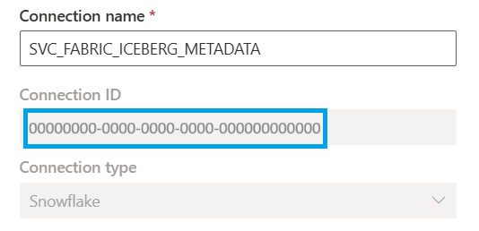
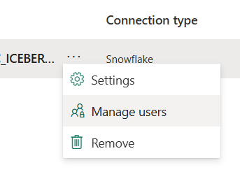

# Write Iceberg tables from Snowflake to OneLake (Preview)

> [!IMPORTANT]
> This feature is currently in **Public Preview**. Behavior may change before General Availability.

## Overview

You can configure a new or existing Snowflake database to automatically store Iceberg tables in Microsoft OneLake. This feature creates a new data item in Microsoft Fabric, and Iceberg tables that you create in Snowflake are stored there by default. With this capability, both Microsoft Fabric and Snowflake can work with a single copy of Iceberg data without duplication or movement.

This article shows you how to:
 - Allow connectivity between Snowflake and Fabric
 - Configure a new Snowflake database to write Iceberg tables to OneLake by default

## Prerequisites

1. Because this feature is in a Preview state, you first need to enable this setting at the **tenant** or **capacity** level.
   - Your tenant admin can enable the setting tenant-wide using the **"Enable Snowflake database item (preview)"** setting seen in the [Admin portal](../../admin/about-tenant-settings.md#how-to-get-to-the-tenant-settings).
   - Alternatively, your capacity admin can enable this delegated tenant setting in the [capacity settings area](../../admin/capacity-settings.md#view-your-capacity).
1. Select (or create) a Fabric workspace for the Snowflake database item.
   - To keep things simple, use alphanumeric characters only for your workspace name. 
   - If workspace name has special characters, copy the workspace ID from the browser URL seen when the workspace is open.  
   - You must have the Admin or Member role to proceed with this feature.
1. Find your Fabric tenant ID (a GUID) and your Snowflake account identifier.
   - You can find your Fabric tenant ID by selecting your profile in the top-right corner of the Fabric UI and hovering over the tenant information.
   - You can find your Snowflake account identifier in the lower-left corner of the Snowflake UI and selecting **Account details**.
1. Identify the Snowflake warehouse that should be used when Fabric communicates with Snowflake (for example, `COMPUTE_WH`).
1. Pick a strong password to assign to the new Snowflake user for Fabric to use when communicating with Snowflake.
   - This article assumes the connection to Snowflake will use a user account with a password. You may use the KeyPair authentication method alternatively.

## Create least-privileged user and role in Snowflake

In your Snowflake account, log in with a user that has an administrative role. 

1. Run the following SQL statements in Snowflake:

    ```sql
    -- Use a privileged role
    USE ROLE ACCOUNTADMIN;

    -- Create least-privilege role (if not exists)
    CREATE ROLE IF NOT EXISTS R_ICEBERG_METADATA;

    -- Create service user (adjust LOGIN_NAME / PASSWORD as needed)
    CREATE USER IF NOT EXISTS SVC_FABRIC_ICEBERG_METADATA
      TYPE = LEGACY_SERVICE
      LOGIN_NAME = 'SVC_FABRIC_ICEBERG_METADATA'
      DISPLAY_NAME = 'Service - Fabric Iceberg Metadata'
      PASSWORD = '<STRONG_PASSWORD_HERE>'
      MUST_CHANGE_PASSWORD = FALSE
      DEFAULT_ROLE = R_ICEBERG_METADATA;

    -- Grant role to user
    GRANT ROLE R_ICEBERG_METADATA TO USER SVC_FABRIC_ICEBERG_METADATA;

    -- Allow role to use an existing warehouse (adjust COMPUTE_WH as needed)
    GRANT USAGE ON WAREHOUSE COMPUTE_WH TO ROLE R_ICEBERG_METADATA;
    ```

1. Go to **Ingestion** > **Add data**.
1. Select **Microsoft OneLake**.
1. Enter your Fabric tenant ID (a GUID).
1. If prompted, click **Provide consent**.  
   - If prompted for permissions, review and accept (may require Entra admin). You may close the popup once complete.
1. Copy the multitenant app name displayed (used to write Iceberg tables to OneLake).
1. Keep this browser tab open.

## Prepare connection in Fabric

In a new browser tab:

1. Open [the Fabric web UI](https://app.fabric.microsoft.com/?experience=fabric-developer).
1. Go to **Settings** (top right) > **Manage connections and gateways**.
1. Select **+ New**.
1. Choose **Cloud connection**. Enter the following details:
   - **Connection type:** Snowflake
   - **Server:** `https://<accountIDpart1>-<accountIDpart2>.snowflakecomputing.com`
   - **Warehouse:** `COMPUTE_WH` (or your choice)
   - **Authentication method:** Snowflake
   - **Username:** `SVC_FABRIC_ICEBERG_METADATA` (unless customized)
   - **Password:** *Your chosen password*

1. Create the connection. If it fails, recheck the information from the previous section.

1. Copy the connection ID (GUID) from the connection page.

    

1. Filter the list of connections to see your new connection.
1. On that connection, select **Manage users**.

    

1. Grant access to the Snowflake multitenant app, then select **Share**.

   > [!NOTE]
   > If you granted consent in the previous section, it may take a few minutes for the multitenant app to appear in your search.
   
1. Navigate to your Fabric workspace.
1. Select **Manage access**, **Add people or groups**.
1. Paste the multitenant app name. Grant at least **Contributor** role to ensure the app can be used by Snowflake to create the data item and write data.

    

1. Keep this browser tab open.

## Establish connectivity in Snowflake

Continue the setup flow in Snowflake:

1. Enter the **Fabric workspace** name (if alphanumeric) or workspace ID.
1. Enter the **Fabric connection ID** that you copied in the previous section.
1. Provide a new **Snowflake database name** (for example, `SnowflakeFabricIcebergDB`).
   - If you choose to have the item name in Fabric differ, keep track of that item name.
1. Confirm that you see the message **"Fabric item and database successfully created."**
1. Continue, and acknowledge the configuration when prompted.
   - If you enter a custom external volume name, keep track of that name.
1. Select **Create volume**, then **View database**.
   - Confirm you see the new database.

1. Run the following SQL statements:
   - Replace `SnowflakeFabricIcebergDB` with your database name.

    ```sql
    -- Grant Iceberg metadata role permissions on the new database
    BEGIN
      LET db STRING := 'SnowflakeFabricIcebergDB';

      EXECUTE IMMEDIATE 'GRANT USAGE ON DATABASE ' || db || ' TO ROLE R_ICEBERG_METADATA';
      EXECUTE IMMEDIATE 'GRANT MONITOR ON DATABASE ' || db || ' TO ROLE R_ICEBERG_METADATA';
      EXECUTE IMMEDIATE 'GRANT USAGE ON ALL SCHEMAS IN DATABASE ' || db || ' TO ROLE R_ICEBERG_METADATA';
      EXECUTE IMMEDIATE 'GRANT USAGE ON FUTURE SCHEMAS IN DATABASE ' || db || ' TO ROLE R_ICEBERG_METADATA';
      EXECUTE IMMEDIATE 'GRANT SELECT ON ALL ICEBERG TABLES IN DATABASE ' || db || ' TO ROLE R_ICEBERG_METADATA';
      EXECUTE IMMEDIATE 'GRANT SELECT ON FUTURE ICEBERG TABLES IN DATABASE ' || db || ' TO ROLE R_ICEBERG_METADATA';
    END;

    GRANT USAGE ON EXTERNAL VOLUME SnowflakeFabricIcebergDB TO ROLE R_ICEBERG_METADATA;
    GRANT OWNERSHIP ON EXTERNAL VOLUME SnowflakeFabricIcebergDB TO ROLE R_ICEBERG_METADATA COPY CURRENT GRANTS;
    ```

You're done with setup! Proceed to create an Iceberg table and read it in Fabric.

## Create an Iceberg table in Snowflake

In Snowflake:

1. Run the following SQL statements to create an Iceberg table and populate it with data:

    ```sql
    -- Create a sample Iceberg table
    CREATE ICEBERG TABLE SnowflakeFabricIcebergDB.PUBLIC.SampleIcebergTable (
      id   INT,
      name STRING
    )
    CATALOG = 'SNOWFLAKE';

    -- Insert sample rows
    INSERT INTO SnowflakeFabricIcebergDB.PUBLIC.SampleIcebergTable VALUES
      (1, 'Alpha'),
      (2, 'Beta'),
      (3, 'Gamma');
    ```

1. Run the following SQL statement to read the Iceberg table in Snowflake:

    ```sql
    -- Display all rows in the Iceberg table
    SELECT * FROM SnowflakeFabricIcebergDB.PUBLIC.SampleIcebergTable;
    ```

## Read the Iceberg table in Fabric

In [the Fabric web UI](https://app.fabric.microsoft.com/?experience=fabric-developer):

1. Navigate to your workspace.
1. Locate the Snowflake database item. Refresh if needed.
1. Open it to see the Iceberg table from Part 4.
1. Select **SQL analytics endpoint** (top right) to query this table using SQL:

    ```sql
    -- Display all rows in the Iceberg table
    SELECT * FROM [SnowflakeFabricIcebergDB].[PUBLIC].[SampleIcebergTable];
    ```

You should see the same data displayed in both Snowflake and Fabric.

This data resides in OneLake, and both Fabric and Snowflake can work with the same copy of data, no data movement or duplication required!

## Alternative setup: Create Snowflake database item in Fabric

This guide walks through setting up connectivity to OneLake from the Snowflake UI as a starting point. As an alternative, you can establish connectivity by creating the Snowflake database Fabric item within the Fabric UI.

To do this, you first need to [follow the prerequisites](#prerequisites), [create the necessary user and role in Snowflake](#create-least-privileged-user-and-role-in-snowflake), and [prepare the connection in Fabric](#prepare-connection-in-fabric). Then you can follow the steps below to create the item in Fabric.

1. In the Snowflake UI, run the following code to create a new database and grant permissions to your role.
   - Replace `SnowflakeFabricIcebergDB` with your database name.

    ```sql
    -- Create new Snowflake database
    CREATE DATABASE SnowflakeFabricIcebergDB;
    
    -- Grant Iceberg metadata role permissions on the new database
    BEGIN
      LET db STRING := 'SnowflakeFabricIcebergDB';

      EXECUTE IMMEDIATE 'GRANT USAGE ON DATABASE ' || db || ' TO ROLE R_ICEBERG_METADATA';
      EXECUTE IMMEDIATE 'GRANT MONITOR ON DATABASE ' || db || ' TO ROLE R_ICEBERG_METADATA';
      EXECUTE IMMEDIATE 'GRANT USAGE ON ALL SCHEMAS IN DATABASE ' || db || ' TO ROLE R_ICEBERG_METADATA';
      EXECUTE IMMEDIATE 'GRANT USAGE ON FUTURE SCHEMAS IN DATABASE ' || db || ' TO ROLE R_ICEBERG_METADATA';
      EXECUTE IMMEDIATE 'GRANT SELECT ON ALL ICEBERG TABLES IN DATABASE ' || db || ' TO ROLE R_ICEBERG_METADATA';
      EXECUTE IMMEDIATE 'GRANT SELECT ON FUTURE ICEBERG TABLES IN DATABASE ' || db || ' TO ROLE R_ICEBERG_METADATA';
    END;
    ```

1. In the Fabric UI, navigate to your workspace.
1. Create a new item, and select the **Snowflake database** item type.
1. Select the Snowflake connection you previously created and proceed.
1. Select your Snowflake database in the creation flow.
1. Create your item.
1. In the browser URL, copy the second GUID, the ID of the new Fabric item.
1. Back in Snowflake, run the following to create the external volume object, update your database to write to OneLake by default, and grant the new role permissions on that external volume object.
   - Replace `SnowflakeFabricIcebergDB` with your database name, and provide the correct values for `WORKSPACE-ID`, `ITEM-ID`, and `FABRIC-TENANT-ID`.

    ```sql
    -- Create new external volume and set it as the default for the new database
    CREATE EXTERNAL VOLUME SnowflakeFabricIcebergDB
    STORAGE_LOCATIONS =
    (
       (
          NAME = 'SnowflakeFabricIcebergDB'
          STORAGE_PROVIDER = 'AZURE'
          STORAGE_BASE_URL = 'azure://onelake.dfs.fabric.microsoft.com/WORKSPACE-ID/ITEM-ID/SnowflakeVolume'
          AZURE_TENANT_ID = 'FABRIC-TENANT-ID'
       )
    );
    
    ALTER DATABASE SnowflakeFabricIcebergDB
    SET EXTERNAL_VOLUME = SnowflakeFabricIcebergDB;
    
    -- Grant the Iceberg metadata role permissions on the new external volume
    GRANT USAGE ON EXTERNAL VOLUME SnowflakeFabricIcebergDB TO ROLE R_ICEBERG_METADATA;
    GRANT OWNERSHIP ON EXTERNAL VOLUME SnowflakeFabricIcebergDB TO ROLE R_ICEBERG_METADATA COPY CURRENT GRANTS;
    ```

1. Back in the Fabric UI, ensure that your Snowflake item reports no errors and is ready for new tables to be written in Snowflake.

You can now proceed to [create your Iceberg tables in Snowflake](#create-an-iceberg-table-in-snowflake)!
