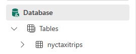
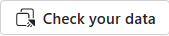
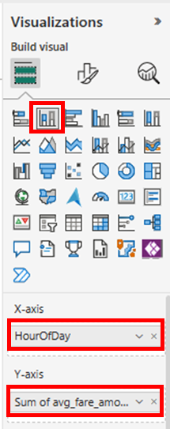
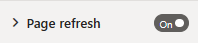

# Real-Time Analytics tutorial part 3: Explore data and build report

> [!NOTE]
> This tutorial is part of a series. For the previous section, see: [Tutorial part 2: Get data with Event streams](tutorial-2-event-streams.md)

## Explore data and build Power BI report

1.  Navigate to your Trident workspace, select your KQL Database.

2.  In the object tree, select the table **nytaxitrips**

> 

3.  In the top right corner, select **Check your data**.

> 

4.  Paste the following query in the query editor and select **Run**

> *//Calculate average fare amount by the hour of the day.*
>
> *nyctaxitrips*
>
> *\| summarize avg(fare_amount) by HourOfDay =
> hourofday(tpep_dropoff_datetime)*

5.  Select **Build Power BI Report.** Empty PowerBI report editing
    window will open.

6.  Select **Stacked Column Chart** in the Visualizations pane. Drag
    **HourOfDay** field to X-axis and **avg_fare_amount** to Y-axis

7.  Select **File** menu and then **Save** in the top left corner

> 

8.  Enter **nyctaxitripstats** in the **Name your file in Power BI**
    field, choose your workspace and choose sensitivity as **Public**.

9.  Once the report is saved, click on the link **Open the file in Power
    BI to view, edit, and get a shareable link**.

10. Click on **Edit** button to edit the Power BI report.

11. Choose **Format your report page**

> 

12. Toggle **Page Refresh** to **On**

> 

13. Expand **Page Refresh** and set the refresh interval to 10 seconds.
    Please note: Refresh interval will be limited by the Admin interval.
    Refresh interval can only be greater than or equal to the Admin
    interval.

14. Save your report.

With this tutorial, you have now built an auto-refreshing Power BI
report that is querying streaming data arriving in KQL Database from
Eventstream.

## Next steps

> [!div class="nextstepaction"]
> [Tutorial part 4: Enrich your data](tutorial-4-enrich-data.md)