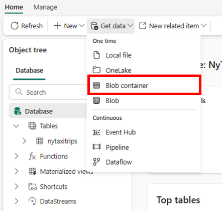
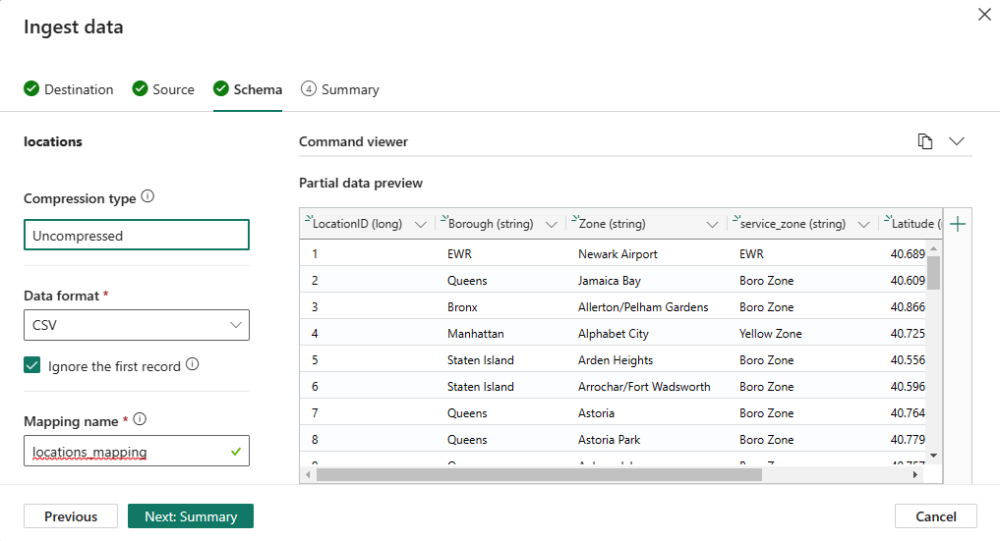
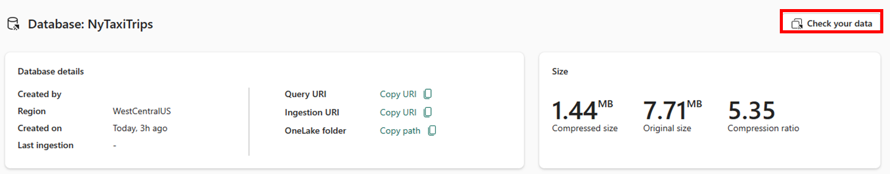
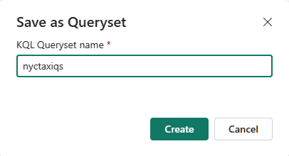

# Real-Time Analytics tutorial part 4: Enrich your data

This tutorial is part of a series. For the previous section, see:

> [!div class="nextstepaction"]
> [Tutorial part 3: Explore data and build report](tutorial-3-explore.md)

## Get dimension data from Blob Storage

In this module, you are going to ingest Location available in a blob
storage container. This data contains additional information on the
pick-up locations and drop-off locations used in the trips dataset.
Real-Time Analytics reads and ingests data directly from the blob
storage without requiring any other intermediary service.

1.  Navigate to KQL Database **NycTaxiDB**

2.  From within the KQL Database, select **Get Data** \> **Blob
    container**.

### Destination tab

In the **Destination** tab, **Database** is auto populated with the name
of the selected database.

3.  Under **Table**, make sure that **New table** is selected, and enter
    ***locations*** as your table name.

> 

4.  Select **Next: Source**.

### Source tab

In the **Source** tab, **Source type** is auto populated with **Blob
container**

1.  Fill out the remaining fields according to the following table:

  ------------------------------------------------------------------------------------------------------------------------------
  **Setting**   **Suggested value**                                                                **Field description**
  ------------- ---------------------------------------------------------------------------------- -----------------------------
  Ingestion     *One-time*                                                                         The type of data ingestion
  type                                                                                             that is intended with options
                                                                                                   being one-time and historical
                                                                                                   data.

  Link to       *https://azuresynapsestorage.blob.core.windows.net/sampledata/NYCTaxiLocations/*   SAS URI to the blob container
  source                                                                                           where the files are located

  Sample size   *Blank*                                                                            

  Folder path   Blank                                                                              

  File          Blank                                                                              
  extension                                                                                        

  Schema        Choose the first file                                                              
  defining file                                                                                    
  ------------------------------------------------------------------------------------------------------------------------------

2.  Select **Next: Schema**.

### Schema tab

The tool automatically infers the schema based on your data.

1.  Select **Next: Summary**.

### Summary tab

In the **Data ingestion is in progress** window, all steps will be
marked with green check marks when the data has been successfully
ingested. The data from Blob container will begin streaming
automatically into your table.

1.  Now that you've got data in your database, click on **Close**.
    you're going to check your data with sample queries.

## Query data

In the following step, you'll use the advanced data analysis
capabilities of Kusto Query language to query your telemetry data.

1.  Select **Check your data** on the right-hand side of your
    database-editor.

-   

    Note: The numbers in the screen capture above may look different in
    your database editor page.

2.  Let's take a look at the data itself. Paste the following query in
    **Check your data** window to take 10 random records from your data.

-   nyctaxitrips
        | take 10

3.  Select Run.

-   
4.  Select **Save as Query Set** to save this and future queries for
    later use.

5.  Under **KQL Queryset name**, enter *nyctaxiqs*, then select
    **Create**.

-   

    **'Check your data'** enables you to run some quick queries to
    understand your data. This query can be saved as a KQL Queryset and
    persisted in the workspace as an item. Query set autosaves the
    queries as you type them and lets you resume from the point where
    you had stopped. In the next module, you will work with the KQL
    Queryset. Saving the quick query as KQL Query Set will automatically
    open your **KQL Queryset** with the queries that you wrote in the
    query editor.

## Next steps

> [!div class="nextstepaction"]
> [Tutorial part 5: Explore the enriched data](tutorial-5-explore-enriched-data.md)