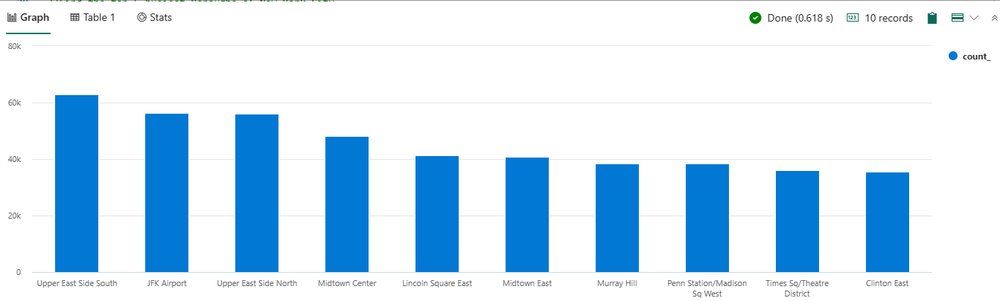

# Real-Time Analytics tutorial part 5: Explore your enriched data

This tutorial is part of a series. For the previous section, see:

> [!div class="nextstepaction"]
> [Tutorial part 4: Enrich your data](tutorial-4-enrich-data.md)

## Explore data further in the KQL Queryset

In this module, you are going to write queries using [Kusto Query
Language](https://learn.microsoft.com/en-us/azure/data-explorer/kusto/query/)
to explore the data that you have ingested from the Event hub and blob
storage. Kusto Query Language is a powerful tool to explore your data
and discover patterns, identify anomalies and outliers, create
statistical modeling, and more. The query uses schema entities that are
organized in a hierarchy similar to SQLs: databases, tables, and
columns. Kusto query is a read-only request to process data and return
results. The request is stated in plain text, using a data-flow model
that is easy to read, author, and automate. Kusto queries are made of
one or more query statements. You are going to write some simple Kusto
queries to get familiar with the language and discover its power and
simplicity.

Run the following queries in the new KQL Queryset you have created.
Copy/paste each query into your environment, select the query and then
select **Run**.

1.  The following query returns the top 10 pickup locations in New York
    City for Yellow Taxis.

-    //Top 10 pickup locations

        nyctaxitrips

        | summarize count() by PULocationID

        | top 10 by count_ 

    

    **Note**: Result of the query may not exactly match the screenshot
    provided as you are ingesting streaming data.

2.  We will run the same query as in the previous step with an addition
    of looking up the corresponding zones of the top 10 pickup locations
    by using the 'locations' table.

-    //For the same top 10 locations, lookup the NYC zones --> Top 10 zones

        nyctaxitrips

        | lookup (locations) on $left.PULocationID == $right.LocationID

        | summarize count() by Zone

        | top 10 by count_

        | render columnchart

```{=html}
<!-- -->
```

-   **Note**: Result of the query may not exactly match the screenshot
    provided as you are ingesting streaming data.

    

3.  Let's check anomalies in the tips that have been given by the
    customers in the Manhattan borough. Hover over the red dots to see
    the values.

-   //Find anomalies in the tips given by the customers 

        nyctaxitrips

        | lookup (locations) on $left.PULocationID==$right.LocationID

        | where Borough == "Manhattan"

        | make-series s1 = avg(tip_amount) on tpep_pickup_datetime from datetime(2022-06-01) to datetime(2022-06-04) step 1h

        | extend anomalies = series_decompose_anomalies(s1)

        | render anomalychart with (anomalycolumns=anomalies)

        Note: Result of the query may not exactly match the screenshot provided as you are ingesting streaming data.

    

4.  To ensure that the sufficient taxis are plying in the Manhattan
    borough, let's forecast the number of taxis needed per hour.

-   //Forecast the number of trips that will begin from Manhattan to line up the taxis in that borough

        nyctaxitrips

        | lookup (locations) on $left.PULocationID==$right.LocationID

        | where Borough == "Manhattan"

        | make-series s1 = count() on tpep_pickup_datetime from datetime(2022-06-01) to datetime(2022-06-08)+3d step 1h by PULocationID

        | extend forecast = series_decompose_forecast(s1, 24*3)

        | render timechart

        Note: Result of the query may not exactly match the screenshot provided below as you are ingesting streaming data.

    

## Next steps

> [!div class="nextstepaction"]
> [Tutorial part 6: Build a Power BI report](tutorial-6-build-report.md)