# Real-time Analytics

Real-time Analytics is a portfolio of capabilities that provides an
end-to-end analytics streaming solution across Trident experiences. It
supplies high velocity, low latency data analysis, and is optimized for
time-series data, including automatic partitioning and indexing of any
data format and structure, such as structured data, semi-structured
(JSON), and free text.

## Scenario

This tutorial is based on a *sample on New York Yellow Taxi trip data*.
The dataset contains trip records of New York's yellow taxis. The yellow
taxi trip records include fields capturing pick-up and drop-off
dates/times, pick-up and drop-off locations, trip distances, itemized
fares, rate types, payment types, and driver-reported passenger counts.
You'll use the streaming and query capabilities of Real-time Analytics
to answer key questions about the trip statistics, taxi demand in the
boroughs of New York and related insights.

In this tutorial, you learn how to:

-   Create a KQL Database
-   Create Eventstream
-   Stream data from Eventstream to KQL Database
-   Check your data with sample queries
-   Save queries as a KQL Queryset
-   Create a Power BI report
-   Create a OneLake shortcut

## Prerequisites

-   Power BI Premium subscription. For more information, see [How to
    purchase Power BI
    Premium](https://learn.microsoft.com/en-us/power-bi/enterprise/service-admin-premium-purchase).
-   Workspace

## Create a KQL Database

1.  In the upper left corner, select **New \> Show all** to display a
    full list of available items.

> 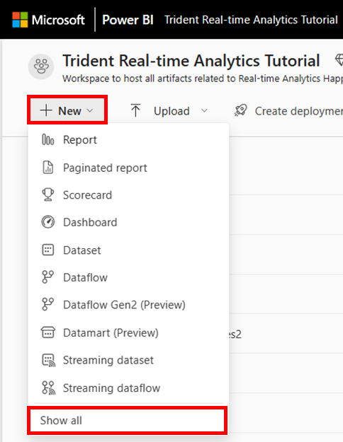

2.  In the **Real-time Analytics** section, select **KQL Database**.

> 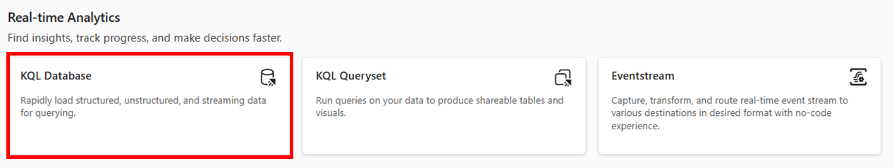

3.  On the **New KQL Database** dialog, enter a ***unique name***. 

4.  Select **Create**. 

> 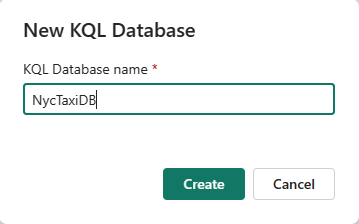

5.  When provisioning is complete the KQL database editor landing page
    will be shown.

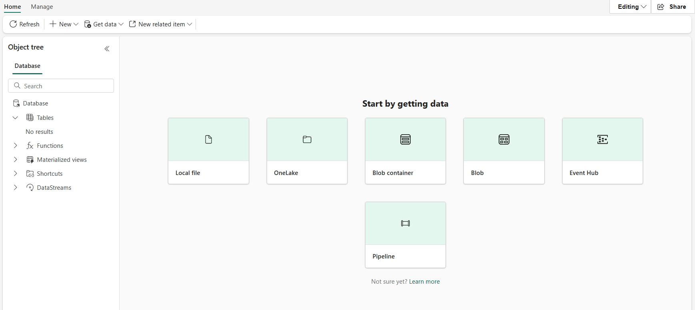

6.  Select the **Database** in the Object tree.

> 

7.  Select **Check your data**

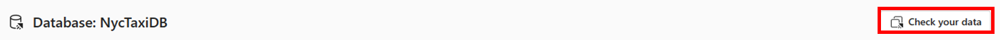

8.  Paste the following command, replace **NycTaxiDB** with your
    database's name and select **Run.**

> *//Command to enable mirroring policy on the database to mirror one
> logical copy in OneLake*
>
> *.alter-merge database NycTaxiDB policy mirroring \`\`\` {
> \'IsEnabled\' : true } \`\`\`*
>
> 

## Create an Eventstream

1.  Go back to Trident workspace home page, select **New \> Show all**
    to display a full list of available items


2.  In the **Real-time Analytics** section, select **Eventstream**

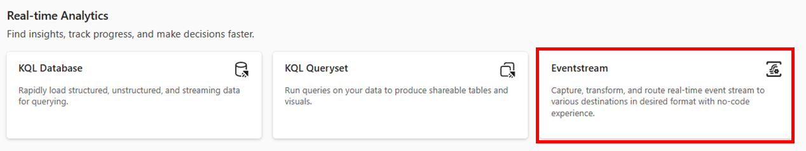

3.  On the New Eventstream dialog, enter NyTaxiTripsEventstream as the
    name.

> 

4.  Select **Create**.

5.  When provisioning is complete, Eventstream landing page will be
    shown.

> 

## Stream data from Eventstream to KQL Database

1.  In the Eventstream authoring area, select **New source** and choose
    **Sample data.**

> 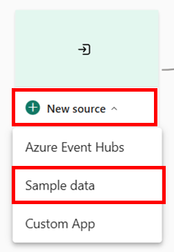

2.  Enter **nytaxitripsdatasource** as the Source Name, choose **Yellow
    Taxi** from Sample data dropdown.

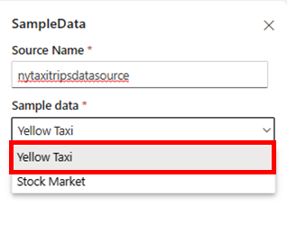

3.  Select **Create**.

4.  In the Eventstream authoring area, select **New destination** and
    choose **KQL Database.**

> 

5.  Enter **nytaxidatabase** as the destination name, choose your
    Trident workspace from the Workspace dropdown and then choose your
    KQL Database that you created above.

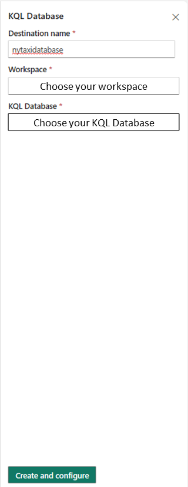

6.  Select **Create and configure.**

7.  In the **Destination** tab, select **New table** and enter
    **nyctaxitrips** as the table name.

> 


8.  Select **Next: Source**.

9.  In the **Source** tab, keep the default values, select **Next:
    Schema.**

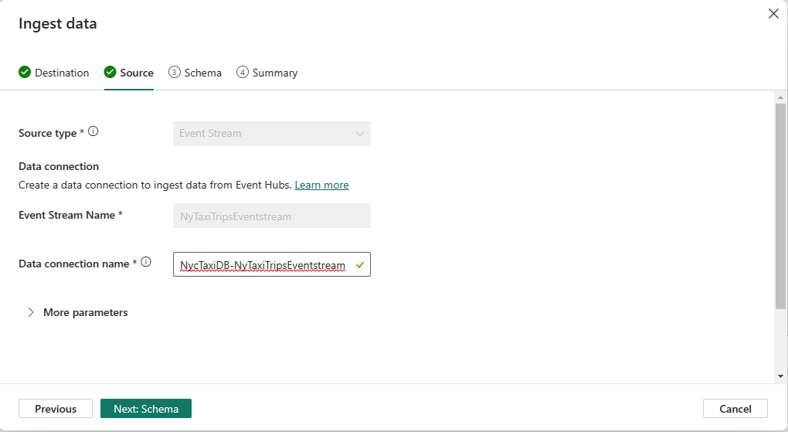

10. In the **Schema** tab, choose **JSON** as the Data format dropdown.

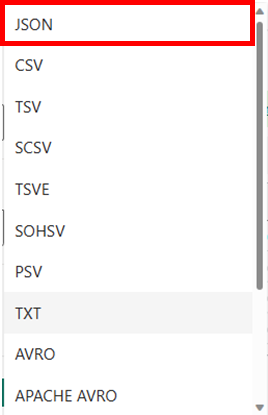

11. After choosing JSON as the Data format, data preview will refresh
    and show the data in strongly typed columns.


12. In this step, we will change data types of multiple columns.

    a.  Select
        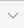

 next to VendorID column name,
        choose **Change data type**, and then choose **int.**


b.  As shown in the previous step, choose datatype as **long** for the
    columns passenger_count, PULocationID, DOLocationID and
    payment_type.

> 

c.  As shown in the previous step, choose datatype as **real** for the
    following columns: extra, mta_tax, tolls_amount,
    improvement_surcharge, congestion_charge, airport_fee,
    trip_distance, fare_amount, tip_amount, total_amount

> 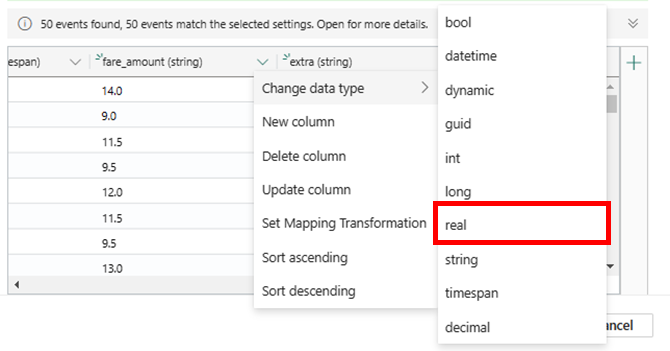

13. Select **Next: Summary**.

14. In the **Continuous ingestion from Event Stream established**
    window, all steps will be marked with green check marks when the
    data connection is successfully created. The data from Eventstream
    will begin streaming automatically into your table.


## Explore data and build Power BI report

1.  Navigate to your Trident workspace, select your KQL Database.

2.  In the object tree, select the table **nytaxitrips**

> 

3.  In the top right corner, select **Check your data**.

> 

4.  Paste the following query in the query editor and select **Run**

> *//Calculate average fare amount by the hour of the day.*
>
> *nyctaxitrips*
>
> *\| summarize avg(fare_amount) by HourOfDay =
> hourofday(tpep_dropoff_datetime)*

5.  Select **Build Power BI Report.** Empty PowerBI report editing
    window will open.

6.  Select **Stacked Column Chart** in the Visualizations pane. Drag
    **HourOfDay** field to X-axis and **avg_fare_amount** to Y-axis


7.  Select **File** menu and then **Save** in the top left corner

> 

8.  Enter **nyctaxitripstats** in the **Name your file in Power BI**
    field, choose your workspace and choose sensitivity as **Public**.

9.  Once the report is saved, click on the link **Open the file in Power
    BI to view, edit, and get a shareable link**.

10. Click on **Edit** button to edit the Power BI report.

11. Choose **Format your report page**

> 

12. Toggle **Page Refresh** to **On**

> 

13. Expand **Page Refresh** and set the refresh interval to 10 seconds.
    Please note: Refresh interval will be limited by the Admin interval.
    Refresh interval can only be greater than or equal to the Admin
    interval.


14. Save your report.

With this tutorial, you have now built an auto-refreshing Power BI
report that is querying streaming data arriving in KQL Database from
Eventstream.

[]{#_Toc132650968 .anchor}Module 3: Extending the real-time analytics
solution

## Get dimension data from Blob Storage

In this module, you are going to ingest Location available in a blob
storage container. This data contains additional information on the
pick-up locations and drop-off locations used in the trips dataset.
Real-time analytics reads and ingests data directly from the blob
storage without requiring any other intermediary service.

1.  Navigate to KQL Database **NycTaxiDB**

2.  From within the KQL Database, select **Get Data** \> **Blob
    container**.

### Destination tab

In the **Destination** tab, **Database** is auto populated with the name
of the selected database.

3.  Under **Table**, make sure that **New table** is selected, and enter
    ***locations*** as your table name.

> 

4.  Select **Next: Source**.

### Source tab

In the **Source** tab, **Source type** is auto populated with **Blob
container**


1.  Fill out the remaining fields according to the following table:

  ------------------------------------------------------------------------------------------------------------------------------
  **Setting**   **Suggested value**                                                                **Field description**
  ------------- ---------------------------------------------------------------------------------- -----------------------------
  Ingestion     *One-time*                                                                         The type of data ingestion
  type                                                                                             that is intended with options
                                                                                                   being one-time and historical
                                                                                                   data.

  Link to       *https://azuresynapsestorage.blob.core.windows.net/sampledata/NYCTaxiLocations/*   SAS URI to the blob container
  source                                                                                           where the files are located

  Sample size   *Blank*                                                                            

  Folder path   Blank                                                                              

  File          Blank                                                                              
  extension                                                                                        

  Schema        Choose the first file                                                              
  defining file                                                                                    
  ------------------------------------------------------------------------------------------------------------------------------

2.  Select **Next: Schema**.

### Schema tab

The tool automatically infers the schema based on your data.


1.  Select **Next: Summary**.

### Summary tab

In the **Data ingestion is in progress** window, all steps will be
marked with green check marks when the data has been successfully
ingested. The data from Blob container will begin streaming
automatically into your table.


1.  Now that you've got data in your database, click on **Close**.
    you're going to check your data with sample queries.

## Query data

In the following step, you'll use the advanced data analysis
capabilities of Kusto Query language to query your telemetry data.

1.  Select **Check your data** on the right-hand side of your
    database-editor.

-   

    Note: The numbers in the screen capture above may look different in
    your database editor page.

2.  Let's take a look at the data itself. Paste the following query in
    **Check your data** window to take 10 random records from your data.

-   nyctaxitrips
        | take 10

3.  Select Run.

-   
4.  Select **Save as Query Set** to save this and future queries for
    later use.

5.  Under **KQL Queryset name**, enter *nyctaxiqs*, then select
    **Create**.

-   

    **'Check your data'** enables you to run some quick queries to
    understand your data. This query can be saved as a KQL Queryset and
    persisted in the workspace as an item. Query set autosaves the
    queries as you type them and lets you resume from the point where
    you had stopped. In the next module, you will work with the KQL
    Queryset. Saving the quick query as KQL Query Set will automatically
    open your **KQL Queryset** with the queries that you wrote in the
    query editor.

## Explore data further in the KQL Queryset

In this module, you are going to write queries using [Kusto Query
Language](https://learn.microsoft.com/en-us/azure/data-explorer/kusto/query/)
to explore the data that you have ingested from the Event hub and blob
storage. Kusto Query Language is a powerful tool to explore your data
and discover patterns, identify anomalies and outliers, create
statistical modeling, and more. The query uses schema entities that are
organized in a hierarchy similar to SQLs: databases, tables, and
columns. Kusto query is a read-only request to process data and return
results. The request is stated in plain text, using a data-flow model
that is easy to read, author, and automate. Kusto queries are made of
one or more query statements. You are going to write some simple Kusto
queries to get familiar with the language and discover its power and
simplicity.

Run the following queries in the new KQL Queryset you have created.
Copy/paste each query into your environment, select the query and then
select **Run**.

1.  The following query returns the top 10 pickup locations in New York
    City for Yellow Taxis.

-    //Top 10 pickup locations

        nyctaxitrips

        | summarize count() by PULocationID

        | top 10 by count_ 

    

    **Note**: Result of the query may not exactly match the screenshot
    provided as you are ingesting streaming data.

2.  We will run the same query as in the previous step with an addition
    of looking up the corresponding zones of the top 10 pickup locations
    by using the 'locations' table.

-    //For the same top 10 locations, lookup the NYC zones --> Top 10 zones

        nyctaxitrips

        | lookup (locations) on $left.PULocationID == $right.LocationID

        | summarize count() by Zone

        | top 10 by count_

        | render columnchart

```{=html}
<!-- -->
```

-   **Note**: Result of the query may not exactly match the screenshot
    provided as you are ingesting streaming data.

    

3.  Let's check anomalies in the tips that have been given by the
    customers in the Manhattan borough. Hover over the red dots to see
    the values.

-   //Find anomalies in the tips given by the customers 

        nyctaxitrips

        | lookup (locations) on $left.PULocationID==$right.LocationID

        | where Borough == "Manhattan"

        | make-series s1 = avg(tip_amount) on tpep_pickup_datetime from datetime(2022-06-01) to datetime(2022-06-04) step 1h

        | extend anomalies = series_decompose_anomalies(s1)

        | render anomalychart with (anomalycolumns=anomalies)

        Note: Result of the query may not exactly match the screenshot provided as you are ingesting streaming data.

    

4.  To ensure that the sufficient taxis are plying in the Manhattan
    borough, let's forecast the number of taxis needed per hour.

-   //Forecast the number of trips that will begin from Manhattan to line up the taxis in that borough

        nyctaxitrips

        | lookup (locations) on $left.PULocationID==$right.LocationID

        | where Borough == "Manhattan"

        | make-series s1 = count() on tpep_pickup_datetime from datetime(2022-06-01) to datetime(2022-06-08)+3d step 1h by PULocationID

        | extend forecast = series_decompose_forecast(s1, 24*3)

        | render timechart

        Note: Result of the query may not exactly match the screenshot provided below as you are ingesting streaming data.

    

## Build Power BI report

A Power BI report is a multi-perspective view into a dataset, with
visuals that represent findings and insights from that dataset.

1.  Continuing the in same queryset, paste the following query. The
    output of this query will be used as the dataset for building the
    Power BI report.

>      //Find the total number of trips that started and ended at the same location
>
>     nyctaxitrips
>
>     | where PULocationID == DOLocationID
>
>     | lookup (locations) on $left.PULocationID==$right.LocationID
>
>     | summarize count() by Borough, Zone, Latitude, Longitude 

2.  Select the query and then select **Build Power BI report**.

-   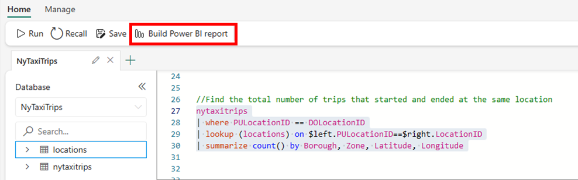
- 
    > Power BI report editor will open with the result of the query
    > available as a table with the name Kusto Query Result.

    > Note:

    > \(a\) When you build a report, a dataset is created and saved in
    > your workspace. You can create multiple reports from a single
    > dataset. (b) Result of the query may not exactly match the
    > screenshot provided below as you are ingesting streaming data.

    > If you delete the dataset, your reports will also be removed.

3.  In the report editor, choose **Azure Maps** as the visual, drag
    **Latitude** field to Latitude, **Longitude** field to Longitude,
    **Borough** field to Legend, and **count\_** field to Size.

-   

4.  Add a **Stacked Bar Chart** to the canvas. Drag **Borough** field to
    Y-Axis and **count\_** to the X-axis

> 

5.  Click File \> Save

6.  Under **Name your file in Power BI**, enter *nyc-taxi-maps-report*.

> 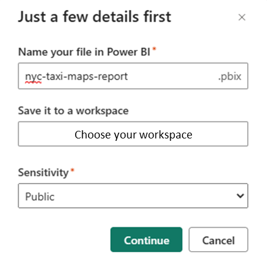

7.  Select the workspace in which you want to save this report. The
    report can be saved in a different workspace than the one you
    started in.

8.  Select the sensitivity label to apply to the report. For more
    information, see [sensitivity
    labels](https://learn.microsoft.com/en-us/power-bi/enterprise/service-security-sensitivity-label-overview).

9.  Select **Continue**.

10. Select **Open the file in Power BI to view, edit, and get a
    shareable link** to view and edit your report.

-   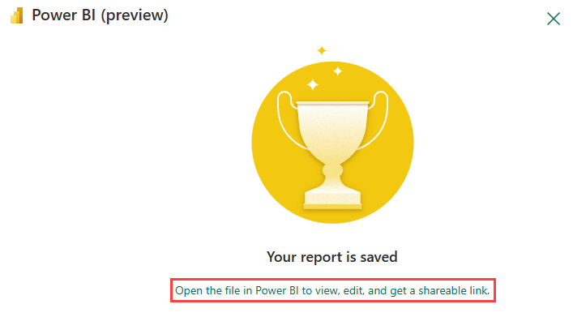

## Create OneLake shortcut

Now that you have finished exploring your data, you may want to access
the underlying data from other Trident experiences.

OneLake is a single, unified, logical data lake for Trident to store
lakehouses, warehouses and other items. Shortcuts are embedded
references within OneLake that point to other files' store locations.
The embedded reference makes it appear as though the files and folders
are stored locally but in reality; they exist in another storage
location. Once you create a shortcut, you can access your data in all of
Trident's experiences. Shortcuts can be updated or removed from your
items, but these changes will not affect the original data and its
source.

1.  Select **Create** in the **Navigation pane**.

-   

2.  Under **Data engineering**, select **Lakehouse**.

-   

3.  Enter *rtatutorial* as your Lakehouse name, then select **Create**.

> 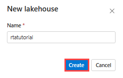

1.  In Lakehouse Explorer, navigate to **Files**, select "**...**",
    select **New Shortcut** from the menu.

> 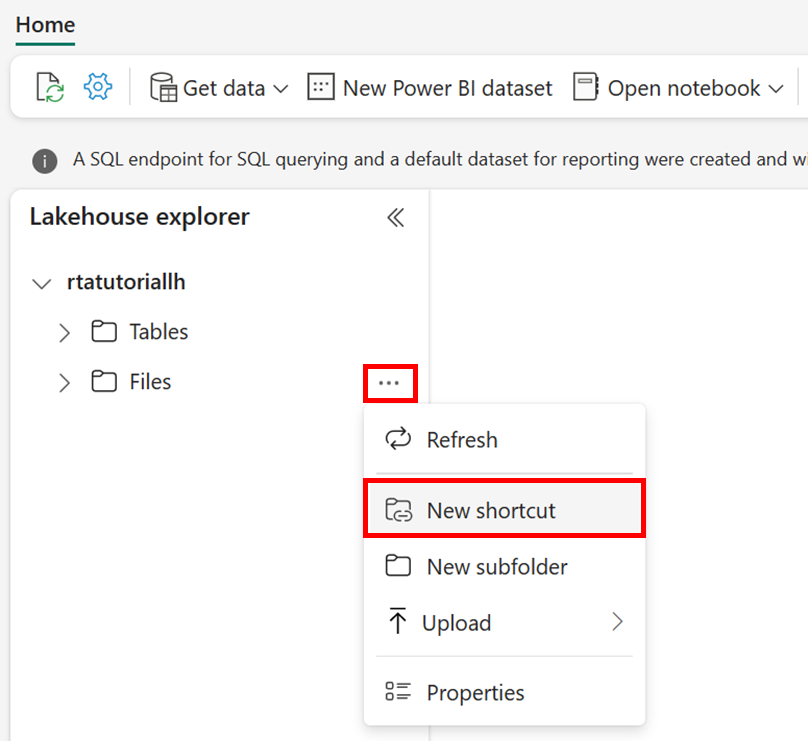
1.  Under **Internal sources**, select **OneLake**.

-   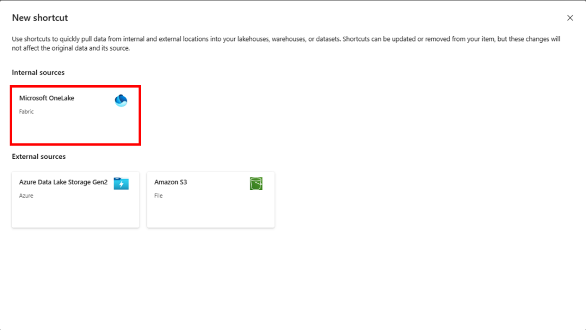
- 
2.  In **Select a data source type**, select ***your KQL Database***,
    then select **Next** to connect the data to your shortcut.

-   

3.  To connect the table with the data from Eventstream, select **\>**
    to expand the tables in the left-hand pane, then select the table
    titled **nyctaxitrips**.

-   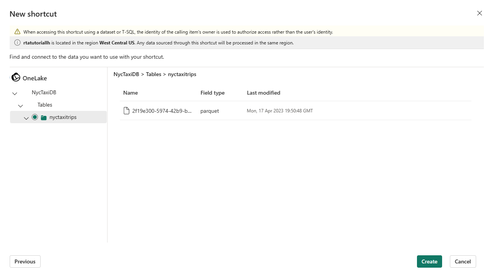

4.  Select **Create** to create the shortcut. The Lakehouse will
    automatically refresh.

The Lakehouse shortcut has been created. Without additional management,
you now have one logical copy of your data in the Lakehouse that you can
use in other Trident experiences, such as Notebooks and Spark jobs.

[]{#_Toc132650974 .anchor}Module 4: Clean up resources

You can delete individual reports, eventstreams, KQL databases, KQL
querysets, and other items or remove the entire workspace.

1.  Select Trident Real-time Analytics Solution Tutorial in the
    left-hand navigation menu to return to the workspace artifact view

> 

2.  Below the workspace name and description at the top of the workspace
    header, select Workspace settings.

> 

3.  Select **Other \> Delete this workspace**

> 

4.  Select **Delete** on the warning.
