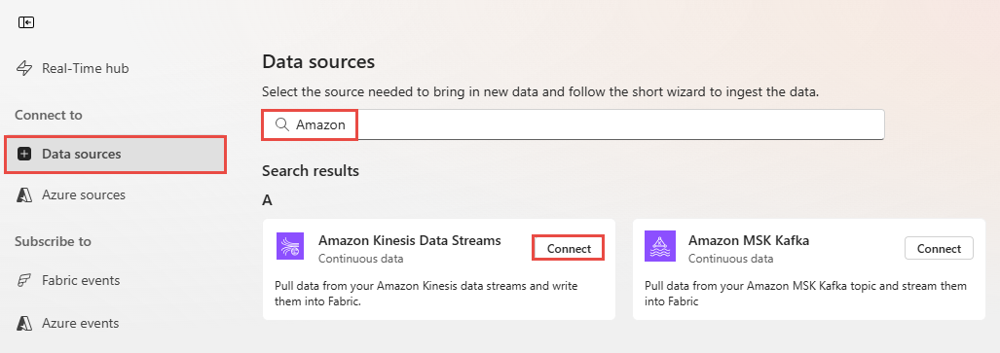

# Add Amazon Kinesis Data Streams as source in Real-Time hub
This article describes how to add Amazon Kinesis Data Streams as an event source in Fabric Real-Time hub. 

[!INCLUDE [preview-note](./includes/preview-note.md)]

## Prerequisites 

- Get access to the Fabric **premium** workspace with **Contributor** or above permissions. 
- An Amazon Web Services (AWS) account with the Kinesis Data Streams service enabled.

[!INCLUDE [launch-get-events-experience](./includes/launch-get-events-experience.md)]

## Add Amazon Kiness Data Streams as a source

1. On the **Select a data source** screen, select **Kinesis Data Streams**.

   
1. On the **Connect** screen, to create a connection, select **New connection**.

    :::image type="content" source="./media/add-source-amazon-kinesis-data-streams/new-connection-link.png" alt-text="Screenshot that shows the Connect page with the New connection highlighted.":::
1. In the **Connection settings** section, for **Data Stream name**, enter the data stream name from Amazon Kinesis.

    
1. In the **Connection credentials** section, do these steps.
    1. For **Connection name**, enter a name for this cloud connection.
    1. For **Authentication kind**, confirm that **Kinesis key** is selected. 
    1. For **API Key** and **API Secret**, enter the credentials you use to access your Kinesis Data Stream. Go to the Amazon IAM console and select **Security credentials**. Copy an **Access Key ID** from the **Access keys** screen and paste it into **API Key** and **API Secret**.
  
        
    1. Select **Connect**. 

       
1. Now, on the **Connect** page, for **Source name**, enter a source name for this new eventstream source.
1. Scroll down, and under **Configure Amazon Kinesis data source**, enter a **Region** for the data source. You can find the Amazon region code such as **us-west-2** from the Kinesis **Data stream summary**.

   
1. In the **Stream details** section of the right pane, do these steps:
    1. Select the **workspace** where you want to save the connection.
    1. Enter a **name for the eventstream** to be created for you.
    1. Name of the **stream** for Real-Time hub is automatically generated for you. 
1. Select **Next**.
1. On the **Review and create** screen, review the summary, and then select **Create source**.

## View data stream details

1. On the **Review and create** page, if you select **Open eventstream**, the wizard opens the eventstream that it created for you with the selected Confluent Cloud Kafka source. To close the wizard, select **Close** at the bottom of the page. 
1. In Real-Time hub, switch to the **Data streams** tab of Real-Time hub. Refresh the page. You should see the data stream created for you. For detailed steps, see [View details of data streams in Fabric Real-Time hub](view-data-stream-details.md).

