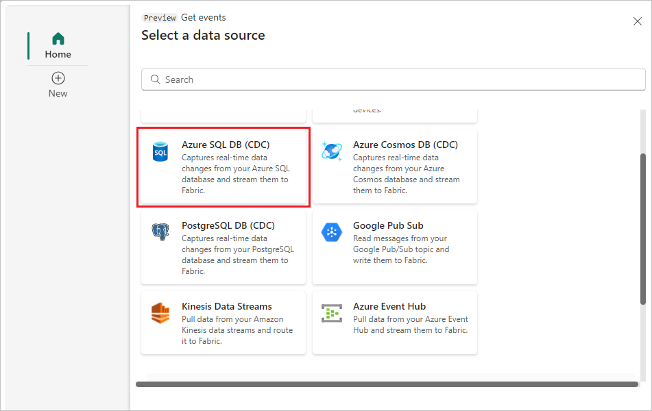

# Add Azure SQL Database Change Data Capture (CDC) as source in Real-Time hub
This article describes how to add an Azure SQL Database Change Data Capture (CDC) as an event source in Fabric Real-Time hub. 

The Azure SQL Database CDC source connector for Microsoft Fabric event streams allows you to capture a snapshot of the current data in an Azure SQL database. The connector then monitors and records any future row-level changes to this data. 

[!INCLUDE [preview-note](./includes/preview-note.md)]

## Prerequisites 

- Get access to the Fabric **premium** workspace with **Contributor** or above permissions. 
- A running Azure SQL server with an Azure SQL database.
- Membership in the **sysadmin** fixed server role for the SQL Server, and **db_owner** role on the database.
- CDC enabled on your Azure SQL database by running the stored procedure `sys.sp_cdc_enable_db`. For details, see [Enable and disable change data capture](/sql/relational-databases/track-changes/enable-and-disable-change-data-capture-sql-server).

>[!NOTE]
>- Mirroring shouldn't be enabled in your database.
>- Multiple tables CDC isn't supported.

## Get events from an Azure SQL Database CDC
You can get events from an Azure SQL Database CDC into Real-Time hub in one of the ways:

- Using the **Get events** experience
- Using the **Microsoft sources** tab

[!INCLUDE [launch-get-events-experience](./includes/launch-get-events-experience.md)]

Use instructions from the [Add Azure SQL Database CDC as a source](#add-azure-sql-database-cdc-as-a-source) section. 

## Using the Microsoft sources tab

1. In Real-Time hub, switch to the **Microsoft sources** tab. 
1. In the **Source** drop-down list, select **Azure SQL DB (CDC)**. 
1. For **Subscription**, select an **Azure subscription** that has the resource group with your SQL database. 
1. For **Resource group**, select a **resource group** that has your SQL database.
1. For **Region**, select a location where your SQL database is located. 
1. Now, move the mouse over the name of the SQL database that you want to connect to Real-Time hub in the list of databases, and select the **Connect** button, or select **... (ellipsis)**, and then select the **Connect** button. 

    :::image type="content" source="./media/add-source-azure-sql-database-cdc/microsoft-sources-connect-button.png" alt-text="Screenshot that shows the Microsoft sources tab with filters to show SQL databases and the connect button for a SQL database.":::

    To configure connection information, use steps from the [Add Azure SQL Database CDC as a source](#add-azure-sql-database-cdc-as-a-source) section. Skip the first step of selecting Azure SQL DB (CDC) as a source type in the Get events wizard. 

## Add Azure SQL Database CDC as a source

1. On the **Select a data source** screen, select **Azure SQL DB (CDC)**.

   
1. On the **Connect** page, select **New connection**.

    :::image type="content" source="./media/add-source-azure-sql-database-cdc/new-connection-link.png" alt-text="Screenshot that shows the Connect page of the Get events wizard with the **New connection** link highlighted." lightbox="./media/add-source-azure-sql-database-cdc/new-connection-link.png"::: 
1. In the **Connection settings** section, enter the following values for your Azure SQL database:

   - **Server:** Enter the Azure SQL server name from the Azure portal.
   - **Database:** Enter the Azure SQL database name from the Azure portal.

        :::image type="content" source="./media/add-source-azure-sql-database-cdc/connect.png" alt-text="Screenshot that shows the Connection settings section of the New connection page." ::: 
1. Scroll down, and in the **Connection credentials** section, follow these steps.
    1. For **Connection name**, enter a name for the connection. 
    1. For **Authentication kind**, select **Basic**. 
    
        > [!NOTE]
        > Currently, Fabric event streams supports only **Basic** authentication.
    1. Enter **Username** and **Password** for the database.   
    1. Select **Connect**.
   
        :::image type="content" source="./media/add-source-azure-sql-database-cdc/connection-credentials.png" alt-text="Screenshot that shows the Connection credentials section of the New connection page." ::: 
1. Now, on the **Connect** page, do these steps:
    1. Enter the **name** of the **SQL table**.
    1. For **Port**, Enter the port number (default is 1433). 
    1. In the **Stream details** section to the right, select the Fabric **workspace** where you want to save the eventstream that the Wizard is going to create. 
    1. For **eventstream name**, enter a name for the eventstream. The wizard creates an eventstream with the selected event hub as a source.
    1. The **Stream name** is automatically generated for you by appending **-stream** to the name of the eventstream. You see this stream on the **Data streams** tab of Real-Time hub when the wizard finishes. 
    1. Select **Next**. 

        :::image type="content" source="./media/add-source-azure-sql-database-cdc/connect-page-filled.png" alt-text="Screenshot that shows the Connect page of the Get events wizard filled." lightbox="./media/add-source-azure-sql-database-cdc/connect-page-filled.png":::         
1. On the **Review and create** screen, review the summary, and then select **Create source**.

      :::image type="content" source="./media/add-source-azure-sql-database-cdc/review-create-page.png" alt-text="Screenshot that shows the Review and create page of the Get events wizard filled." lightbox="./media/add-source-azure-sql-database-cdc/review-create-page.png":::         