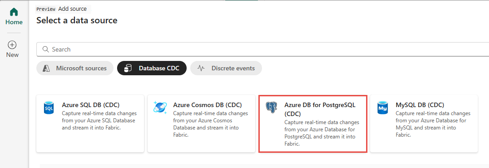

# Add PostgreSQL Database CDC as source in Real-Time hub
This article describes how to add PostgreSQL Database Change Data Capture (CDC) as an event source in Fabric Real-Time hub. 

The PostgreSQL Database Change Data Capture (CDC) source connector for Microsoft Fabric event streams allows you to capture a snapshot of the current data in a PostgreSQL database. The connector then monitors and records any future row-level changes to this data. 

[!INCLUDE [preview-note](./includes/preview-note.md)]

## Prerequisites 

- Get access to the Fabric **premium** workspace with **Contributor** or above permissions. 
- Registered user access in the PostgreSQL database.
- CDC enabled in the PostgreSQL database.

  If you have Azure Database for PostgreSQL, follow the steps in the next section to enable CDC. For detailed information, see [Logical replication and logical decoding - Azure Database for PostgreSQL - Flexible Server](/azure/postgresql/flexible-server/concepts-logical).

  For other PostgreSQL databases, see [Debezium connector for PostgreSQL :: Debezium Documentation](https://debezium.io/documentation/reference/stable/connectors/postgresql.html#setting-up-postgresql).

>[!NOTE]
>Multiple tables CDC isn't supported.

[!INCLUDE [launch-get-events-experience](./includes/launch-get-events-experience.md)]

Use instructions from the [Add PostgreSQL Database CDC as a source](#add-azure-database-for-postgresql-cdc-as-a-source) section. 

## Microsoft sources tab

1. In Real-Time hub, switch to the **Microsoft sources** tab. 
1. In the **Source** drop-down list, select **PostgreSQL (CDC)**. 
1. For **Subscription**, select an **Azure subscription** that has the resource group with your Azure MySQL Database account. 
1. For **Resource group**, select a **resource group** that has the database.
1. For **Region**, select a location where your database is located. 
1. Now, move the mouse over the name of the PostgreSQL Database CDC source that you want to connect to Real-Time hub in the list of databases, and select the **Connect** button, or select **... (ellipsis)**, and then select the **Connect** button. 

    :::image type="content" source="./media/add-source-postgresql-database-cdc/microsoft-sources-connect-button.png" alt-text="Screenshot that shows the Microsoft sources tab with filters to show Azure MySQL CDC and the connect button." lightbox="./media/add-source-postgresql-database-cdc/microsoft-sources-connect-button.png":::

    To configure connection information, use steps from the [Add Azure MySQL DB CDC as a source](#add-azure-database-for-postgresql-cdc-as-a-source) section. Skip the first step of selecting Azure MySQL DB CDC as a source type in the Get events wizard. 

## Add Azure Database for PostgreSQL CDC as a source

1. On the **Select a data source** screen, select **Azure DB for PostgreSQL (CDC)**.

   
1. On the **Connect** page, select **New connection**.

    :::image type="content" source="media/add-source-postgresql-database-cdc/new-connection-link.png" alt-text="Screenshot that shows the Connect page for an Azure PostgreSQL database with New connection link highlighted.":::
1. In the **Connection settings** section, enter the following information.

   - **Server**: The server address of your PostgreSQL database, for example *my-pgsql-server.postgres.database.azure.com*.
   - **Database**: The database name, for example *my_database*.

        :::image type="content" source="media/add-source-postgresql-database-cdc/connection-settings.png" alt-text="Screenshot that shows the Connection settings section for the Azure PostgreSQL database connector.":::
1. Scroll down, and in the **Connection credentials** section, follow these steps.
    1. For **Connection name**, enter a name for the connection. 
    1. For **Authentication kind**, select **Basic**. 
    
        > [!NOTE]
        > Currently, Fabric event streams supports only **Basic** authentication.
    1. Enter **Username** and **Password** for the database.   
    1. Select **Connect**.
   
        :::image type="content" source="media/add-source-postgresql-database-cdc/connect.png" alt-text="Screenshot that shows the Connection credentials section for the Azure PostgreSQL database connector.":::
1. Now, on the **Connect** page, do these steps:
    1. For **table**, Enter a table name.
    1. For **Port**, enter the port number or leave the default value: 5432. 
    1. For **eventstream name**, enter a name for the eventstream. The wizard creates an eventstream with the selected PostgreSQL Database CDC as a source.
    1. The **Stream name** is automatically generated for you by appending **-stream** to the name of the eventstream. You see this stream on the **Data streams** tab of Real-Time hub when the wizard finishes. 
    1. Select **Next** at the bottom of the page.

        :::image type="content" source="media/add-source-postgresql-database-cdc/connect-page-filled.png" alt-text="Screenshot that shows the Connect page filled for the Azure PostgreSQL database connector." lightbox="media/add-source-postgresql-database-cdc/connect-page-filled.png":::
1. On the **Review and create** screen, review the summary, and then select **Create source**.

    :::image type="content" source="media/add-source-postgresql-database-cdc/review-create-page.png" alt-text="Screenshot that shows the Review and create page filled for the Azure PostgreSQL database connector." lightbox="media/add-source-postgresql-database-cdc/review-create-page.png":::

## View data stream details

1. On the **Review and create** page, if you select **Open eventstream**, the wizard opens the eventstream that it created for you with the selected PostgreSQL Database CDC as a source. To close the wizard, select **Close** at the bottom of the page. 

    :::image type="content" source="./media/add-source-postgresql-database-cdc/review-create-success.png" alt-text="Screenshot that shows the Data streams tab of Real-Time hub with the stream based on PostgreSQL Database CDC source." lightbox="./media/add-source-postgresql-database-cdc/review-create-success.png":::
1. In Real-Time hub, switch to the **Data streams** tab of Real-Time hub. Refresh the page. You should see the data stream created for you as shown in the following image.
