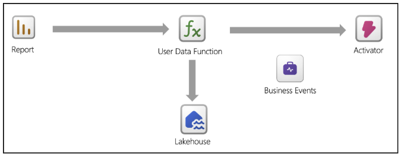
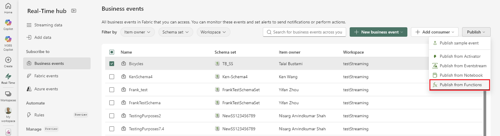
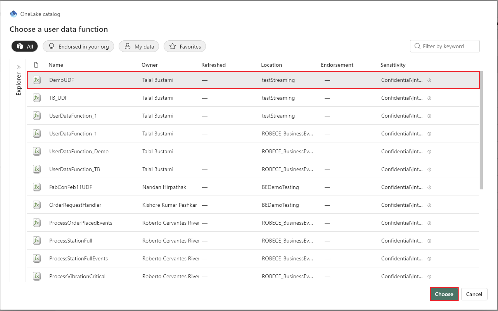
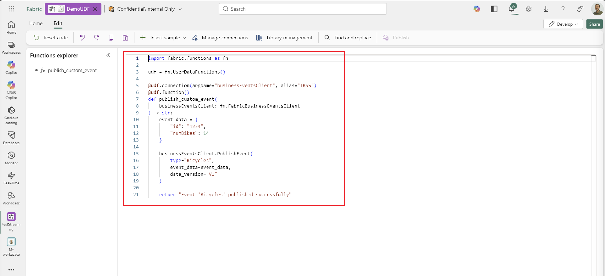
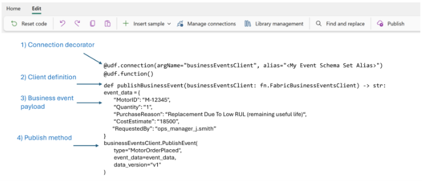

# Use a User Data Function as a business events publisher

User Data Functions provide a flexible execution layer that powers everything from service-to-service integration to application logic in Power BI and Data Agents. By using native support for publishing business events, UDFs can now emit events whenever a meaningful change occurs, enabling downstream systems to react instantly.
 
Consider a scenario where you have a sales dashboard that tracks the status of sales deals. Previously, if there were changes to the deal, it was difficult to notify all the downstream consumers in a consistent way. Now, you can build a Power BI report that uses the User Data Functions integration to automatically trigger whenever a change is detected.



> [!TIP]
> For a step-by-step walkthrough, see [Tutorial: Publish business events using a User Data Function and get notified via email using Activator](tutorial-business-events-user-data-function-activation-email.md).

## Why use a User Data Function to publish business events?

When you use **User Data Functions (UDFs)** as business event publishers, you place event emission at the point where **business logic is executed**, rather than at the raw data source. This approach allows you to publish business events only when a condition is meaningful from a business perspective.

Unlike telemetry pipelines or raw data ingestion, UDFs operate on **validated inputs**, **business rules**, and **domain logic**. This approach ensures that you emit events only when a true **business condition** is met, such as an order being placed, a threshold being crossed, or an approval being required, rather than on every data change.

## The built-in User Data Function publisher API

The **built-in UDF publisher API** provides a native, **first-class way** for **UDFs** to publish **business events** directly into **Microsoft Fabric**, without requiring developers to integrate or manage external eventing SDKs.

At a high level, this API allows a UDF to publish business events by using a built-in client that's automatically configured through Fabric connections and permissions. The publishing operation runs **in the context of the user and workspace**, ensuring governance, security, and consistency across the platform.

## Create or select a User Data Function from Real-Time Hub

You can start from a business event in Real-Time hub and either create a UDF or add publishing code to an existing UDF.

1. In Real-Time hub, select **Business Events**.
1. Select one or more business events. If you select multiple events, they must belong to the same event schema set.
1. Select **Publish** > **Publish from Functions**.

   

1. Select **Existing user-defined function**. In the OneLake catalog, select the UDF, and then select **Choose**.

   

Fabric prepares the UDF by deploying it if necessary, adding a connection to the event schema set, importing sample publisher code, and publishing the function. When the process finishes, the UDF editor opens.



Review the generated function before you use it. Update the event payload and any function parameters so that they match your business event schema and application requirements.

## Publish a business event from a User Data Function

> [!NOTE]
> Workspace private links can block cross-workspace business event publishing. For Business events, the source workspace is the workspace that contains the Event Schema Set. If that workspace blocks public access, publish from a UDF in the same workspace or establish a private link from the publisher's network to the source workspace. For more information, see [Workspace private links for Azure, Fabric, and Business events](../workspace-private-links-real-time-events.md).

A function publishes a business event by providing:

* **type**: The business event name.

* **event_data**: A data payload that matches the business event schema.

* **data_version**: The version of the business event schema.

Anatomy of a business event publisher in a User Data Function:


## Example: Generate a sale summary business event from a User Data Function

The following example shows the UDF code to generate a summary for a sale and emit the relevant data as a business event: 

```python
# Select 'Manage connections' and add connections to an Event Schema Set item and a Lakehouse 
# Replace the alias "<My Event Schema Set Alias>" with your Event Schema Set connection alias. 
# Replace the alias "<My Lakehouse Alias>" with your Lakehouse connection alias. 

import fabric.functions as fn 
import datetime 

udf = fn.UserDataFunctions() 
@udf.connection(argName="businessEventsClient", alias="<My Event Schema Set Alias>") 
@udf.connection(argName="myLakehouse", alias="<My Lakehouse Alias>") 
@udf.function() 

def generate_sale_summary_event( 

    businessEventsClient: fn.FabricBusinessEventsClient,  
    myLakehouse: fn.FabricLakehouseClient, 
    customerKey: int, 
    saleKey: int, 
    salesPersonKey: int 
) -> str: 

    ''' 
    Description: Query sale data from a lakehouse and generate a business event with the sale summary. 
        This sample demonstrates how to query sales data from a Lakehouse, aggregate it by  
        stock item, and publish a business event containing the sale summary. This pattern  is useful for order confirmation notifications, sales reporting events, or invoice generation triggers. 

        Pre-requisites: 
            * Create a business events item in Microsoft Fabric with an event type  
            * Create a Lakehouse with a dbo.fact_sale table containing columns:  
              CustomerKey, SaleKey, SalesPersonKey, StockItemKey, Description, Quantity,  
                 TotalIncludingTax 
            * Add connections to both the Event Schema Set item and the Lakehouse 
    Args: 
        businessEventsClient (fn.FabricBusinessEventsClient):  
            Fabric business events connection client used to publish events to the business events item. 
        myLakehouse (fn.FabricLakehouseClient): Fabric Lakehouse connection client used to query sale data. 
        customerKey (int): The customer identifier to filter sales. 
        saleKey (int): The sale identifier to filter sales. 
        salesPersonKey (int): The sales person identifier to filter sales. 

    Returns: 
        str: Summary message indicating the event was generated with item count. 

    Workflow: 

        1. Connect to the Lakehouse SQL analytics endpoint. 
        2. Query the fact_sale table filtering by customerKey, saleKey, and salesPersonKey. 
        3. Aggregate the results by StockItemKey, summing quantities and totals. 
        4. Generate a business event with the sale summary details. 
        5. Return a confirmation message. 
        
    Example: 
        generate_sale_summary_event(businessEventsClient, myLakehouse, customerKey=100,  
            saleKey=5001, salesPersonKey=25)  
        returns "Generated sale summary event for sale 5001 with 3 line items totaling  
            $1,234.56" 
    ''' 

    # Connect to the Lakehouse SQL analytics endpoint 

    connection = myLakehouse.connectToSql() 
    cursor = connection.cursor() 

    # Query and aggregate sale items by StockItemKey 

    query = f""" 
        SELECT  
            StockItemKey, 
            Description, 
            SUM(Quantity) AS TotalQuantity, 
            SUM(TotalIncludingTax) AS TotalPrice 

        FROM dbo.fact_sale  

        WHERE CustomerKey = {customerKey} 

          AND SaleKey = {saleKey} 
          AND SalesPersonKey = {salesPersonKey} 

        GROUP BY StockItemKey, Description 
    """ 

    cursor.execute(query) 

    # Process results into line items 

    rows = cursor.fetchall() 
    line_items = [] 
    grand_total = 0.0 

    for row in rows: 

        stock_item_key, description, total_quantity, total_price = row 
        line_item = { 

            "stockItemKey": stock_item_key, 
            "description": description, 
            "totalQuantity": int(total_quantity), 
            "totalPrice": float(total_price) 
        } 

        line_items.append(line_item) 
        grand_total += float(total_price) 

    # Build the event data payload 

    event_data = { 
        "saleKey": saleKey, 
        "customerKey": customerKey, 
        "salesPersonKey": salesPersonKey, 
        "lineItems": line_items, 
        "lineItemCount": len(line_items), 
        "grandTotal": grand_total, 
        "eventTimestamp": datetime.datetime.now(datetime.timezone.utc).isoformat() 
    } 

    # Publish the business event 

    businessEventsClient.PublishEvent( 

        type="Sales.SummaryGenerated",  
        event_data=event_data,  
        data_version="v1" 
    ) 

    # Close the connection 
    cursor.close() 
    connection.close() 

    return f"Generated sale summary event for sale {saleKey} with {len(line_items)} line items totaling ${grand_total:,.2f}" 

```

## Related articles

- [Business Events in Microsoft Fabric](business-events-overview.md)
- [Tutorial: Publish business events from a User Data Function](tutorial-business-events-user-data-function-activation-email.md)
