# Real-Time Dashboard supported visuals

Real-Time Dashboard supports most visualizations available through the [render operator](/kusto/query/render-operator?context=/fabric/context/context-rta&pivots=fabric), as well as the following [dashboard-specific visuals](dashboard-visuals.md): funnel chart, and heatmap.

This article describes each supported visual, along with common use cases and a visual example, so you can choose the right visual for your data and monitoring scenario.

## Supported visuals

The following table describes each supported visual, along with common use cases and a visual example. For more information on customizing the properties of each visual type, see [Customize Real-Time Dashboard visuals](dashboard-visuals-customize.md).

| Visual | Description | Use case | Visual example |
|--|--|--|--|
| **Anomaly chart** | A time chart that automatically highlights data points identified as anomalies. | Spot unexpected spikes or drops in a metric over time, such as unusual error rates. | 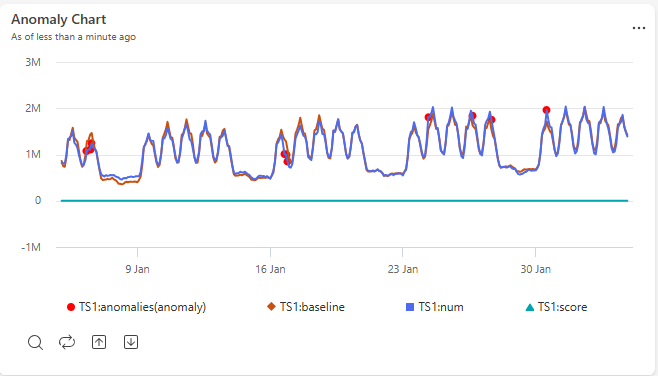 |
| **Area chart** | A line chart with the area beneath each line filled in, showing values accumulating over time. | Show trends in volume or magnitude over time, such as total requests processed per hour. | 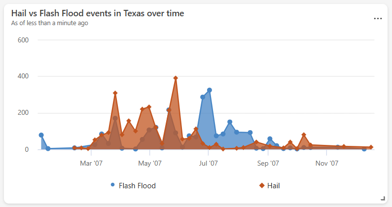 |
| **Bar chart** | A chart that represents categories as horizontal bars, with length proportional to value. | Compare values across categories with long or many labels, such as errors by service name. | 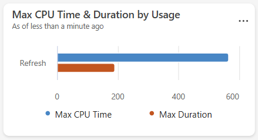 |
| **Column chart** | A chart that represents categories as vertical bars, with height proportional to value. | Compare values across categories or discrete time buckets, such as daily sign-ups. | 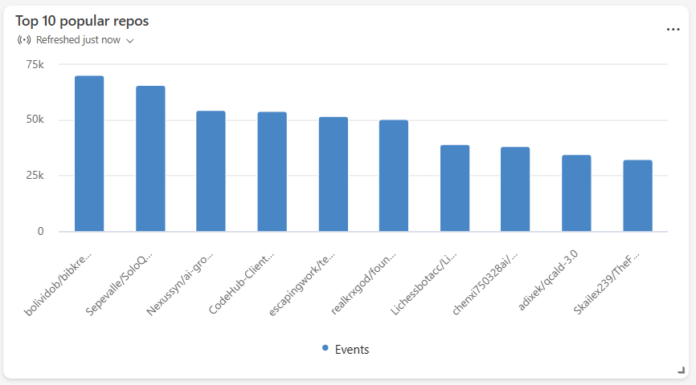 |
| **Funnel chart** | A chart that shows values decreasing through sequential stages, shaped like a funnel. | Track drop-off through a multistep process, such as conversions through a sign-up flow. | 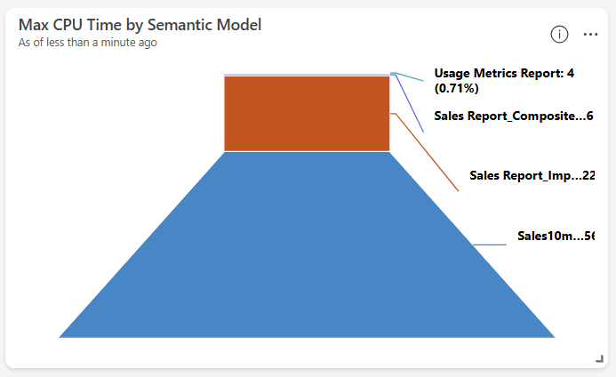 |
| **Heatmap** | A grid that uses color intensity to represent the magnitude of a value across two dimensions. | Identify patterns or concentrations across two categories, such as activity by hour and day of week. | 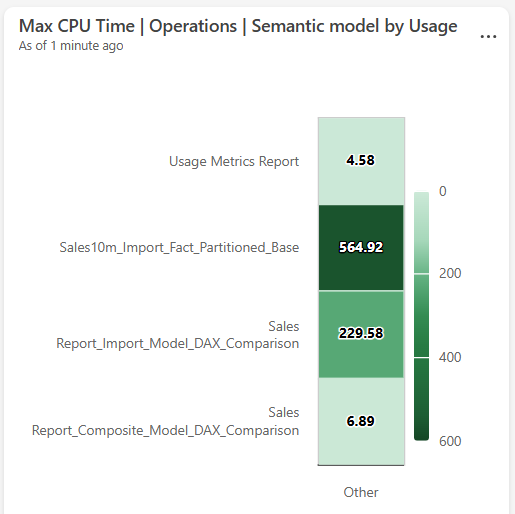 |
| **[KPI](dashboard-visuals-customize.md#kpi-visualization)** | A tile that displays a single key metric, often with a trend indicator. | Highlight a critical metric at a glance, such as current system uptime or revenue. | 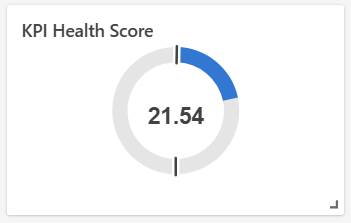 |
| **Line chart** | A chart that connects data points with a continuous line along a numeric or time axis. | Track how a metric changes over time or across an ordered sequence, such as latency trends. | 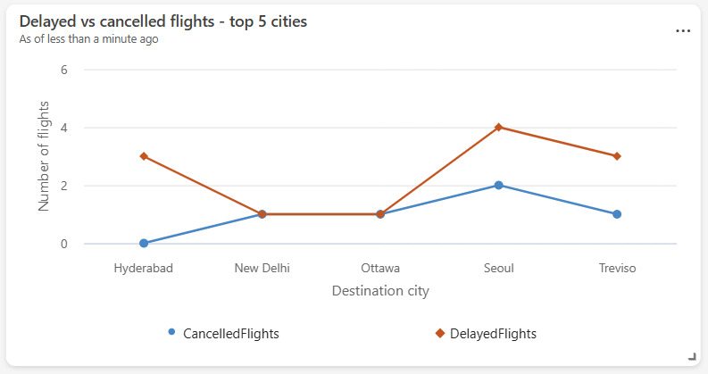 |
| **Map** | A visual that plots data points on a geographic map by location. | Visualize the geographic distribution of events or resources, such as device locations. | 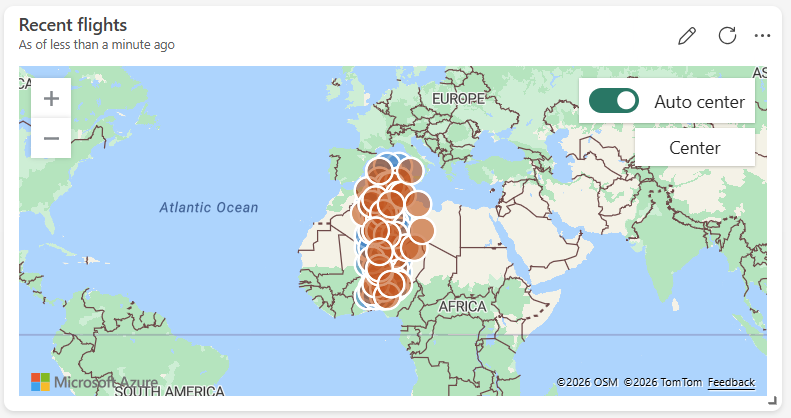 |
| **[Markdown](dashboard-markdown-visual.md)** | A tile that renders formatted text and images using Markdown syntax. | Add titles, descriptions, instructions, or embedded images to provide context on a dashboard. |  |
| **Multi stat** | A grid of single-value tiles, each showing a key metric. | Display several key metrics side by side at a glance, such as total users and active sessions. | 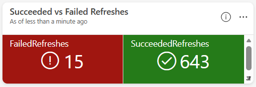 |
| **Pie chart** | A circular chart divided into slices, each representing a category's proportion of the whole. | Show the relative distribution of categories, such as traffic share by device type. | 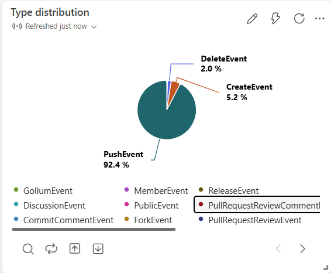 |
| **Scatter chart** | A chart that plots individual data points against two numeric axes. | Explore the correlation between two metrics, such as latency versus load. | 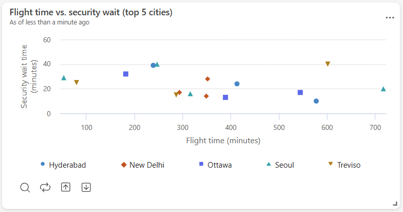 |
| **Stat** | A tile that displays a single numeric value. | Highlight one key metric prominently, such as total revenue. | 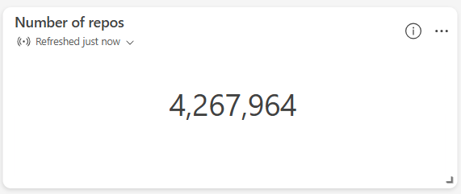 |
| **Table** | A grid that displays rows and columns of data. | Review detailed or raw records, such as the most recent transactions. | 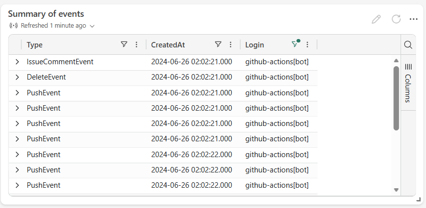 |
| **Time chart** | A line chart with time plotted on the x-axis. | Monitor how a metric evolves over time, such as CPU usage. | 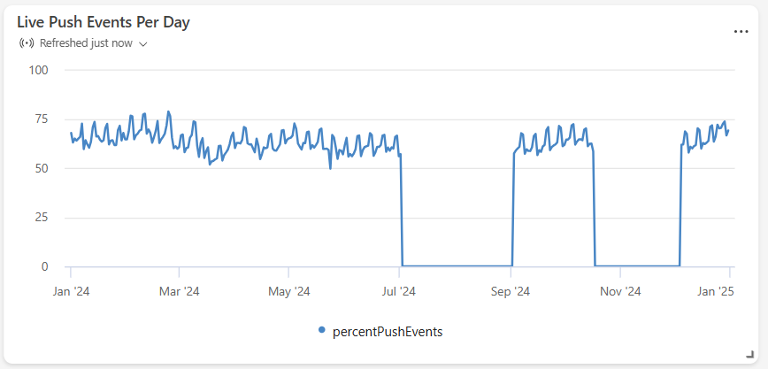 |
| **[Time series chart (preview)](dashboard-time-series.md)** | A chart that plots multiple time-based measures and categories, with interactive drill-down. | Monitor several related time series together and drill into specific entities or time ranges. | 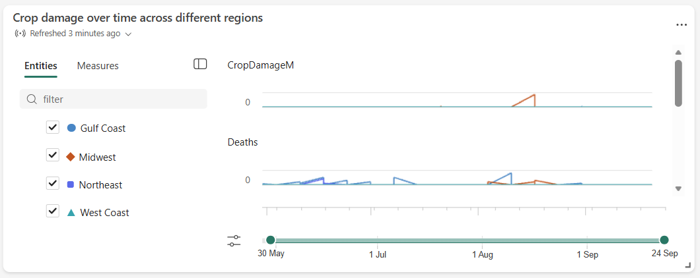 |

## Related content

* [Real-Time Dashboard overview](real-time-dashboards-overview.md)
* [Customize Real-Time Dashboard visuals](dashboard-visuals-customize.md)
* [Real-Time Dashboard-specific visuals](dashboard-visuals.md)
* [Troubleshoot Real-Time Dashboard visual errors](troubleshoot-dashboard-tile-error.md)
