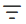

# Create an alert in Power BI report

You can create alerts in Power BI reports to monitor changes in data values and receive notifications via email or Teams. Once your alert is ready, you can open it in Fabric Activator to refine it further with advanced capabilities like:

- Setting more granular conditions
- Integrating with Power Automate workflows  
- Expanding alert capabilities to meet specific business needs

This article describes how to access Power BI report alerts and refine those alerts in Activator.

> [!IMPORTANT]
> - This article shows you how to create an alert in a Power BI **report, not a dashboard**. To learn how to set alerts on a dashboard, see [Set alerts on a Power BI dashboard](/power-bi/create-reports/service-set-data-alerts).
> - In Activator, an **alert** is referred to as a **rule**.

## Prerequisites

Before you begin, ensure you have the following prerequisites:

* **Workspace access:** A [Microsoft Fabric workspace](../../get-started/create-workspaces.md) with [enabled capacity](../../enterprise/licenses.md#capacity)
* **Report permissions:** Edit access to a Power BI report published to your workspace
* **Tenant setting:** The following setting must be enabled: *All Power BI users can see "Set alert" button to create Fabric Activator alerts*

## Create an alert for a report

First, let's see how to set an alert for a report using the **Set alert** button on the ribbon for the report. When you use this option, it shows all the measures associated with the report. You use one of the measures to set an alert. Here are the detailed steps:

1. Select **Set alert** button on the ribbon at the top. You see the **Alerts** pane to the right.

    :::image type="content" source="media/activator-get-data-power-bi/global-set-alert-button.png" alt-text="Screenshot showing the Set Alert button on the ribbon or Add alert button in the Alerts window." lightbox="media/activator-get-data-power-bi/global-set-alert-button.png":::

    If you had the **Alerts** window open already, select **Add alert** in the **Alerts** pane.

1. To set the **Fabric Activator** item where you want to save the alerts, choose **Select save location** at the bottom of the **Alerts** pane.

    You might see an **Activator** item already associated with the alert at the bottom. An Activator item can have one or more alerts in it. You can use it group a set of related alerts in one Fabric item. If you want to change the Activator item associated with the report, select the activator item and follow these steps. If you don't need to change the associated activator item, move on to step after the next step where you select a measure from the list of measures.

    :::image type="content" source="media/activator-get-data-power-bi/select-save-location.png" alt-text="Screenshot showing the Alerts window with the link to change the location highlighted." lightbox="media/activator-get-data-power-bi/select-save-location.png":::

1. On the **Select the location of your alerts** window, do these steps:
    1. For **Workspace**, select the workspace where you want to save the Activator item that will contain the alerts you're going to create. 
    1. For **Item**, select **Create a new activator item** or select an existing activator item. The following screenshot shows the first option. 
    1. If you selected **Create a new activator item** option, for **Item name**, select a name for the activator item. 
    1. Then, select **Confirm**.

        :::image type="content" source="media/activator-get-data-power-bi/select-activator-location.png" alt-text="Screenshot showing the window where you can select the location for the activator item." lightbox="media/activator-get-data-power-bi/select-activator-location.png":::

1. In the **Alerts** pane, select **+Add alert** to get back to see all the measures associated with the report. Also, notice that the activator item you created in the previous step shows up at the bottom of the Alerts pane. 

    :::image type="content" source="media/activator-get-data-power-bi/add-alert-button-global.png" alt-text="Screenshot showing the Alerts window with the + Add alert button highlighted." lightbox="media/activator-get-data-power-bi/select-activator-location.png":::

1. From the list of available measures in the report to set up an alert, select the **measure** you want to use to set up the alert. As you select the measure, the associated visual is highlighted.

    :::image type="content" source="media/activator-get-data-power-bi/select-measure.png" alt-text="Screenshot showing the Alerts window showing available measures in the report." lightbox="media/activator-get-data-power-bi/select-measure.png":::  

    In the following example, **Average Gross Sales per Product** is selected.

    :::image type="content" source="media/activator-get-data-power-bi/average-sales-selected.png" alt-text="Screenshot showing the Alerts window with the Average Gross Sales per Product measure selected." lightbox="media/activator-get-data-power-bi/average-sales-selected.png":::

1. After you select the measure, you see the same user interface as you did when you set up the first alert. Follow the same steps to define a condition (select **Changes** or **Becomes**) and an action (send **notification**) for the second alert. Then, select **Apply**. Here's an example:

    :::image type="content" source="media/activator-get-data-power-bi/second-alert-definition.png" alt-text="Screenshot showing the Alerts window with the second alert definition." lightbox="media/activator-get-data-power-bi/second-alert-definition.png":::

1. To minimize the second alert window, select at the top of it. The **Alerts** window should show the alert you created.

    :::image type="content" source="media/activator-get-data-power-bi/two-alerts.png" alt-text="Screenshot showing the Alerts window with both the alerts." lightbox="media/activator-get-data-power-bi/two-alerts.png":::

## Create an alert for a visual in the report

In the previous example, you set up an alert using the **Set alert** button on the ribbon at the report level. In this section, you learn how to set an alert at the visual level in a report.

1. If the report isn't already open, launch your Power BI report in [editing view](/power-bi/create-reports/service-interact-with-a-report-in-editing-view).

1. Close **Alerts** pane if it's already open. Choose a visual on the report to monitor, in the upper right corner of the visual select the ellipses (...) > **Add alert**. You can also select the bell icon in the visual.

    :::image type="content" source="media/activator-get-data-power-bi/activator-power-bi-alert.png" alt-text="Screenshot of sales by store in Power BI report." lightbox="media/activator-get-data-power-bi/activator-power-bi-alert.png":::
1. In the **Alerts** pane, at the bottom of the window, notice the **Activator** item associated with the alert at the bottom. 
1. You see two sections for the alert you're trying to create: **Condition** and **Send notification** with an action to be taken when the alert condition is met.
1. In the **Condition** section, select one of the conditions: **Changes** or **Becomes**. 
    - Select **Changes**, if you want the alert to be triggered when the value changes, or changes by a certain amount or percentage, increases by a certain amount or percentage, or decreases by a certain amount or percentage. 

        :::image type="content" source="media/activator-get-data-power-bi/changes-condition.png" alt-text="Screenshot showing the alerts window with Changes selected for the condition." lightbox="media/activator-get-data-power-bi/changes-condition.png":::        

        In the following example, the alert is triggered when the value **increases by 10%**. 

        :::image type="content" source="media/activator-get-data-power-bi/increases-by-ten-percent.png" alt-text="Screenshot showing an alert set up if the value increases by 10 percent." lightbox="media/activator-get-data-power-bi/increases-by-ten-percent.png":::   
    - Select **Becomes**, if you want the alert to be triggered when the value is greater than, less than, equal to a specified value, or it's within or outside a rage. If you select the range option, you need to enter the minimum and maximum values for the range. 

        :::image type="content" source="media/activator-get-data-power-bi/becomes-condition.png" alt-text="Screenshot showing the alerts window with Becomes selected for the condition." lightbox="media/activator-get-data-power-bi/becomes-condition.png":::     
1. In the **Send notification** or Action section, follow these steps:
    1. For **Via**, select **Teams** or **Email**. The **Teams** option sends notifications to specified users via Teams, and the **Email** option sends notification via email. 

        :::image type="content" source="media/activator-get-data-power-bi/send-notification-via.png" alt-text="Screenshot showing the alert window showing the options for sending notifications." lightbox="media/activator-get-data-power-bi/send-notification-via.png":::     
    1. For **Send to**, specify users who need to be notified when the alert condition occurs. 

        :::image type="content" source="media/activator-get-data-power-bi/send-notification-section.png" alt-text="Screenshot showing the alert window showing send notification section." lightbox="media/activator-get-data-power-bi/send-notification-section.png"::: 
    1. Select **Apply**. 
    1. Confirm that you see **2 alerts on this report** at the top of the **Alerts** window.

        :::image type="content" source="media/activator-get-data-power-bi/alert-in-report.png" alt-text="Screenshot showing the alert message at the top showing the number of alerts in the report." lightbox="media/activator-get-data-power-bi/send-notification-section.png":::   

        > [!NOTE]
        > In this example, you created an alert on the **Gross Sales** measure so that a **Teams notification** is sent to **Testuser1** when the value increases by **10%**.

        > [!NOTE]
        > Power BI uses the filters in place at the time that you create your alert. Changing the filters on your visual after creating your alert has no effect on the alert logic. Select **Show applied filters** or the filter icon  to see the filters on your visual.

## Edit alerts in the Activator

1. To open the Activator item, at the bottom of the **Alerts** window, select **ellipsis (...)**, and then select **Open in Activator**. 

    :::image type="content" source="media/activator-get-data-power-bi/open-in-activator-menu.png" alt-text="Screenshot showing the Alerts window with options to open the Activator item." lightbox="media/activator-get-data-power-bi/open-in-activator-menu.png"::: 

1. The Activation window is opened in a separate tab. You should see the alerts you created in this Activator item. To make changes to conditions or actions of the rule (or alert), ensure that you are in the **Edit** mode. 

    :::image type="content" source="media/activator-get-data-power-bi/activator-window-two-alerts.png" alt-text="Screenshot showing the Activator window with both the alerts." lightbox="media/activator-get-data-power-bi/activator-window-two-alerts.png":::       

1. Select an **alert** that you want to update. 

    > [!IMPORTANT]
    > Once you use the Activator user interface to update the alerts (or rules), you won't be able to update them in the Power BI report user interface anymore. 

    :::image type="content" source="media/activator-get-data-power-bi/gross-sales-alert-definition.png" alt-text="Screenshot showing the Gross Sales Alert definition." lightbox="media/activator-get-data-power-bi/activator-window-two-alerts.png":::   
        
1. To stop the alert, you can use the **Stop** button on the ribbon. 

    :::image type="content" source="media/activator-get-data-power-bi/stop-button.png" alt-text="Screenshot showing the Stop button on the ribbon." lightbox="media/activator-get-data-power-bi/stop-button.png":::     

1. In the **Definition** window to the right, make any changes you want. In this example, the value is increased from 10% to 15%. As soon as you modify, you get the following message to confirm whether you want to upgrade to an advanced alert that you can edit only the Activator user interface from now onwards. If you upgrade, you can't edit this rule in the Power BI report user interface anymore. 

    :::image type="content" source="media/activator-get-data-power-bi/upgrade-to-advanced-alert.png" alt-text="Screenshot showing the upgrade window." lightbox="media/activator-get-data-power-bi/upgrade-to-advanced-alert.png":::      

1. **Save** the updated definition, or **save and start** the updated alert. 

    :::image type="content" source="media/activator-get-data-power-bi/save-button.png" alt-text="Screenshot showing the Alert window showing the Save button." lightbox="media/activator-get-data-power-bi/save-button.png":::
   
    If you save the alert without starting, you can start the alert using the **Start** button in the same window (**Definition**), or **Start** button on the ribbon.

    :::image type="content" source="media/activator-get-data-power-bi/start-button.png" alt-text="Screenshot showing the Start button." lightbox="media/activator-get-data-power-bi/start-button.png"::: 

## See alerts in the Power BI

1. Now, switch to the browser tab with the Power BI report open. **Refresh** the web browser page, and then select **Set alert** on the ribbon. Currently, it's the only way to see all alerts associated with the report. 

    :::image type="content" source="media/activator-get-data-power-bi/power-bi-set-alert.png" alt-text="Screenshot showing the Set alert button on the ribbon of the Power BI report." lightbox="media/activator-get-data-power-bi/power-bi-set-alert.png"::: 
1. In the **Alerts** window, close the **Select a measure** section. 

    :::image type="content" source="media/activator-get-data-power-bi/close-measure-section.png" alt-text="Screenshot showing the Measure section with the Close button highlighted." lightbox="media/activator-get-data-power-bi/close-measure-section.png":::     
1. You should see the alerts you created in the report. 

    :::image type="content" source="media/activator-get-data-power-bi/both-alerts.png" alt-text="Screenshot showing the all alerts in the Alerts window." lightbox="media/activator-get-data-power-bi/both-alerts.png":::         
1. If you select the one you modified in the **Activator** user interface, you should see the message as shown in the following image:

    :::image type="content" source="media/activator-get-data-power-bi/advanced-alert.png" alt-text="Screenshot showing the Alerts window with an advanced alert that can be edited only in Activator." lightbox="media/activator-get-data-power-bi/advanced-alert.png":::             
1. If you select the one that you haven't modified in the **Activator** user interface, you should be able to update conditions or notification actions in the **Alerts** window. 

    :::image type="content" source="media/activator-get-data-power-bi/second-alert-update.png" alt-text="Screenshot showing the Alerts window with an alert that can be edited in the Power BI user interface." lightbox="media/activator-get-data-power-bi/second-alert-update.png":::      

## View Activator item in the workspace

You can see the Activator item with all the alerts you created in the workspace as shown in the following image. Select the item to open in an editor. 

:::image type="content" source="media/activator-get-data-power-bi/activator-in-my-workspace.png" alt-text="Screenshot showing Activator item in my workspace." lightbox="media/activator-get-data-power-bi/activator-in-my-workspace.png":::      

## Limitations and considerations

* If your visual has multiple series, then Activator applies the alert rule to each series. In the example shown here, the visual shows sales per store, so the alert rule applies per store.
* If your visual has a time axis, then Activator uses the time axis in the alert logic. In the example shown here, the visual has a daily time axis, so Activator monitors sales per day. Activator checks each point on the time axis once. If the visual updates the value for a particular point in time after Activator checks it, then Activator ignores the updated value.
* You can create alerts on tables and matrix visuals. Activator applies the alert condition to each row in the table, or to each cell in the matrix. If your table or matrix has a column containing timestamps, then Activator interprets that column as a time axis.
* Activator uses the filters in place at the time that you create your alert. Changing the filters on your visual after creating your alert has no effect on the alert logic. Select **Show applied filters** to see the filters on your visual.

## Related content

* [What is Activator?](activator-introduction.md)
* [Activator tutorial using sample data](activator-tutorial.md)
* [Use Custom Actions to trigger Power Automate Flows](activator-trigger-power-automate-flows.md)
