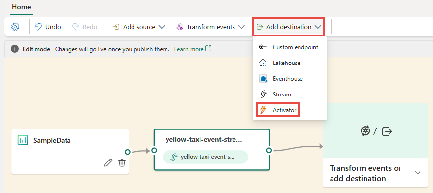
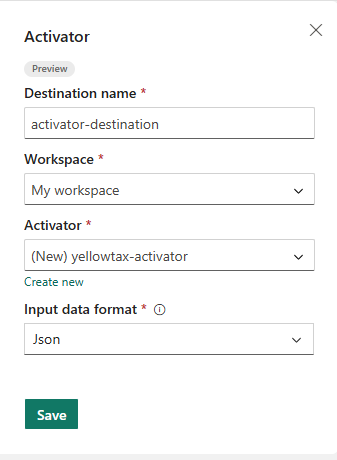
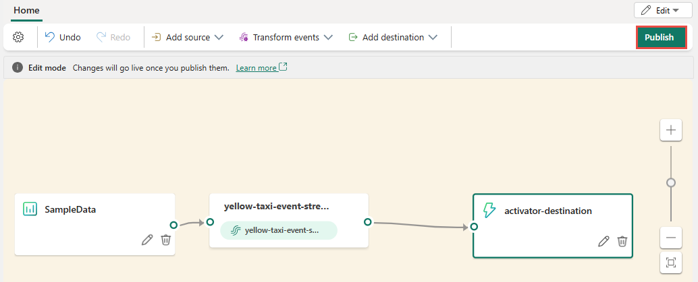
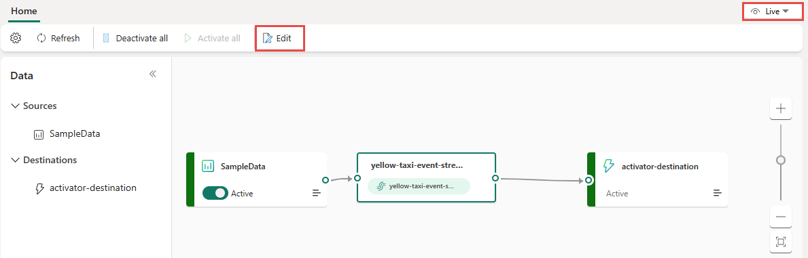

# Add a Fabric Activator destination to an eventstream (preview)

This article shows you how to add Activator destination to an eventstream.

## Prerequisites

- Access to the Fabric **premium workspace** where your eventstream is located with **Contributor** or higher permissions.
- If you already have an Activator you want to use, access to the **premium workspace** where your Activator is located with **Contributor** or higher permissions.

[!INCLUDE [sources-destinations-note](./includes/sources-destinations-note.md)]

## Add Activator as a destination

To add an Activator destination to a default stream or derived stream, follow these steps.

1. In **Edit mode** for your eventstream, select **Add destination** on the ribbon and select **Activator** from the dropdown list.

   

    You can also select **Transform events or add destination** tile on the canvas, and select **Activator** from the drop-down list. 

    :::image type="content" source="media/add-destination-activator-enhanced/add-destination-canvas.png" alt-text="Screenshot that shows the canvas for an eventstream with New destination, Activator menu selected.":::
1. On the **Activator** screen, enter a **Destination name**, select a **Workspace**, and select an existing **Activator** or select **Create new** to create a new one.

   
1. Select **Save**.
1. To implement the newly added Activator destination, select **Publish**.

   

    Once you complete these steps, the Activator destination is available for visualization in **Live view**. Select **Edit** to switch to the Edit mode to make more changes to the eventstream.

    

## Related content 

To learn how to add other destinations to an eventstream, see the following articles: 

- [Route events to destinations](add-manage-eventstream-destinations.md)
- [Custom app destination](add-destination-custom-app.md)
- [Derived stream destination](add-destination-derived-stream.md)
- [Eventhouse destination](add-destination-kql-database.md)
- [Lakehouse destination](add-destination-lakehouse.md)
- [Create an eventstream](create-manage-an-eventstream.md)

