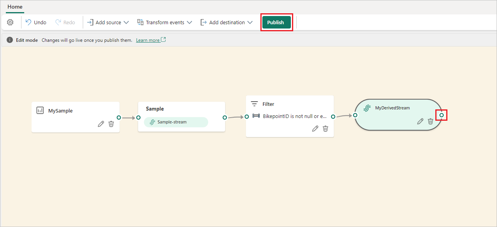

# Add a derived stream destination to an eventstream (preview)

This article shows you how to add a derived stream destination to an eventstream with enhanced capabilities.

You can create a derived stream after doing operations like filtering and aggregating an eventstream. The derived stream is then ready for further consumption or analysis through the Real-Time hub. For more information about derived streams, see [Create default and derived Fabric eventstreams](create-default-derived-streams.md).

## Prerequisites

- Access to the Fabric **premium workspace** where your eventstream is located with **Contributor** or higher permissions.

## Add a derived stream as a destination

To route event data to a derived stream destination, follow these steps to add the **Stream** destination.

1. In **Edit mode** for your eventstream, use one of the following ways to create a new stream:

   - Hover over the operator and select the **+** symbol, then select **Stream** as the destination.

     

   - Select **Destination** from the ribbon and select **Stream**. Then drag the new derived stream to connect it to the operator node.

     

1. On the **Derived Stream** screen, give the stream a name, specify the data format, and select **Save**.

   

1. After you create the derived stream, it appears in your eventstream on the canvas in **Edit mode**. You can continue processing your data by adding operations and destinations after the derived stream. To implement your changes, select **Publish**.

   

After you complete these steps, the derived stream appears on the canvas in **Live view**. You can view the **Details** pane. If you add a Reflex or custom endpoint destination after your derived **Stream** node, you can also see **Data Insights** and **Data Preview**.

You can also access this stream in Real-Time hub.

## Related content 

To learn how to add other destinations to an eventstream, see the following articles: 

- [Route events to destinations ](add-manage-eventstream-destinations-enhanced.md)
- [Custom app destination](add-destination-custom-app-enhanced.md)
- [KQL Database destination](add-destination-kql-database-enhanced.md)
- [Lakehouse destination](add-destination-lakehouse-enhanced.md)
- [Reflex destination](add-destination-reflex-enhanced.md)
- [Create an eventstream](create-manage-an-eventstream.md)
