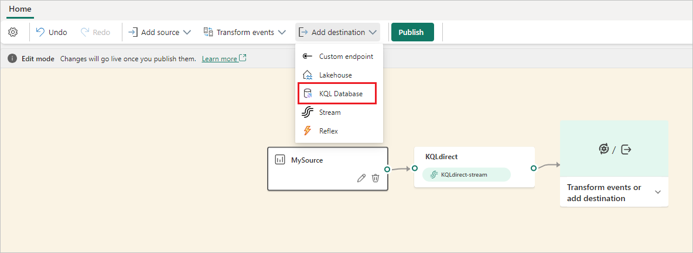
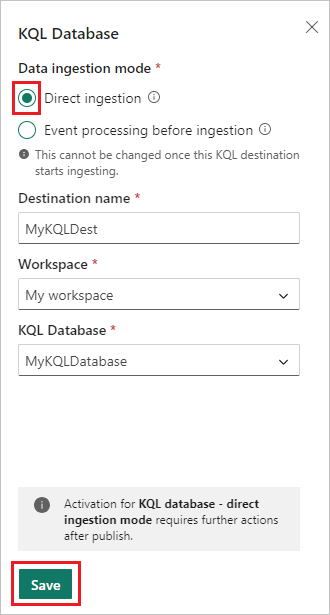
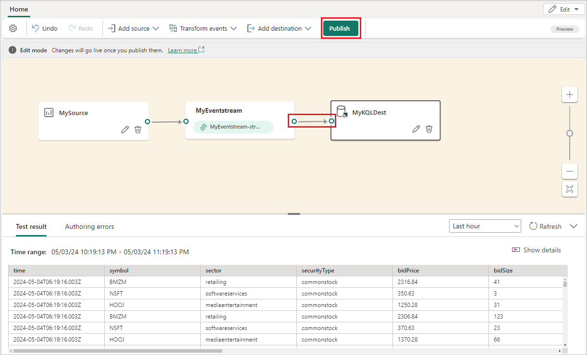
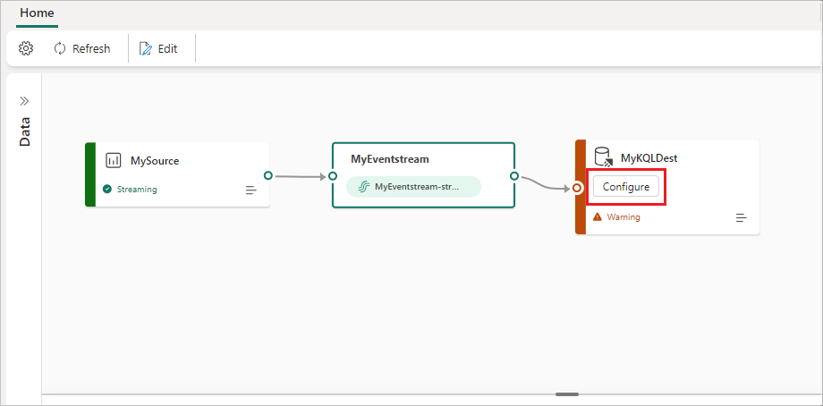
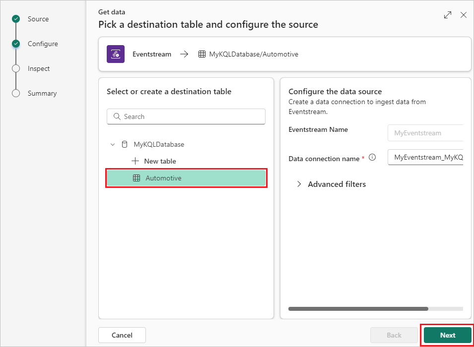
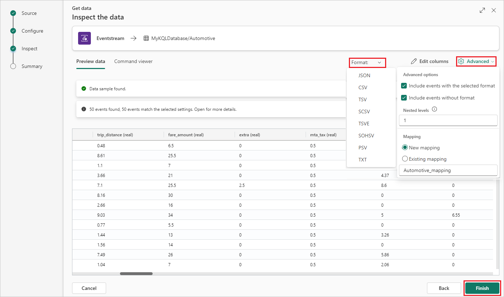
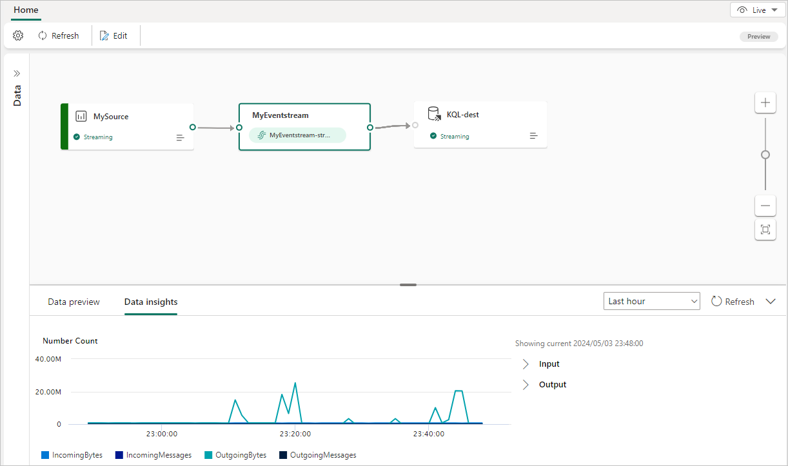
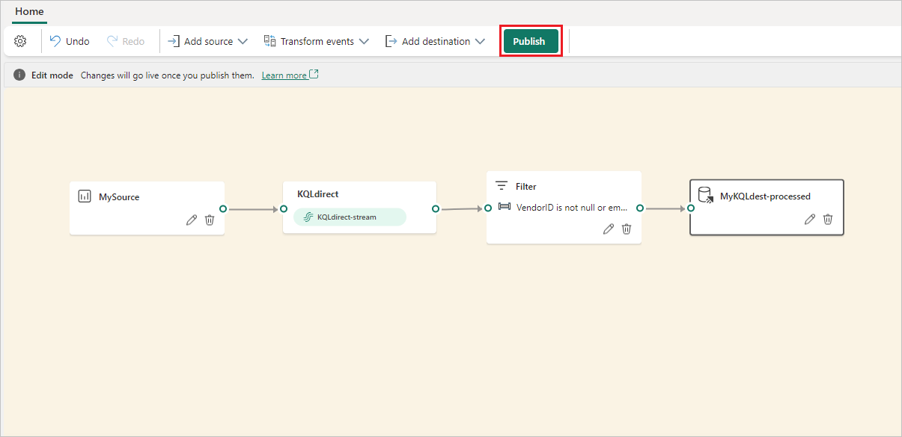
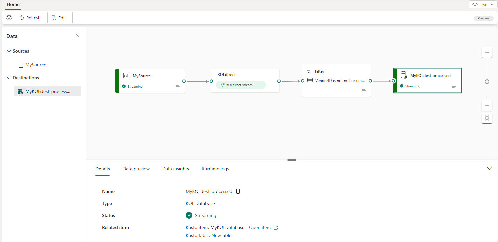

# Add a KQL Database destination to an eventstream

This article shows you how to add a KQL database as a destination to an eventstream in Microsoft Fabric event streams.

If you want to use enhanced capabilities that are in preview, see the content in the **Enhanced capabilities** tab. Otherwise, use the content in the **Standard capabilities** tab. For information about the enhanced capabilities that are in preview, see [Enhanced capabilities](new-capabilities.md).

# [Enhanced capabilities (Preview)](#tab/enhancedcapabilities)

## Prerequisites

- Access to the Fabric **premium workspace** where your eventstream is located with **Contributor** or higher permissions.
- A KQL database created in a Fabric **premium workspace**.
- Access to the Fabric **premium workspace** where your KQL database is located with **Contributor** or higher permissions.

##  Add a KQL database as a destination

To add a KQL database as a destination, you can choose between two ingestion modes: **Direct ingestion** or **Event processing before ingestion**.

### Direct ingestion mode

Direct ingestion mode ingests your event data directly into the KQL database without any processing. You can use direct ingestion mode to add a KQL database destination to your default stream.

> [!IMPORTANT]
> You can use **Direct ingestion** only for your default stream. Direct ingestion can't follow processing operators or derived streams. If you want to add a KQL Database destination after processing operators or derived streams, use **Event processing before ingestion** instead.

1. In **Edit mode** for your eventstream, select **Add destination** on the ribbon or the **Transform events or add destination** card on the canvas, and then select **KQL Database**. 

   

1. On the KQL Database screen, select **Direct ingestion**.

1. Enter a **Destination name**, a **Workspace**, and a **KQL Database** from the selected workspace.

1. Select **Save**.

   

1. Proceed to configure the KQL Database data connection by selecting **Publish**.

   

1. In the KQL Database destination node, select **Configure**.

   

1. Your KQL Database opens. On the left pane of the **Get data** screen, select an existing table of the KQL database or create a new one to route and ingest the data.

1. Select **Next**.

   

1. On the **Inspect the data** screen, select a data format to preview how the data is sent to your KQL database..

   

1. You can also **Edit column headers**, or select **Advanced** to choose other options.

   

1. When you're finished configuring the data, select **Finish**.

1. On the **Summary** screen, review the details and status of your data ingestion, including the table with the schema you defined and the connection between the eventstream and the KQL database. Select **Close** to finalize the setup of your KQL database.

   

You can now see the KQL Database destination on the canvas in **Live view**.

### Event processing before ingestion

The event processing before ingestion mode processes your event data before ingesting it into the KQL database. Use this mode if you apply operators such as filtering or aggregation to process the data before ingestion, or after a derived stream.

1. In **Edit mode** for your eventstream, hover over an operator or derived stream, select **+**, and then select **KQL Database**.

   

1. On the **KQL Database** screen, **Event processing before ingestion** should be selected. Complete the rest of the information about your KQL database, and then select **Save**.

   

1. To implement the newly added KQL Database destination, select **Publish**.

   

Once you complete these steps, the eventstream with KQL Database destination is available for visualization in **Live view.**

# [Standard capabilities](#tab/standardcapabilities)

## Prerequisites

Before you start, you must complete the following prerequisites:

- Get access to a **premium workspace** with **Contributor** or above permissions where your eventstream is located.
- Access to a **premium workspace** with **Contributor** or above permissions where your KQL database is located.

[!INCLUDE [sources-destinations-note](./includes/sources-destinations-note.md)]

## Add a KQL database as a destination

To add a KQL database as a destination, you need to have a KQL database created in the workspace, and choose between two ingestion modes: **Direct ingestion** and **Event processing before ingestion**.

### Direct ingestion
   This mode ingests your event data directly into the KQL database without any processing. You can use this mode if you want to ingest your event data as-is and perform any processing or transformation later in KQL database using KQL queries.
   1. Select **New destination** on the ribbon or "**+**" in the main editor canvas and then select **KQL Database**. The **KQL Database** destination configuration screen appears.

   2. Select **Direct ingestion**, enter a destination name, select a workspace, choose a KQL database from the selected workspace, and then select **Add and configure**.

      > [!NOTE]
      > You can only select workspaces that have the same region Fabric capacity as the eventstream.

      :::image type="content" source="./media/event-streams-destination/eventstream-destinations-kql-database.png" alt-text="Screenshot of the KQL Database pull mode destination configuration screen." lightbox="./media/event-streams-destination/eventstream-destinations-kql-database.png" :::

   3. On the **Get data** page, navigate through the tabs to complete the configuration:
      1. **Configure**: Use an existing table of your KQL database or create a new one to route and ingest the data. Complete the required fields and select **Next**.

         :::image type="content" source="./media/add-manage-eventstream-destinations/eventstream-destination-kql-wizard-1.png" alt-text="Screenshot showing the Destination tab of the Ingest data screen for creating a KQL database destination." lightbox="./media/add-manage-eventstream-destinations/eventstream-destination-kql-wizard-1.png" :::

      2. **Inspect**: Select a data format, and preview how the data is sent to your KQL database.

         :::image type="content" source="./media/add-manage-eventstream-destinations/eventstream-destination-kql-wizard-2.png" alt-text="Screenshot showing the data format of the Ingest data screen for creating a KQL database destination." lightbox="./media/add-manage-eventstream-destinations/eventstream-destination-kql-wizard-2.png" :::

         You can also change the column name, data type, or update column by clicking the arrow in the table header. Complete the required fields and select **Finish**.

         :::image type="content" source="./media/add-manage-eventstream-destinations/eventstream-destination-kql-wizard-3.png" alt-text="Screenshot showing how to change the column of the Ingest data screen for creating a KQL database destination." lightbox="./media/add-manage-eventstream-destinations/eventstream-destination-kql-wizard-3.png":::

         :::image type="content" source="./media/add-manage-eventstream-destinations/eventstream-destination-kql-wizard-4.png" alt-text="Screenshot showing the change the column name, data type of the Ingest data screen for creating a KQL database destination." lightbox="./media/add-manage-eventstream-destinations/eventstream-destination-kql-wizard-4.png" :::

      3. **Summary**: Review the status of your data ingestion, including the table created with the schema you defined, and connection between the eventstream and the KQL database.

          :::image type="content" source="./media/add-manage-eventstream-destinations/eventstream-destination-kql-wizard-5.png" alt-text="Screenshot showing the Summary tab of the Ingest data screen for creating a KQL database destination." lightbox="./media/add-manage-eventstream-destinations/eventstream-destination-kql-wizard-5.png" :::

   4. After you configure everything and select **Close**, a KQL database destination appears on the canvas, connected to your eventstream.

      :::image type="content" source="./media/add-manage-eventstream-destinations/eventstream-destination-kql-database.png" alt-text="Screenshot showing the new KQL database pull mode destination." lightbox="./media/add-manage-eventstream-destinations/eventstream-destination-kql-database.png" :::

### Event processing before ingestion
   This mode processes your event data before ingesting it into the KQL database. You can use this mode if you want to apply some processing or transformation to your event data before ingesting it, such as filtering, aggregating, or expanding. You can design the processing logic using event processor.
   1. Select **Event processing before ingestion**, complete the information about your KQL Database, and then select **Open event processor**.

      :::image type="content" source="./media/event-streams-destination/eventstream-destinations-kql-database-push-mode.png" alt-text="Screenshot of the KQL Database push mode destination configuration screen." lightbox="./media/event-streams-destination/eventstream-destinations-kql-database-push-mode.png":::

   2. Design the event processing with event processor, and then select **Save**

      :::image type="content" source="./media/process-events-using-event-processor-editor/event-processor-editor-preview.png" alt-text="Screenshot of the push mode event processor screen." lightbox="./media/process-events-using-event-processor-editor/event-processor-editor-preview.png":::

   3. When you choose an existing Kusto table, schema validation between the current schema in this eventstream and the target KQL table will be performed. If the two schemas aren't matched, an error message is shown and reminds you to open event processor to adjust the schema in this eventstream accordingly.

      :::image type="content" source="./media/process-events-using-event-processor-editor/event-processor-error.png" alt-text="Screenshot of the push mode event processor error screen." lightbox="./media/process-events-using-event-processor-editor/event-processor-error.png":::

      When open the event processor, the detailed mismatch information is shown in Authoring error tab.

      :::image type="content" source="./media/process-events-using-event-processor-editor/event-processor-mismatch-information.png" alt-text="Screenshot of the push mode event processor mismatch information screen." lightbox="./media/process-events-using-event-processor-editor/event-processor-mismatch-information.png":::

   4. After you configure everything and select **Save**, a KQL database destination appears on the canvas, connected to your eventstream, and you can check the metrics in the **Data insights** and logs in **Runtime logs**.

      :::image type="content" source="./media/add-manage-eventstream-destinations/eventstream-destination-kql-database-push-mode.png" alt-text="Screenshot showing the new KQL database push mode destination." lightbox="./media/add-manage-eventstream-destinations/eventstream-destination-kql-database-push-mode.png" :::

## Manage a destination

**Edit/remove**: You can edit or remove an eventstream destination either through the navigation pane or canvas.

When you select **Edit**, the edit pane opens in the right side of the main editor. You can modify the configuration as you wish, including the event transformation logic through the event processor editor.

:::image type="content" source="./media/add-manage-eventstream-destinations/eventstream-destination-edit-deletion.png" alt-text="Screenshot showing where to select the modify and delete options for destinations on the canvas." lightbox="./media/add-manage-eventstream-destinations/eventstream-destination-edit-deletion.png" :::

---

## Related content

To learn how to add other destinations to an eventstream, see the following articles:

- [Route events to destinations](add-manage-eventstream-destinations-enhanced.md)
- [Custom app destination](add-destination-custom-app.md)
- [Derived stream destination](add-destination-derived-stream.md)
- [Lakehouse destination](add-destination-lakehouse.md)
- [Reflex destination](add-destination-reflex.md)
- [Create an eventstream](create-manage-an-eventstream.md)
