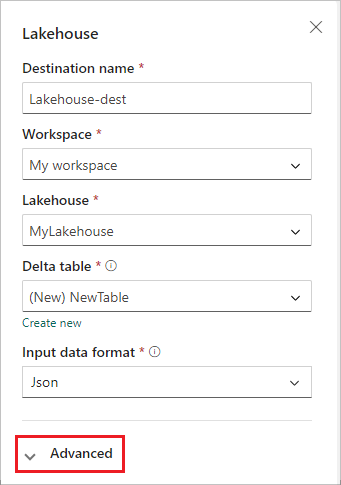
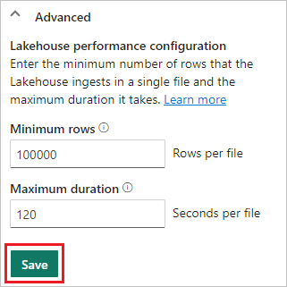

# Add a lakehouse destination to an eventstream

This article shows you how to add a lakehouse as a destination to an eventstream in Microsoft Fabric event streams.

If you want to use enhanced capabilities that are in preview, see the content in the **Enhanced capabilities** tab. Otherwise, use the content in the **Standard capabilities** tab. For information about the enhanced capabilities that are in preview, see [Enhanced capabilities](new-capabilities.md).

> [!IMPORTANT]
> There is *schema enforcement* for writing data into a lakehouse destination table. All new writes to the table must be compatible with the target table's schema at write time, ensuring data quality.
> 
> When output is written to a new delta table, the table schema is created based on the first record. All records of the output data are projected onto the schema of the existing table.
> 
> If the incoming data has columns that aren't in the existing table schema, the extra columns aren't included in the data written to the table. Likewise, if the incoming data is missing columns that are in the existing table schema, the missing columns write to the table with the values set to null.

# [Enhanced capabilities (Preview)](#tab/enhancedcapabilities)

## Prerequisites

- Access to the Fabric **premium workspace** where your eventstream is located with **Contributor** or higher permissions.
- Access to the **premium workspace** where your lakehouse is located with **Contributor** or higher permissions.

## Add a lakehouse as a destination

To add a lakehouse destination to a default or derived eventstream, follow these steps.

1. In **Edit mode** for your eventstream, select **Add destination** on the ribbon and select **Lakehouse** from the dropdown list.

   :::image type="content" source="media/add-destination-lakehouse/add-destination.png" alt-text="A screenshot of the Add destination dropdown list with Lakehouse highlighted." lightbox="media/add-destination-lakehouse/add-destination.png":::

1. Connect the lakehouse node to your stream node or operator.

1. On the **Lakehouse** configuration screen, complete the following information:

   1. Enter a **Destination name**.
   1. Select the **Workspace** that contains your lakehouse.
   1. Select an existing **Lakehouse** from the workspace you specified.
   1. Select an existing **Delta table**, or create a new one to receive data.
   1. Select the **Input data format** that is sent to your lakehouse. The supported data formats are JSON, Avro, and CSV (with header).

   

1. Select **Advanced**.

1. Two ingestion modes are available for a lakehouse destination. Based on your scenario, configure these modes to optimize how Fabric event streams writes to the lakehouse.

   - **Minimum rows** is the minimum number of rows that the lakehouse ingests in a single file. The minimum is 1 row, and the maximum is 2 million rows per file. The smaller the minimum number of rows, the more files the lakehouse creates during ingestion.

   - **Maximum duration** is the maximum duration that the lakehouse takes to ingest a single file. The minimum is 1 minute and maximum is 2 hours. The longer the duration, the more rows are ingested in a file.

   

1. Select **Save**.

1. To implement the newly added lakehouse destination, select **Publish**.

   :::image type="content" source="media/add-destination-lakehouse/edit-mode.png" alt-text="A screenshot of the stream and lakehouse destination in Edit mode with the Publish button highlighted." lightbox="media/add-destination-lakehouse/edit-mode.png":::

Once you complete these steps, the lakehouse destination is available for visualization in **Live view**. In the **Details** pane, you can select the **Optimize table in notebook** shortcut to launch an Apache Spark job within a Notebook, which consolidates the small streaming files within the target lakehouse table.

:::image type="content" source="media/add-destination-lakehouse/live-view.png" alt-text="A screenshot of the lakehouse destination and the table optimization button in Live view." lightbox="media/add-destination-lakehouse/live-view.png":::

# [Standard capabilities](#tab/standardcapabilities)

## Prerequisites

Before you start, you must complete the following prerequisites:

- Get access to a **premium workspace** with **Contributor** or above permissions where your eventstream is located.
- Get access to a **premium workspace** with **Contributor** or above permissions where your lakehouse is located.

[!INCLUDE [sources-destinations-note](./includes/sources-destinations-note.md)]

## Add a lakehouse as a destination

If you have a lakehouse created in your workspace, follow these steps to add the lakehouse to your eventstream as a destination:

1. Select **New destination** on the ribbon or "**+**" in the main editor canvas and then select **Lakehouse**. The **Lakehouse** destination configuration screen appears.

1. Enter a name for the eventstream destination and complete the information about your lakehouse.

   :::image type="content" source="./media/event-streams-destination/eventstream-destinations-lakehouse.png" alt-text="Screenshot of the Lakehouse destination configuration screen."lightbox="./media/event-streams-destination/eventstream-destinations-lakehouse.png":::

   1. **Lakehouse**: Select an existing lakehouse from the workspace you specified.
   1. **Delta table**: Select an existing delta table or create a new one to receive data.

      > [!NOTE]
      > When writing data into the lakehouse table, there is **Schema enforcement**. This means all new writes to a table must be compatible with the target table's schema at write time, ensuring data quality.
      >
      > All records of the output data are projected onto the schema of the existing table. When writing the output to a new delta table, the table schema is created based on the first record. If the incoming data has an additional column compared to the existing table schema, it writes to the table without including the extra column. Conversely, if the incoming data is missing a column compared to the existing table schema, it writes to the table with the column's value set to null.
   1. **Input data format**: Select the format for the data (input data) that is sent to your lakehouse.

      > [!NOTE]
      > The supported input event data formats are JSON, Avro, and CSV (with header).
   1. **Event processing**: You can use the event processing editor to specify how the data should be processed before sending it to your lakehouse. Select **Open event processor** to open the event processing editor. To learn more about real-time processing using the event processor, see [Process event data with event processor editor](./process-events-using-event-processor-editor.md). When you're done with the editor, select **Done** to return to the **Lakehouse** destination configuration screen.

      :::image type="content" source="./media/add-manage-eventstream-destinations/eventstream-destination-lakehouse-event-processor-editor.png" alt-text="Screenshot showing the event processor editor." lightbox="./media/add-manage-eventstream-destinations/eventstream-destination-lakehouse-event-processor-editor.png" :::
1. Two ingestion modes are available for a lakehouse destination. Select one of these modes to optimize how the Fabric event streams feature writes to the lakehouse based on your scenario.
    1. **Rows per file** – The minimum number of rows that Lakehouse ingests in a single file. The smaller the minimum number of rows, the more files Lakehouse creates during ingestion. Minimum is 1 row. Maximum is 2M rows per file.
    1. **Duration** – The maximum duration that Lakehouse would take to ingest a single file. The longer the duration, more rows are ingested in a file. Minimum is 1 minute and maximum is 2 hours.  
      
        :::image type="content" source="./media/add-manage-eventstream-destinations/ingestion-modes.png" alt-text="Screenshot showing the ingestion modes." lightbox="./media/add-manage-eventstream-destinations/ingestion-modes.png" :::
1. Select **Add** to add the lakehouse destination.
1. Table optimization shortcut available inside the lakehouse destination. This solution facilitates you by launching a Spark job within a Notebook, which consolidates these small streaming files within the target Lakehouse table.

    :::image type="content" source="./media/add-manage-eventstream-destinations/table-optimization.png" alt-text="Screenshot showing the table optimization settings." lightbox="./media/add-manage-eventstream-destinations/table-optimization.png" :::
1. A lakehouse destination appears on the canvas, with a spinning status indicator. The system takes a few minutes to change the status to **Ingesting**.

   :::image type="content" source="./media/add-manage-eventstream-destinations/eventstream-destination-lakehouse.png" alt-text="Screenshot showing the lakehouse destination." lightbox="./media/add-manage-eventstream-destinations/eventstream-destination-lakehouse.png" :::

## Manage a destination

**Edit/remove**: You can edit or remove an eventstream destination either through the navigation pane or canvas.

When you select **Edit**, the edit pane opens in the right side of the main editor. You can modify the configuration as you wish, including the event transformation logic through the event processor editor.

:::image type="content" source="./media/add-manage-eventstream-destinations/eventstream-destination-edit-deletion.png" alt-text="Screenshot showing where to select the modify and delete options for destinations on the canvas." lightbox="./media/add-manage-eventstream-destinations/eventstream-destination-edit-deletion.png" :::

---
## Related content

To learn how to add other destinations to an eventstream, see the following articles:

- [Route events to destinations](add-manage-eventstream-destinations-enhanced.md)
- [Custom app destination](add-destination-custom-app.md)
- [Derived stream destination](add-destination-derived-stream.md)
- [KQL Database destination](add-destination-kql-database.md)
- [Reflex destination](add-destination-reflex.md)
- [Create an eventstream](create-manage-an-eventstream.md)