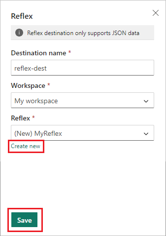

# Add a Reflex destination to an eventstream

This article shows you how to add Reflex destination to an eventstream.

If you want to use enhanced capabilities that are in preview, see the content in the **Enhanced capabilities** tab. Otherwise, use the content in the **Standard capabilities** tab. For information about the enhanced capabilities that are in preview, see [Enhanced capabilities](new-capabilities.md).

# [Enhanced capabilities (preview)](#tab/enhancedcapabilities)

## Prerequisites

- Access to the Fabric **premium workspace** where your eventstream is located with **Contributor** or higher permissions.
- If you already have a Reflex you want to use, access to the **premium workspace** where your Reflex is located with **Contributor** or higher permissions.

## Add Reflex as a destination

To add a Reflex destination to a default stream or derived stream, follow these steps.

1. In **Edit mode** for your eventstream, select **Add destination** on the ribbon and select **Reflex** from the dropdown list.

   

1. On the **Reflex** screen, enter a **Destination name**, select a **Workspace**, and select an existing **Reflex** or select **Create new** to create a new one.

   

1. Select **Save**.

1. To implement the newly added Reflex destination, select **Publish**.

   

Once you complete these steps, the Reflex destination is available for visualization in **Live view**.

# [Standard capabilities](#tab/standardcapabilities)

## Prerequisites

Before you start, you must complete the following prerequisites:

- Get access to a **premium workspace** with **Contributor** or above permissions where your eventstream is located.
- Get access to a **premium workspace** with **Contributor** or above permissions where your destination is located.

[!INCLUDE [sources-destinations-note](./includes/sources-destinations-note.md)]

## Add a Reflex as a destination

To add a Reflex from your workspace as an eventstream's destination, do the following steps:

1. Select **New destination** on the ribbon or "**+**" in the main editor canvas and then select **Reflex**. The **Reflex** destination configuration screen appears.

1. Enter a name for the eventstream destination and complete the information about your Reflex.

   **Reflex**: Select an existing Reflex or create a new one to receive data.

   :::image type="content" source="./media/add-manage-eventstream-destinations/eventstream-destination-reflexconfiguration.png" alt-text="Screenshot showing the reflex configuration." lightbox="./media/add-manage-eventstream-destinations/eventstream-destination-reflexconfiguration.png" :::

1. After you select on the Add button, you can see a Reflex destination on the canvas that is linked to your eventstream.

   :::image type="content" source="./media/add-manage-eventstream-destinations/eventstream-destination-add-reflex.png" alt-text="Screenshot showing the new reflex destination." lightbox="./media/add-manage-eventstream-destinations/eventstream-destination-add-reflex.png" :::

## Manage a destination

**Edit/remove**: You can edit or remove an eventstream destination either through the navigation pane or canvas.

When you select **Edit**, the edit pane opens in the right side of the main editor. You can modify the configuration as you wish, including the event transformation logic through the event processor editor.

:::image type="content" source="./media/add-manage-eventstream-destinations/eventstream-destination-edit-deletion.png" alt-text="Screenshot showing where to select the modify and delete options for destinations on the canvas." lightbox="./media/add-manage-eventstream-destinations/eventstream-destination-edit-deletion.png" :::

---

## Related content 

To learn how to add other destinations to an eventstream, see the following articles: 

- [Route events to destinations](add-manage-eventstream-destinations.md)
- [Custom app destination](add-destination-custom-app.md)
- [Derived stream destination](add-destination-derived-stream.md)
- [KQL Database destination](add-destination-kql-database.md)
- [Lakehouse destination](add-destination-lakehouse.md)
- [Create an eventstream](create-manage-an-eventstream.md)