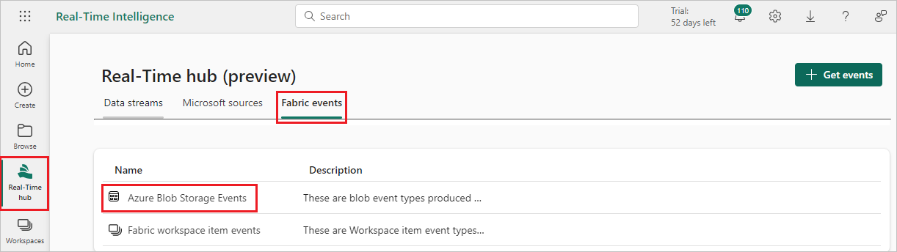
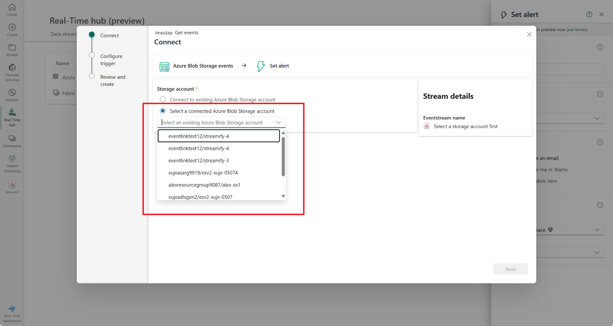
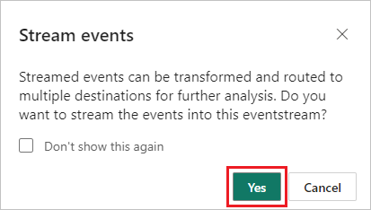
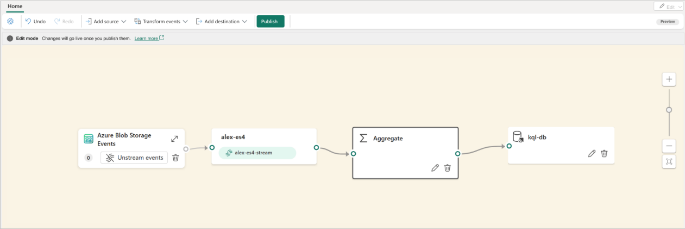
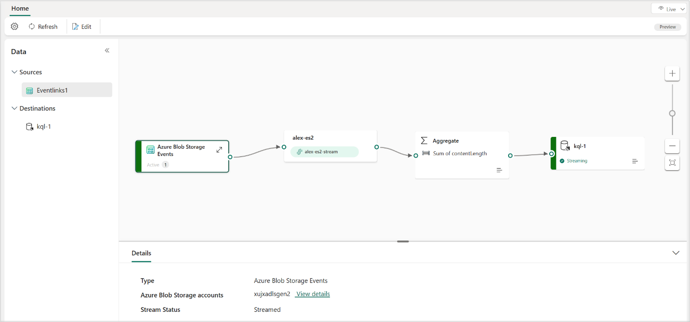
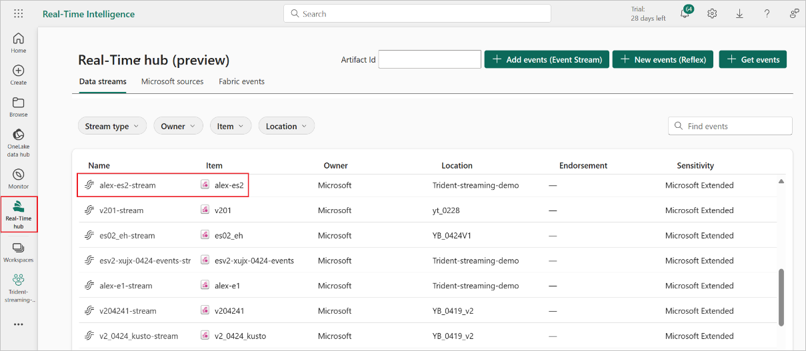

# Add Azure Blob Storage event source to an eventstream (preview)

This article shows you how to add an Azure Blob Storage event source to an eventstream. An event is the smallest amount of information that fully describes something that happened in a system. Azure Blob Storage events are triggered when a client creates, replaces, or deletes a blob. Microsoft Fabric event streams allows you to link Blob Storage events to Fabric events in Real-Time hub.

When you add Azure Blob Storage events as an eventstream source, it automatically creates system events to your Blob Storage account and links them to Fabric events in Real-Time hub. You can then convert these events into continuous data streams and transform them before routing them to various destinations in Fabric.

Fabric event streams supports the following Blob Storage event types:

|Event name|Description|
|-------|------------|
|Microsoft.Storage.BlobCreated|Triggered when a blob is created or replaced.|
|Microsoft.Storage.BlobDeleted                    |Triggered when a blob is deleted.|
|Microsoft.Storage.BlobRenamed                    |Triggered when a blob is renamed.|
|Microsoft.Storage.BlobTierChanged                |Triggered when the blob access tier is changed.|
|Microsoft.Storage.DirectoryCreated               |Triggered when a directory is created.|
|Microsoft.Storage.DirectoryRenamed               |Triggered when a directory is renamed.|
|Microsoft.Storage.AsyncOperationInitiated        |Triggered when an operation involving moving or copying data from the archive to hot or cool tiers is initiated.|
|Microsoft.Storage.DirectoryDeleted               |Triggered when a directory is deleted.|
|Microsoft.Storage.BlobInventoryPolicyCompleted   |Triggered when the inventory run completes for a rule that defines an inventory policy.|
|Microsoft.Storage.LifecyclePolicyCompleted       |Triggered when the actions defined by a lifecycle management policy are done.|

For more details about available event types, see [Azure Blob Storage as Event Grid source](/azure/event-grid/event-schema-blob-storage).

[!INCLUDE [enhanced-capabilities-preview-note](./includes/enhanced-capabilities-preview-note.md)]

## Unstreamed vs. streamed events

Azure Blob Storage events are discrete events with clear start and end points. Fabric Real-Time hubs can capture these events in two formats:

- **Unstreamed events.** These events are represented in their raw format as discrete events. If Azure Blob Storage events aren't streamed in an eventstream, they're not directly connected to the eventstream, and the default stream isn't created.

  This status indicates that the events are linked to Fabric events in the Real-Time hub and awaiting further action. Actions include creating alerts with Data Activator that execute Fabric job items like Pipeline or Notebook in the **Fabric events** tab in Real-Time hub.

  

- **Streamed events.** These events are converted to continuous events, enabling real-time transformation and routing to various destinations in Fabric for further analysis. In an eventstream, selecting the **Stream events** button on an unstreamed Azure Blob Storage source converts the events into continuous events. The eventstream is then assigned a default stream, letting you add operations and route it to other destinations in Fabric.

  

## Prerequisites

- Access to the Fabric **premium workspace** with **Contributor** or higher permissions.
- Access to an Azure Blob Storage **StorageV2 (general purpose v2)**, **BlockBlobStorage**, or **BlobStorage** account. The **Storage (general purpose v1)** storage type doesn't support integration with Fabric event streams.

## Add Azure Blob Storage events as source

1. Select **Eventstream** to create a new eventstream. Make sure the **Enhanced Capabilities (preview)** option is enabled.

   

1. On the next screen, select **Add external source**.

   

## Configure and connect to Azure Blob Storage events

[!INCLUDE [azure-blob-storage-connector](includes/azure-blob-storage-source-connector.md)]

Once the connection is created, you can see the Azure Blob Storage event source added to your eventstream in **Edit mode**. Select **Publish** to publish the eventstream and start capturing your Azure Blob Storage events.

> [!NOTE]
> The Eventstream node in the editor doesn't have a default stream created. This is because the Blob Storage events are still in the form of discrete events and aren't yet converted to a stream or connected to the eventstream.

After you publish the changes, your Azure Blob Storage account is now linked to the **Real-Time hub**. Go to **Real-time hub > Fabric events > Azure Blob Storage Events**, you can locate your Azure Blob Storage account in the drop-down list and set a trigger to take actions on the blob storage events. 

## Transform Azure Blob Storage events

After you link Azure Blob Storage events to Fabric events in Real-Time hub, you can convert these events into a stream and do transformations within eventstreams.

1. After you add an Azure Blob Storage event source in **Edit mode**, select **Stream events** in the source to convert the Blob Storage events into a data stream.

   

1. Respond **Yes** to the popup that asks if you want to stream the Blob Storage events into the eventstream.

   

1. In the editor, a default stream is created within the eventstream node, indicating that the Blob Storage events are converted into a stream as the default stream.

   

1. Then you need to publish the eventstream and make sure there's at least one event being triggered from your Azure Blob Storage in order to proceed with transformation or routing.

   

1. Once events are flowing into the eventstream, enter **Edit mode** and add operations to transform the streamed Blob Storage events. The following example shows that the Blob Storage events are aggregated and routed to a KQL database.

   

1. Once the changes are published, the streamed Azure Blob Storage events are transformed and routed to the designated destination in Fabric.

   

   You can also view the data stream on the **Data streams** tab of **Real-Time hub** for verification.

   

## Related content

- [Add Fabric workspace item events to an eventstream](add-source-fabric-workspace.md)
- [Create eventstreams for discrete events](create-eventstreams-discrete-events.md)