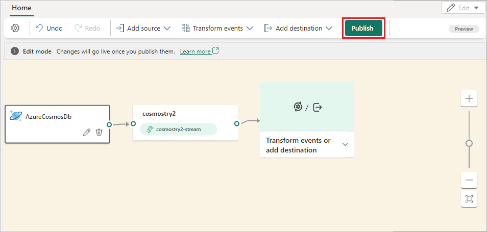
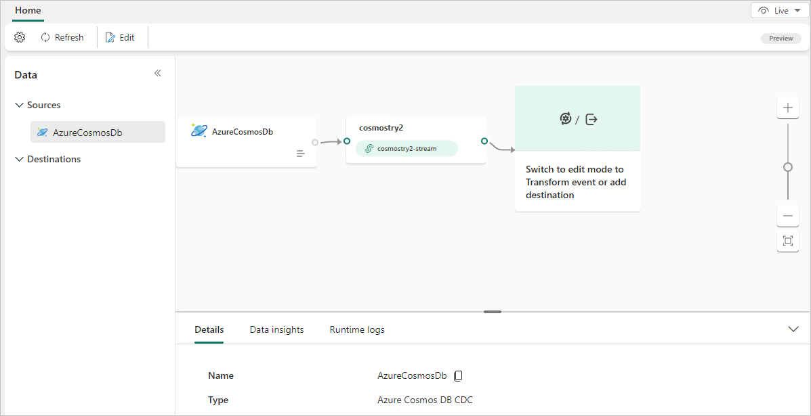

# Add Azure Cosmos DB CDC source to an eventstream

This article shows you how to add an Azure SQL Database Change Data Capture source to an eventstream.

The Azure Cosmos DB Change Data Capture (CDC) source connector for Microsoft Fabric event streams lets you capture a snapshot of the current data in an Azure Cosmos DB database. The connector then monitors and records any further row-level changes to this data. Once the changes are captured in the eventstream, you can process this CDC data in real-time and send it to different destinations within Fabric for further processing or analysis.

## Prerequisites

- Access to the Fabric **premium workspace** with **Contributor** or higher permissions.
- Access to an Azure Cosmos DB account and database.

## Get connection details

1. On the Azure portal page for your Azure Cosmos DB account, select **Connection strings** under **Settings** in the left navigation.

1. On the **Connection strings** page, copy the **Endpoint** and **Primary key** values to use for setting up the eventstream connection.

   

1. On the Azure portal **Overview** page for your Azure Cosmos DB account, note the **Database** and item **ID** you want to collect data for, depending on the API for your Azure Cosmos DB account.

   - **Azure Cosmos DB for NoSQL:**
   
     

   - **Azure Cosmos DB for Table:**
   
     

## Add Azure Cosmos DB (CDC) as a source

1. In Fabric Real-Time Intelligence, select **Eventstream** to create a new eventstream. Make sure the **Enhanced Capabilities (preview)** option is enabled.

   

1. On the next screen, select **Add external source**.

   

## Configure and connect to Azure Cosmos DB (CDC)

[!INCLUDE [azure-cosmos-db-connector](./includes/azure-cosmos-db-cdc-source-connector.md)]

You see the Azure CosmosDB (CDC) source added to your eventstream in **Edit mode**.

   

Select **Publish** to publish the changes and begin streaming Azure Cosmos DB CDC data to the eventstream.

   

## Related content

Other connectors:

- [Amazon Kinesis Data Streams](add-source-amazon-kinesis-data-streams.md)
- [Azure Event Hubs](add-source-azure-event-hubs-enhanced.md)
- [Azure IoT Hub](add-source-azure-iot-hub-enhanced.md)
- [Azure SQL Database Change Data Capture (CDC)](add-source-azure-sql-database-change-data-capture.md)
- [Confluent Kafka](add-source-confluent-kafka.md)
- [Custom endpoint](add-source-custom-app-enhanced.md)
- [Google Cloud Pub/Sub](add-source-google-cloud-pub-sub.md) 
- [MySQL Database CDC](add-source-mysql-database-change-data-capture.md)
- [PostgreSQL Database CDC](add-source-postgresql-database-change-data-capture.md)
- [Sample data](add-source-sample-data-enhanced.md)
- [Azure Blob Storage events](add-source-azure-blob-storage.md)
- [Fabric workspace event](add-source-fabric-workspace.md)