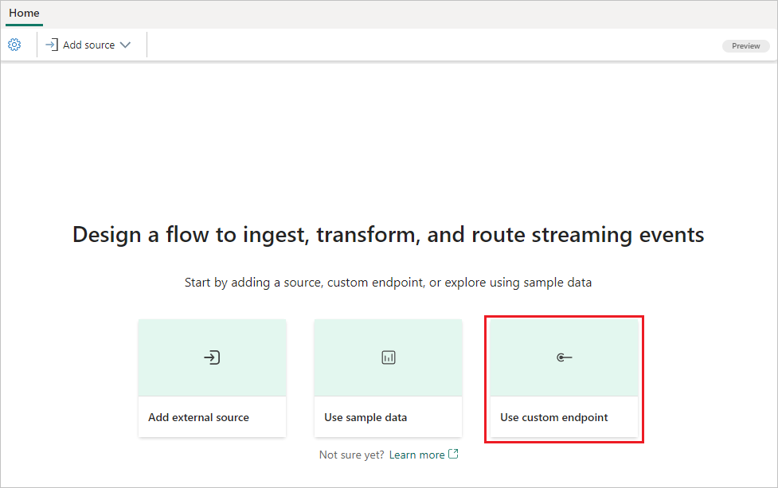

# Add custom app source to an eventstream

If you want to connect your own application with an eventstream, you can add a custom endpoint source. Then you can send data to the eventstream from your own application with the connection endpoint displayed as the custom endpoint. This article shows you how to add a custom app source to an eventstream.

If you want to use enhanced capabilities that are in preview, see the content in the **Enhanced capabilities** tab. Otherwise, use the content in the **Standard capabilities** tab. For information about the enhanced capabilities that are in preview, see [Enhanced capabilities](new-capabilities.md).

# [Enhanced capabilities (Preview)](#tab/enhancedcapabilities)

## Prerequisites

- Access to the Fabric **premium workspace** with **Contributor** or higher permissions.

## Add custom app data as a source

Follow these steps to add a sample data source:

1. To create a new eventstream, select **Eventstream** from the **Home** screen. Make sure the **Enhanced Capabilities (preview)** option is enabled.

   

1. To add custom app source, on the get-started page, select **Use custom endpoint**.

   

   Or, if you already have a published eventstream and want to add custom app data as a source, switch to **Edit** mode. Then select **Add source** in the ribbon, and select **Custom endpoint**.

   

1. On the **Custom endpoint** screen, enter a name for the custom source under **Source name**, and then select **Add**.

   

1. After you create the custom app source, you see it added to your eventstream on the canvas in **Edit mode**. To implement this newly added custom app source data, select **Publish**.

   

Once you complete these steps, the custom app data is available for visualization in **Live view**.

## Get connection strings and sample code

In the Live view **Details** pane, you can see three categories: **Basic**, **Keys**, and **Sample code**. You can also select from three protocol tabs: **Event hub**, **AMQP**, and **Kafka**. The **Keys** and **Sample code** information varies by protocol.

**Basic** shows the name, description, type, and status of your custom endpoint.

**Keys** shows connection strings for your custom endpoint, which you can copy and paste into your application.

The connection string is an event hub-compatible string you can use in your application to receive events from this eventstream. The **Event hub** format is the default format for the connection string, and is compatible with the Azure Event Hubs SDK. You can use this format to connect to eventstreams by using the Event Hubs protocol.

The following example shows what the connection string looks like in **Event hub** format:

*Endpoint=sb://eventstream-xxxxxxxx.servicebus.windows.net/;SharedAccessKeyName=key_xxxxxxxx;SharedAccessKey=xxxxxxxx;EntityPath=es_xxxxxxxx*

**Sample code** shows sample code you can refer to or copy and paste into your application, to push or pull event data to or from this eventstream.

Other than **Event hub**, the other two protocol format tabs you can select in the **Details** pane are **AMQP** and **Kafka**.

- The **AMQP** format is compatible with the AMQP 1.0 protocol, a standard messaging protocol that supports interoperability between different platforms and languages. You can use this format to connect to eventstreams by using the AMQP protocol.

- The **Kafka** format is compatible with the Apache Kafka protocol, a popular distributed streaming platform that supports high-throughput and low-latency data processing. You can use this format to connect to eventstreams by using the Kafka protocol.

You can choose the protocol format that suits your application needs and preferences. Select these tabs in the **Details** pane to get customized **Keys** and **Sample code**. Copy and paste the connection strings from the **Keys** section into your application. Refer to or copy and paste the provided sample code to send or receive events by using the different protocols.

# [Standard capabilities](#tab/standardcapabilities)

## Prerequisites

Before you start, you must complete the following prerequisites:

- Get access to a **premium workspace** with **Contributor** or above permissions where your eventstream is located.

[!INCLUDE [sources-destinations-note](./includes/sources-destinations-note.md)]

## Add a custom app  as a source

If you want to connect your own application with an eventstream, you can add a custom app source. Then, send data to the eventstream with your own application with the connection endpoint exposed in the custom app. Follow these steps to add a custom app source:

1. Select **New source** on the ribbon or "**+**" in the main editor canvas and then **Custom App**.

1. Enter a **Source name** for the custom app and select **Add**.

   :::image type="content" source="./media/event-streams-source\eventstream-sources-custom-app.png" alt-text="Screenshot showing the custom app source configuration." lightbox="./media/event-streams-source/eventstream-sources-custom-app.png":::

1. After you have successfully created the custom application source, you can switch and view the following information in the **Details** tab in the lower pane:

   :::image type="content" source="./media/add-manage-eventstream-sources/custom-app-source.png" alt-text="Screenshot showing the custom app source." lightbox="./media/add-manage-eventstream-sources/custom-app-source.png":::

   - **Basic**: Shows the name, description, type and status of your custom app.
   - **Keys**: Shows the connection string for your custom app, which you can copy and paste into your application.
   - **Sample code**: Shows sample code, which you can refer to or copy to push the event data to this eventstream or pull the event data from this eventstream.

   For each tab (**Basic** / **Keys** / **Sample code**), you can also switch three protocol tabs: **Eventhub**, **AMQP**, and **Kafka** to access diverse protocol formats information:

   The connection string is an event hub compatible connection string, and you can use it in your application to receive events from your eventstream. The connection string has multiple protocol formats, which you can switch and select in the Keys tab. The following example shows what the connection string looks like in Event Hubs format:

   *`Endpoint=sb://eventstream-xxxxxxxx.servicebus.windows.net/;SharedAccessKeyName=key_xxxxxxxx;SharedAccessKey=xxxxxxxx;EntityPath=es_xxxxxxxx`*

      The **Event hub** format is the default format for the connection string, and it's compatible with the Azure Event Hubs SDK. You can use this format to connect to eventstream using the Event Hubs protocol.

      :::image type="content" source="./media/add-manage-eventstream-sources/custom-app-source-detail.png" alt-text="Screenshot showing the custom app details." lightbox="./media/add-manage-eventstream-sources/custom-app-source-detail.png":::

      The other two protocol formats are **AMQP** and **Kafka**, which you can select by clicking on the corresponding tabs in the Keys tab.

      The **AMQP** format is compatible with the AMQP 1.0 protocol, which is a standard messaging protocol that supports interoperability between different platforms and languages. You can use this format to connect to eventstream using the AMQP protocol.

      The **Kafka** format is compatible with the Apache Kafka protocol, which is a popular distributed streaming platform that supports high-throughput and low-latency data processing. You can use this format to connect to eventstream using the Kafka protocol.

   You can choose the protocol format that suits your application needs and preferences, and copy and paste the connection string into your application. You can also refer to or copy the sample code that we provide in the Sample code tab, which shows how to send or receive events using different protocols.

---

## Related content 

To learn how to add other sources to an eventstream, see the following articles:

- [Amazon Kinesis Data Streams](add-source-amazon-kinesis-data-streams.md)
- [Azure Blob Storage events](add-source-azure-blob-storage.md)
- [Azure Cosmos DB](add-source-azure-cosmos-db-change-data-capture.md)
- [Azure Event Hubs](add-source-azure-event-hubs.md)
- [Azure IoT Hub](add-source-azure-iot-hub.md)
- [Azure SQL Database Change Data Capture (CDC)](add-source-azure-sql-database-change-data-capture.md)
- [Confluent Kafka](add-source-confluent-kafka.md)
- [Fabric workspace event](add-source-fabric-workspace.md) 
- [Google Cloud Pub/Sub](add-source-google-cloud-pub-sub.md) 
- [MySQL Database CDC](add-source-mysql-database-change-data-capture.md)
- [PostgreSQL Database CDC](add-source-postgresql-database-change-data-capture.md)
- [Sample data](add-source-sample-data.md)

To add a destination to an eventstream, see the following articles:

- [Route events to destinations ](add-manage-eventstream-destinations-enhanced.md)
- [Custom app destination](add-destination-custom-app.md)
- [Derived stream destination](add-destination-derived-stream.md)
- [KQL Database destination](add-destination-kql-database-enhanced.md)
- [Lakehouse destination](add-destination-lakehouse-enhanced.md)
- [Reflex destination](add-destination-reflex.md)
- [Create an eventstream](create-manage-an-eventstream.md)
