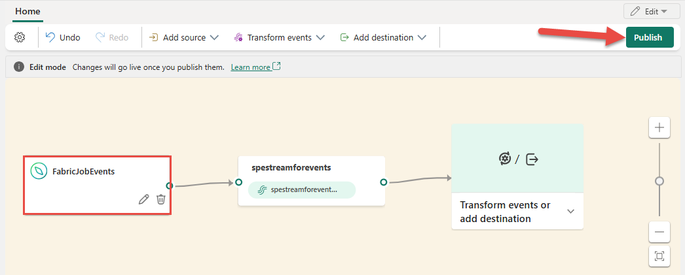
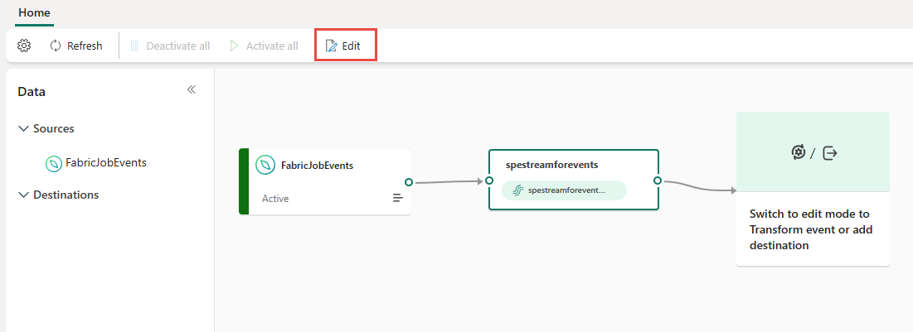

# Add Fabric job events to an eventstream

This article shows you how to add Fabric job event source to an eventstream.

[!INCLUDE [consume-fabric-events-regions](../../real-time-hub/includes/consume-fabric-events-regions.md)]

Job events allow you to subscribe to changes produced when Fabric runs a job. For example, you can react to changes when refreshing a semantic model, running a scheduled pipeline, or running a notebook. Each of these activities can generate a corresponding job, which in turn generates a set of corresponding job events. 

With Fabric event streams, you can capture these Job events, transform them, and route them to various destinations in Fabric for further analysis. This seamless integration of Job events within Fabric event streams gives you greater flexibility for monitoring and analyzing activities in your Job.

## Event types

| Event type name | Description |
| --------------- | ----------- |
| Microsoft.Fabric.ItemJobCreated | Raised when the Fabric platform creates or triggers a job, manually or scheduled. |
| Microsoft.Fabric.ItemJobStatusChanged | Raised when the job status changes to another non-terminal state. 
This event isn't raised if the workload doesn't push when the status changes. The job status might change from created to completed soon. 
| Microsoft.Fabric.ItemJobSucceeded | Raised when the job completes. |     
| Microsoft.Fabric.ItemJobFailed | Raised when the job fails, including job getting stuck or canceled. |

## Prerequisites

- Get access to a workspace in the Fabric capacity license mode (or) the Trial license mode with Contributor or higher permissions.
- [Create an eventstream](create-manage-an-eventstream.md) if you don't already have an eventstream.

## Add Fabric Job events as source

[!INCLUDE [launch-connect-external-source](./includes/launch-connect-external-source.md)]

On the **Select a data source** page, search for and select **Connect** on the **Job events** tile.

:::image type="content" source="./media/add-source-fabric-job/select-fabric-job-events.png" alt-text="Screenshot that shows the selection of Fabric Job events as the source type in the Select a data source window.":::

## Configure and connect to Fabric job events

[!INCLUDE [fabric-job-source-connector](includes/fabric-job-source-connector.md)]

## View updated eventstream

1. Once the connection is created, you can see the Fabric job events source added to your eventstream in **Edit mode**. Select **Publish** to publish the eventstream and capture the job events.

    

    > [!NOTE]
    > Before proceeding with event transformation or routing, ensure that job events have been triggered and successfully sent to the eventstream.

1. If you want to transform the Fabric job events, open your eventstream and select **Edit** to enter **Edit mode**. Then you can add operations to transform the Fabric job events or route them to a destination such as Lakehouse.

    

[!INCLUDE [known-issues-discrete-events](./includes/known-issues-discrete-events.md)]

## Related content

- [Azure Blob Storage events](add-source-azure-blob-storage.md)
- [Create eventstreams for discrete events](create-eventstreams-discrete-events.md)
