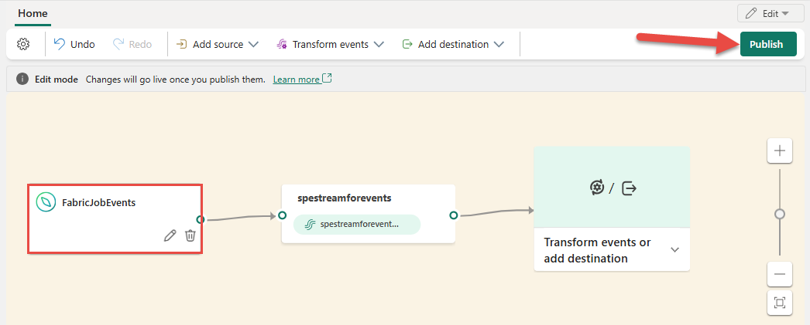
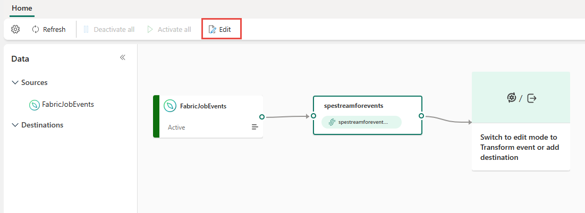

# Add Fabric job events to an eventstream

This article shows you how to add Fabric job event source to an eventstream.

[!INCLUDE [fabric-job-source-connector-prerequisites](includes/connectors/fabric-job-source-connector-prerequisites.md)]

## Add Fabric Job events as source

[!INCLUDE [launch-connect-external-source](./includes/launch-connect-external-source.md)]

On the **Select a data source** page, search for and select **Connect** on the **Job events** tile.

:::image type="content" source="./media/add-source-fabric-job/select-fabric-job-events.png" alt-text="Screenshot that shows the selection of Fabric Job events as the source type in the Select a data source window.":::

## Configure and connect to Fabric job events

[!INCLUDE [fabric-job-source-connector-configuration](includes/connectors/fabric-job-source-connector-configuration.md)]

## View updated eventstream

1. Once the connection is created, you can see the Fabric job events source added to your eventstream in **Edit mode**. Select **Publish** to publish the eventstream and capture the job events.

    

    > [!NOTE]
    > Before proceeding with event transformation or routing, ensure that job events have been triggered and successfully sent to the eventstream.

1. If you want to transform the Fabric job events, open your eventstream and select **Edit** to enter **Edit mode**. Then you can add operations to transform the Fabric job events or route them to a destination such as Lakehouse.

    

[!INCLUDE [known-issues-discrete-events](./includes/known-issues-discrete-events.md)]

## Related content

- [Azure Blob Storage events](add-source-azure-blob-storage.md)
- [Create eventstreams for discrete events](create-eventstreams-discrete-events.md)

