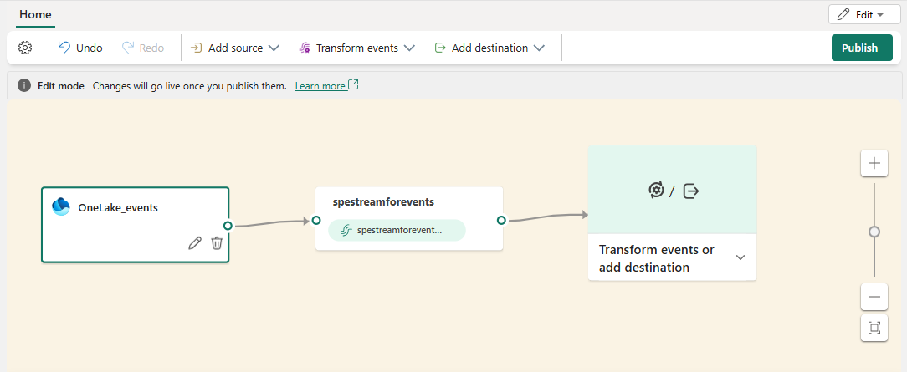

# Add Fabric OneLake events to an eventstream 

This article shows you how to add Fabric OneLake event source to an eventstream.

[!INCLUDE [consume-fabric-events-regions](../../real-time-hub/includes/consume-fabric-events-regions.md)]

OneLake events allow you to subscribe to changes in files and folders in OneLake, and then react to those changes in real-time. With Fabric event streams, you can capture these OneLake events, transform them, and route them to various destinations in Fabric for further analysis. This seamless integration of OneLake events within Fabric event streams gives you greater flexibility for monitoring and analyzing activities in your OneLake.

## Event types
Here are the supported OneLake events:

| Event type name | Description |
| --------------- | ----------- |
| Microsoft.Fabric.OneLake.FileCreated | Raised when a file is created or replaced in OneLake. |
| Microsoft. Fabric.OneLake.FileDeleted | Raised when a file is deleted in OneLake. |
| Microsoft. Fabric.OneLake.FileRenamed | Raised when a file is renamed in OneLake. | 
| Microsoft.Fabric.OneLake.FolderCreated | Raised created when a folder is created in OneLake. | 
| Microsoft. Fabric.OneLake.FolderDeleted | Raised when a folder is deleted in OneLake. | 
| Microsoft. Fabric.OneLake.FolderRenamed | Raised when a folder is renamed in OneLake. | 

## Prerequisites

- Get access to a workspace in the Fabric capacity license mode (or) the Trial license mode with Contributor or higher permissions.
- [Create an eventstream](create-manage-an-eventstream.md) if you don't already have an eventstream. 

## Add Fabric OneLake events as source

[!INCLUDE [launch-connect-external-source](./includes/launch-connect-external-source.md)]

On the **Select a data source** page, search for and select **Connect** on the **OneLake events** tile.

:::image type="content" source="./media/add-source-fabric-onelake/select-fabric-onelake-events.png" alt-text="Screenshot that shows the selection of Fabric OneLake events as the source type in the Select a data source window.":::

## Configure and connect to Fabric OneLake events

[!INCLUDE [fabric-onelake-source-connector](includes/fabric-onelake-source-connector.md)]

## View updated eventstream

1. Once the connection is created, you can see the Fabric OneLake events source added to your eventstream in **Edit mode**. Select **Publish** to publish the eventstream and capture the OneLake events.

    

    > [!NOTE]
    > Before proceeding with event transformation or routing, ensure that OneLake events have been triggered and successfully sent to the eventstream.

1. If you want to transform the Fabric OneLake events, open your eventstream and select **Edit** on the toolbar to enter **Edit mode**. Then you can add operations to transform the Fabric OneLake events or route them to a destination such as Lakehouse.

:::image type="content" source="./media/add-source-fabric-onelake/live-view.png" alt-text="Screenshot that shows the newly added Fabric OneLake events source in live view.":::

[!INCLUDE [known-issues-discrete-events](./includes/known-issues-discrete-events.md)]

## Related content

- [Azure Blob Storage events](add-source-azure-blob-storage.md)
- [Create eventstreams for discrete events](create-eventstreams-discrete-events.md)
