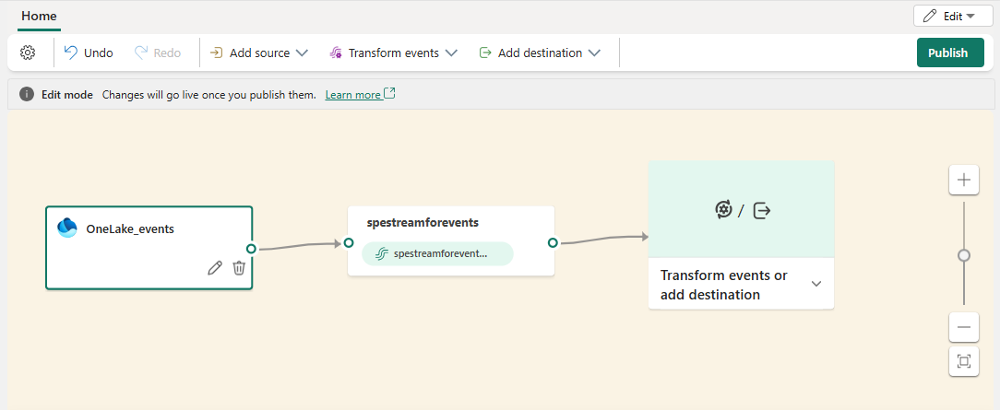

# Add Fabric OneLake events to an eventstream 

This article shows you how to add Fabric OneLake event source to an eventstream.

[!INCLUDE [fabric-onelake-source-connector-prerequisites](includes/connectors/fabric-onelake-source-connector-prerequisites.md)]
- [Create an eventstream](create-manage-an-eventstream.md) if you don't already have an eventstream. 

## Add Fabric OneLake events as source

[!INCLUDE [launch-connect-external-source](./includes/launch-connect-external-source.md)]

On the **Select a data source** page, search for and select **Connect** on the **OneLake events** tile.

:::image type="content" source="./media/add-source-fabric-onelake/select-fabric-onelake-events.png" alt-text="Screenshot that shows the selection of Fabric OneLake events as the source type in the Select a data source window.":::

## Configure and connect to Fabric OneLake events

[!INCLUDE [fabric-onelake-source-connector-configuration](includes/connectors/fabric-onelake-source-connector-configuration.md)]

## View updated eventstream

1. Once the connection is created, you can see the Fabric OneLake events source added to your eventstream in **Edit mode**. Select **Publish** to publish the eventstream and capture the OneLake events.

    

    > [!NOTE]
    > Before proceeding with event transformation or routing, ensure that OneLake events were triggered and successfully sent to the eventstream.

1. If you want to transform the Fabric OneLake events, open your eventstream and select **Edit** on the toolbar to enter **Edit mode**. Then you can add operations to transform the Fabric OneLake events or route them to a destination such as Lakehouse.

:::image type="content" source="./media/add-source-fabric-onelake/live-view.png" alt-text="Screenshot that shows the newly added Fabric OneLake events source in live view.":::

[!INCLUDE [known-issues-discrete-events](./includes/known-issues-discrete-events.md)]

## Related content

- [Azure Blob Storage events](add-source-azure-blob-storage.md)
- [Create eventstreams for discrete events](create-eventstreams-discrete-events.md)

