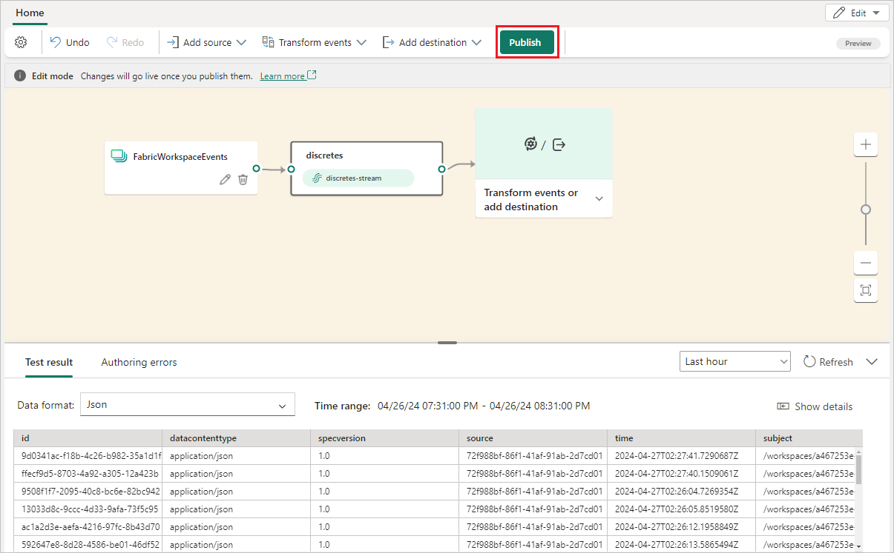
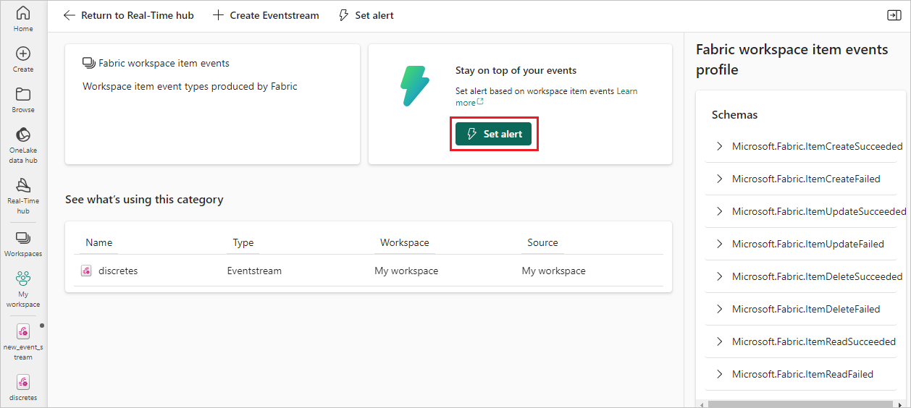
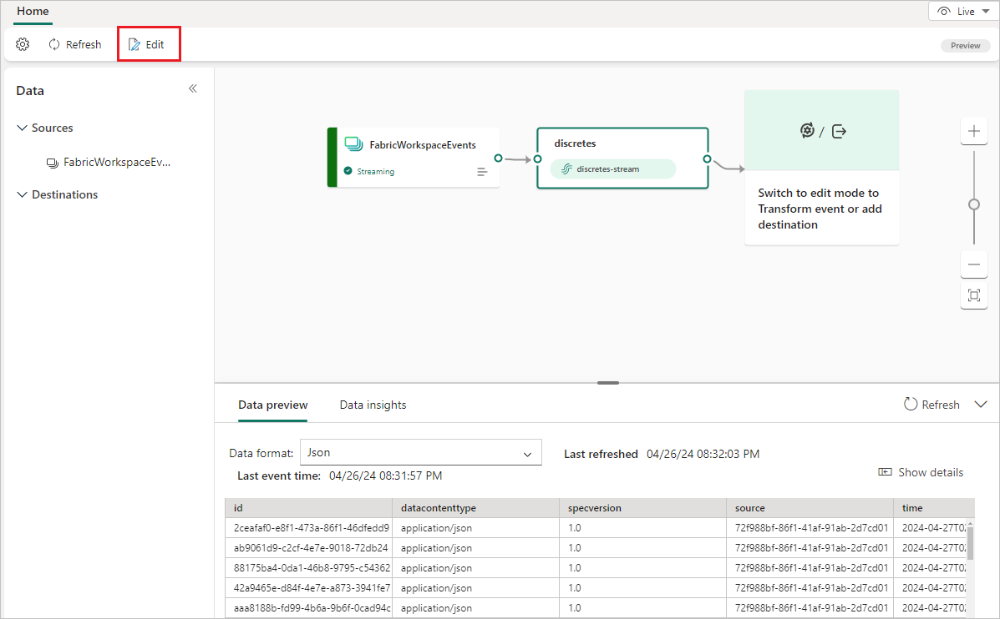

# Add Fabric workspace item events to an eventstream

This article shows you how to add Fabric workspace item event source to an eventstream.

Fabric workspace item events are discrete Fabric events that occur when changes are made to your Fabric Workspace. These changes include creating, updating, or deleting a Fabric item.

With Fabric event streams, you can capture these Fabric workspace events, transform them, and route them to various destinations in Fabric for further analysis. This seamless integration of Fabric workspace events within Fabric event streams gives you greater flexibility for monitoring and analyzing activities in your Fabric workspace.

Fabric event streams supports the following Fabric workspace events:

- Microsoft.Fabric.ItemCreateSucceeded
- Microsoft.Fabric.ItemCreateFailed
- Microsoft.Fabric.ItemUpdateSucceeded
- Microsoft.Fabric.ItemUpdateFailed
- Microsoft.Fabric.ItemDeleteSucceeded
- Microsoft.Fabric.ItemDeleteFailed
- Microsoft.Fabric.ItemReadSucceeded
- Microsoft.Fabric.ItemReadFailed

## Prerequisites

- Access to the Fabric **premium workspace** with **Contributor** or higher permissions.
- A Fabric workspace with events you want to track.

## Add Fabric Workspace Item events as source

1. Select **Eventstream** to create a new eventstream. Make sure the **Enhanced Capabilities (preview)** option is enabled.

   

1. On the next screen, select **Add external source**.

   

## Configure and connect to Fabric Workspace Item events 

[!INCLUDE [fabric-workspace-source-connector](includes/fabric-workspace-source-connector.md)]

Once the connection is created, you can see the Fabric workspace item events source added to your eventstream in **Edit mode**. Select **Publish** to publish the eventstream and capture the workspace events.

Before you proceed with event transformation or routing, make sure you successfully created and captured the workspace events in the eventstream and published the eventstream.

Once it's published, you can find the default stream representing the captured events in **Real-time hub** on the **Fabric events** tab.

You can set an alert or take other actions.

Select **Edit** on the Eventstream ribbon to enter **Edit mode**, where you can add operations to transform the Fabric workspace events or route them to a destination such as Lakehouse.

## Related content

- [Azure Blob Storage events](add-source-azure-blob-storage.md)
- [Create eventstreams for discrete events](create-eventstreams-discrete-events.md)
