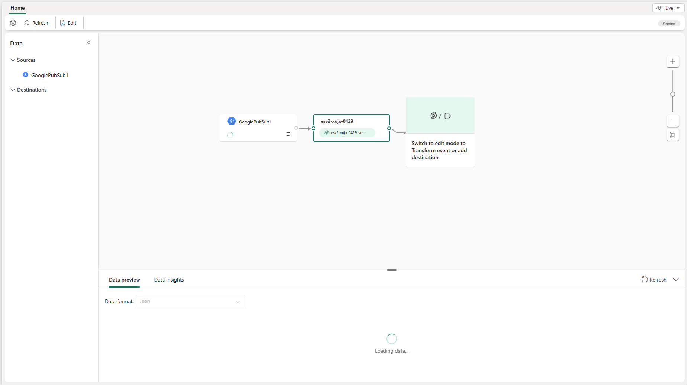

# Add Google Cloud Pub/Sub source to an eventstream (preview)

This article shows you how to add a Google Cloud Pub/Sub source to an eventstream. 

Google Pub/Sub is a messaging service that enables you to publish and subscribe to streams of events. You can add Google Pub/Sub as a source to your eventstream to capture, transform, and route real-time events to various destinations in Fabric.

[!INCLUDE [enhanced-capabilities-preview-note](./includes/enhanced-capabilities-preview-note.md)]

## Prerequisites

- Access to the Fabric **premium workspace** with **Contributor** or higher permissions.
- A Google Cloud account with the Pub/Sub service enabled and a role with the required permissions.
- Your Google Cloud Pub/Sub source must be publicly accessible and not be behind a firewall or secured in a virtual network.

## Add Google Cloud Pub/Sub as a source

1. Select **Eventstream** to create a new eventstream. Make sure the **Enhanced Capabilities (preview)** option is enabled.

   

1. On the next screen, select **Add external source**.

   

## Configure and connect to Google Cloud Pub/Sub

>[!IMPORTANT]
>You can consume the Google Cloud Pub/Sub events in only one eventstream. Once you fetch the events into an eventstream, they can't be consumed by other eventstreams.

[!INCLUDE [google-cloud-pub-sub-connector](./includes/google-cloud-pub-sub-source-connector.md)]

You can see the Google Cloud Pub/Sub source added to your eventstream in **Edit mode**.

   

Select **Publish** to publish the changes and begin streaming data from Google Cloud Pub/Sub to the eventstream.

   

## Related content

Other connectors:

- [Amazon Kinesis Data Streams](add-source-amazon-kinesis-data-streams.md)
- [Azure Cosmos DB](add-source-azure-cosmos-db-change-data-capture.md)
- [Azure Event Hubs](add-source-azure-event-hubs.md)
- [Azure IoT Hub](add-source-azure-iot-hub.md)
- [Azure SQL Database Change Data Capture (CDC)](add-source-azure-sql-database-change-data-capture.md)
- [Confluent Kafka](add-source-confluent-kafka.md)
- [Custom endpoint](add-source-custom-app.md)
- [MySQL Database CDC](add-source-mysql-database-change-data-capture.md)
- [PostgreSQL Database CDC](add-source-postgresql-database-change-data-capture.md)
- [Sample data](add-source-sample-data.md)
- [Azure Blob Storage events](add-source-azure-blob-storage.md)
- [Fabric workspace event](add-source-fabric-workspace.md)