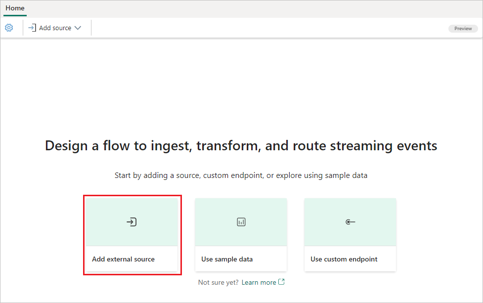
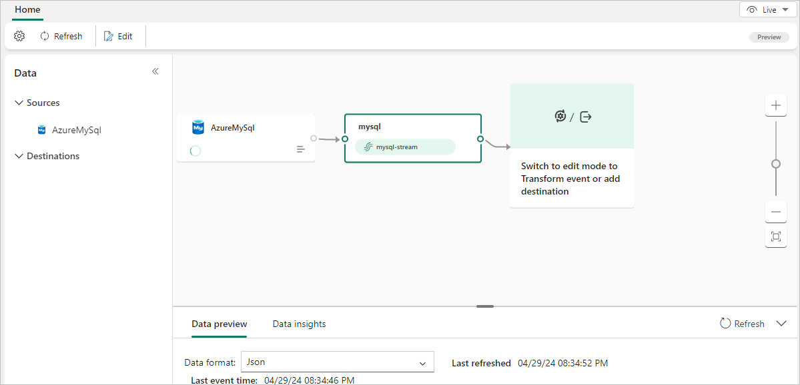

# Add MySQL Database CDC source to an eventstream (preview)

>[!NOTE]
>This article contains references to the term `SLAVE`, a term that Microsoft no longer uses. When the term is removed from the software, we'll remove it from this article.

This article shows you how to add an Azure Database for MySQL Change Data Capture source to an eventstream. The Azure MySQL Database Change Data Capture (CDC) Source connector for Microsoft Fabric event streams allows you to capture a snapshot of the current data in an Azure Database for MySQL database.

You can specify the tables to monitor, and the eventstream records any future row-level changes to the tables. Once the changes are captured in the eventstream, you can process this CDC data in real-time and send it to different destinations in Fabric for further processing or analysis.

[!INCLUDE [enhanced-capabilities-preview-note](./includes/enhanced-capabilities-preview-note.md)]

## Prerequisites

- Access to the Fabric **premium workspace** with **Contributor** or higher permissions.
- Access to an instance of Azure Database for MySQL - Flexible Server.
- Your MySQL database must be publicly accessible and not be behind a firewall or secured in a virtual network.

## Set up MySQL DB

The connector uses the Debezium MySQL connector to capture changes in your Azure Database for MySQL database. You must define a MySQL user with permissions on all databases that the Messaging Connector monitors.

1. At the `mysql` command prompt, create the MySQL user:

   ```
   mysql> CREATE USER 'user'@'localhost' IDENTIFIED BY 'password';
   ```

1. Grant the required permissions to the user:

   ```
   mysql> GRANT SELECT, SHOW DATABASES, REPLICATION SLAVE, REPLICATION CLIENT ON *.* TO 'user'@'localhost';
   ```

1. Finalize the user's permissions:

   ```
   mysql> FLUSH PRIVILEGES;
   ```

For more information about granting the required permissions to the user, see [Debezium connector for MySQL :: Debezium Documentation](https://debezium.io/documentation/reference/1.9/connectors/mysql.html#mysql-creating-user).

## Enable the binlog

You must enable binary logging for MySQL replication. The binary logs record transaction updates for replication tools to propagate changes.

1. On the Azure portal page for your Azure Database for MySQL account, select **Server parameters** under **Settings** in the left navigation.

1. On the **Server parameters** page, configure the following properties, and then select **Save**.

   - For [binlog_row_image](https://dev.mysql.com/doc/refman/8.0/en/replication-options-binary-log.html#sysvar_binlog_row_image), select **full**.

   - For [binlog_expire_logs_seconds](https://dev.mysql.com/doc/refman/8.0/en/replication-options-binary-log.html#sysvar_binlog_expire_logs_seconds), set the number of seconds the service waits before the binary log file is purged. Set the value to match the needs of your environment, for example *86400*.

   

## Add Azure MySQL DB (CDC) as a source

1. In Fabric Real-Time Intelligence, select **Eventstream** to create a new eventstream. Make sure the **Enhanced Capabilities (preview)** option is enabled.

   

1. On the next screen, select **Add external source**.

   

## Configure and connect to Azure MySQL DB (CDC) 

[!INCLUDE [mysql-database-cdc-connector](./includes/mysql-database-cdc-source-connector.md)]

You see the Azure MySQL DB (CDC) source added to your eventstream in **Edit mode**.

   

Select **Publish** to publish the changes and begin streaming Azure MySQL DB CDC data to the eventstream.

   

## Related content

Other connectors:

- [Amazon Kinesis Data Streams](add-source-amazon-kinesis-data-streams.md)
- [Azure Cosmos DB](add-source-azure-cosmos-db-change-data-capture.md)
- [Azure Event Hubs](add-source-azure-event-hubs.md)
- [Azure IoT Hub](add-source-azure-iot-hub.md)
- [Azure SQL Database Change Data Capture (CDC)](add-source-azure-sql-database-change-data-capture.md)
- [Confluent Kafka](add-source-confluent-kafka.md)
- [Custom endpoint](add-source-custom-app.md)
- [Google Cloud Pub/Sub](add-source-google-cloud-pub-sub.md) 
- [PostgreSQL Database CDC](add-source-postgresql-database-change-data-capture.md)
- [Sample data](add-source-sample-data.md)
- [Azure Blob Storage events](add-source-azure-blob-storage.md)
- [Fabric workspace event](add-source-fabric-workspace.md)
