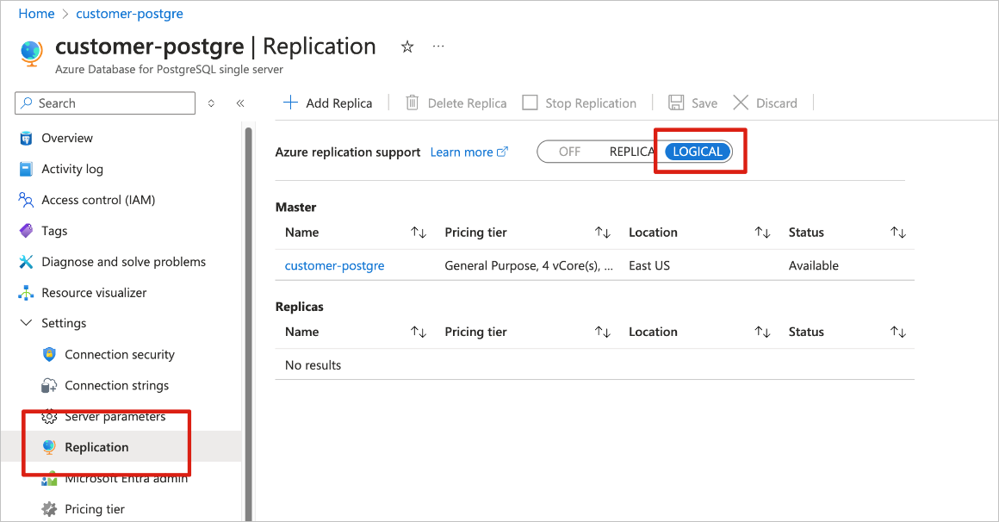
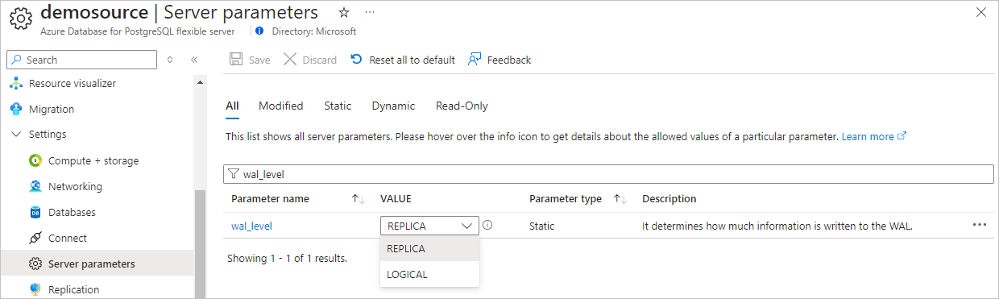

# Add PostgreSQL Database CDC source to an eventstream

This article shows you how to add a PostgreSQL Database Change Data Capture (CDC) source to an eventstream.

The PostgreSQL Database Change Data Capture (CDC) source connector for Microsoft Fabric event streams allows you to capture a snapshot of the current data in a PostgreSQL database. The connector then monitors and records any future row-level changes to this data. Once the changes are captured in the eventstream, you can process this CDC data in real-time and send it to different destinations within Fabric for further processing or analysis.

## Prerequisites

- Access to the Fabric **premium workspace** with **Contributor** or higher permissions.
- Registered user access in the PostgreSQL database.
- CDC enabled in the PostgreSQL database.

  If you have Azure Database for PostgreSQL, follow the steps in the next section to enable CDC. For detailed information, see [Logical replication and logical decoding - Azure Database for PostgreSQL - Flexible Server](/azure/postgresql/flexible-server/concepts-logical).

  For other PostgreSQL databases, see [Debezium connector for PostgreSQL :: Debezium Documentation](https://debezium.io/documentation/reference/stable/connectors/postgresql.html#setting-up-postgresql).

## Enable CDC in your Azure Database for PostgreSQL

To enable CDC in your Azure Database for PostgreSQL, follow these steps based on your deployment type.

### Azure Database for PostgreSQL single server

1. Go to the **Replication** page on the Azure portal.
1. Change the replication rule to **Logical**.



### Azure Database for PostgreSQL flexible server

1. On your Azure Database for PostgreSQL flexible server page in the Azure portal, select **Server parameters** in the navigation menu.

1. On the **Server parameters** page:

   - Set **wal_level** to **logical**.
   - Update the **max_worker_processes** to at least **16**.

   

1. Save the changes and restart the server.

## Add Azure Database for PostgreSQL CDC as a source

1. Confirm that your Azure Database for PostgreSQL flexible server instance allows public network traffic.

1. Grant the admin user replication permissions by running the following SQL statement.

   ```sql
   ALTER ROLE <admin user> WITH REPLICATION;
   ```

1. Select **Eventstream** to create a new eventstream. Make sure the **Enhanced Capabilities (preview)** option is enabled.

   

1. On the next screen, select **Add external source**.

   

## Configure and connect to Azure Database for PostgreSQL CDC

[!INCLUDE [postgresql-database-cdc-connector](./includes/postgresql-database-cdc-source-connector.md)]

## Related content

Other connectors:

- [Amazon Kinesis Data Streams](add-source-amazon-kinesis-data-streams.md)
- [Azure Cosmos DB](add-source-azure-cosmos-db-change-data-capture.md)
- [Azure Event Hubs](add-source-azure-event-hubs-enhanced.md)
- [Azure IoT Hub](add-source-azure-iot-hub-enhanced.md)
- [Azure SQL Database Change Data Capture (CDC)](add-source-azure-sql-database-change-data-capture.md)
- [Confluent Kafka](add-source-confluent-kafka.md)
- [Custom endpoint](add-source-custom-app-enhanced.md)
- [Google Cloud Pub/Sub](add-source-google-cloud-pub-sub.md) 
- [MySQL Database CDC](add-source-mysql-database-change-data-capture.md)
- [PostgreSQL Database CDC](add-source-postgresql-database-change-data-capture.md)
- [Sample data](add-source-sample-data-enhanced.md)
- [Azure Blob Storage events](add-source-azure-blob-storage.md)
- [Fabric workspace event](add-source-fabric-workspace.md)