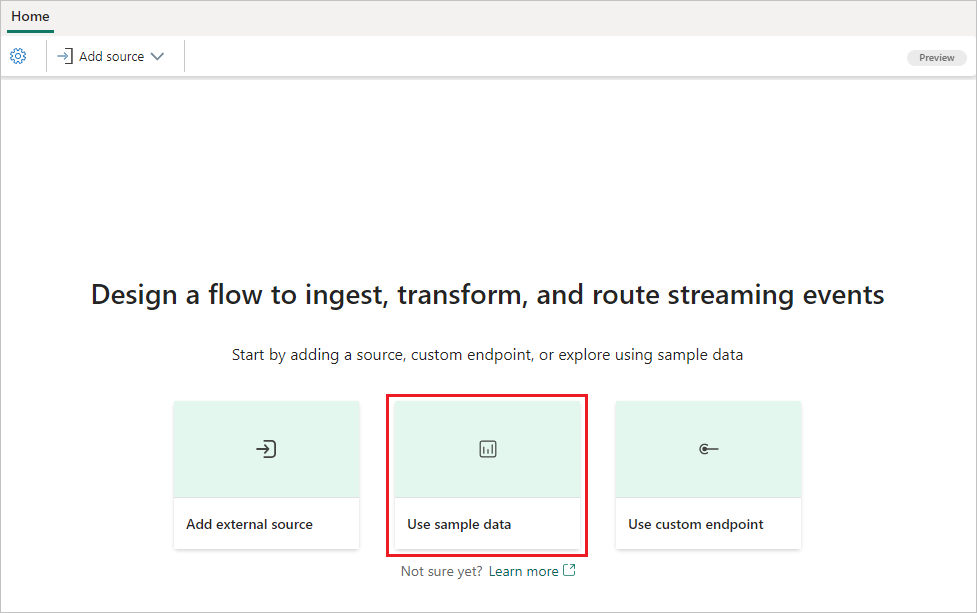

# Add a sample data source to an eventstream

To get a better understanding of how an eventstream works, you can use the out-of-box sample data provided and send the data to the eventstream. This article shows you how to add the sample data source to an eventstream. 

If you want to use enhanced capabilities that are in preview, see the content in the **Enhanced capabilities** tab. Otherwise, use the content in the **Standard capabilities** tab. For information about the enhanced capabilities that are in preview, see [Enhanced capabilities](new-capabilities.md).

# [Enhanced capabilities (Preview)](#tab/enhancedcapabilities)

## Prerequisites

- Access to the Fabric **premium workspace** with **Contributor** or higher permissions.

## Add sample data as a source

Follow these steps to add a sample data source:

1. To create a new eventstream, select **Eventstream** from the **Home** screen. Make sure the **Enhanced Capabilities (preview)** option is enabled.

   

1. To add sample data source, on the get-started page, select **Use sample data**.

   

   Or, if you already have a published eventstream and want to add sample data as a source, switch to **Edit** mode. Then select **Add source** in the ribbon, and select **Sample data**.

   

## Configure and connect to sample data

[!INCLUDE [sample-data-source-connector](./includes/sample-data-source-connector.md)]

## Publish and visualize sample data

After you create the sample data source, you see it added to your eventstream on the canvas in **Edit mode**. To implement this newly added sample data, select **Publish**.

Once you complete these steps, sample data is available for visualization in **Live view**.

# [Standard capabilities](#tab/standardcapabilities)

## Prerequisites

Before you start, you must complete the following prerequisites:

- Get access to a **premium workspace** with **Contributor** or above permissions where your eventstream is located.

[!INCLUDE [sources-destinations-note](./includes/sources-destinations-note.md)]

## Add sample data as a source

To get a better understanding of how an eventstream works, you can use the out-of-box sample data provided and send data to the eventstream. Follow these steps to add a sample data source:

1. Select **New source** on the ribbon or "**+**" in the main editor canvas and then **Sample data**.

1. On the right pane, enter a source name to appear on the canvas, select the sample data you want to add to your eventstream, and then select **Add**.
   - **Bicycles**: sample bicycles data with a preset schema that includes fields such as BikepointID, Street, Neighborhood, Latitude, and more.
   - **Yellow Taxi**: sample taxi data with a preset schema that includes fields such as pickup time, drop-off time, distance, total fee, and more.
   - **Stock Market**: sample data of a stock exchange with a preset schema column such as time, symbol, price, volume, and more.

       :::image type="content" source="./media/event-streams-source/eventstream-sources-sample-data.png" alt-text="Screenshot showing the sample data source configuration." lightbox="./media/event-streams-source/eventstream-sources-sample-data.png":::

1. When the sample data source is added successfully, you can find it on the canvas and navigation pane.

To verify if the sample data is added successfully, select **Data preview** in the bottom pane.

:::image type="content" source="./media/add-manage-eventstream-sources/sample-data-source-completed.png" alt-text="Screenshot showing the sample data source." lightbox="./media/add-manage-eventstream-sources/sample-data-source-completed.png":::

---

## Related content 

To learn how to add other sources to an eventstream, see the following articles:

- [Amazon Kinesis Data Streams](add-source-amazon-kinesis-data-streams.md)
- [Azure Cosmos DB](add-source-azure-cosmos-db-change-data-capture.md)
- [Azure Event Hubs](add-source-azure-event-hubs.md)
- [Azure IoT Hub](add-source-azure-iot-hub.md)
- [Azure SQL Database Change Data Capture (CDC)](add-source-azure-sql-database-change-data-capture.md)
- [Confluent Kafka](add-source-confluent-kafka.md)
- [Custom endpoint](add-source-custom-app.md)
- [Google Cloud Pub/Sub](add-source-google-cloud-pub-sub.md) 
- [MySQL Database CDC](add-source-mysql-database-change-data-capture.md)
- [PostgreSQL Database CDC](add-source-postgresql-database-change-data-capture.md)
- [Azure Blob Storage events](add-source-azure-blob-storage.md)
- [Fabric workspace event](add-source-fabric-workspace.md) 

To add a destination to an eventstream, see the following articles:

- [Route events to destinations ](add-manage-eventstream-destinations-enhanced.md)
- [Custom app destination](add-destination-custom-app-enhanced.md)
- [Derived stream destination](add-destination-derived-stream.md)
- [KQL Database destination](add-destination-kql-database-enhanced.md)
- [Lakehouse destination](add-destination-lakehouse-enhanced.md)
- [Reflex destination](add-destination-reflex-enhanced.md)
- [Create an eventstream](create-manage-an-eventstream.md)
