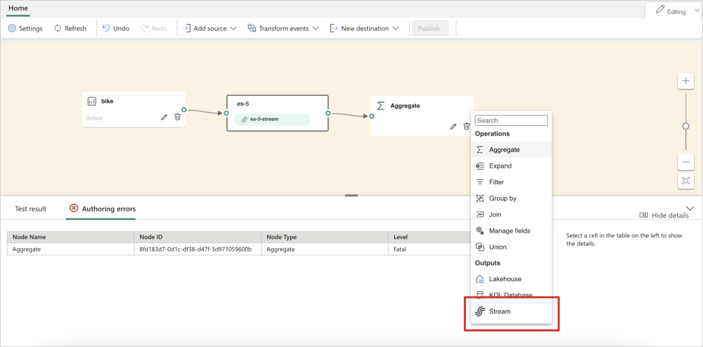
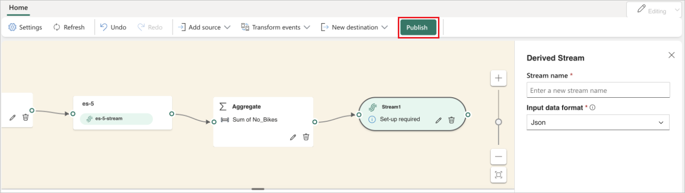
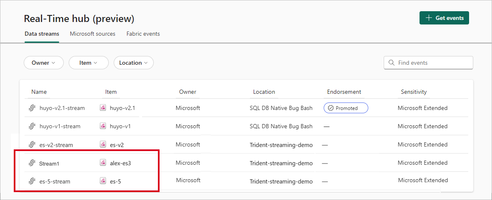

# Create default and derived eventstreams

This article shows you how to create default and derived Microsoft Fabric eventstreams. A data stream is a dynamic and continuous flow of data that offers a range of capabilities for immediate action and analysis. With a data stream, you can set up real-time alerting, feed into different types of data stores, and enable a publish/subscribe model that multiple customers can subscribe to.

The integration of the Real-Time hub feature within Fabric event streams further enhances these capabilities. This integration lets you create and manage multiple data streams with different processing operations, which can then be displayed in the Real-Time hub.

## Concepts

- An **eventstream** is an item within your Fabric workspace that allows you to ingest, transform, and route data streams to various destinations in Fabric.

- A **stream** is a continuous and unbounded flow of data events. When data events flow into Fabric event streams, the stream forms inside Fabric event streams to represent the data events. There are two kinds of streams in Fabric event streams:

  - **Default stream**: Every Fabric event streams item comes with a default stream that's automatically generated once a streaming source is added to the eventstream. It represents the raw events coming from the streaming source. You can transform and route the default stream to multiple destinations in Fabric. You can view the default stream from the Real-Time hub.

  - **Derived stream** is a specialized type of destination within Fabric event streams that's created following the addition of a series of stream operations, such as **Filter** or **Manage Fields**. The derived stream represents the transformed default stream following stream processing. You can also route the derived stream to multiple destinations in Fabric. Once created, you can view the derived stream from the Real-Time hub.

## Create a default stream

Once you create a new eventstream, you can add a source to the eventstream and the default stream is automatically generated. The following example shows that the default stream **es-5-stream** is automatically generated when you add a bike sample data source to the Fabric event streams item.

## Create a derived stream

1. To create a new derived stream, add an operation such as **Aggregate** to the eventstream. Then select the **Stream** option.

   

1. Give a name to the new stream and select **Publish** to commit the changes.

   

   Once completed, you can access both your default and derived streams in Real-Time hub for further use, such as previewing the stream or adding destinations to flow the stream to.

   

## Related content

- [New capabilities in Microsoft Fabric event streams](new-capabilities.md)
- [Edit and publish an eventstream](edit-publish.md)
- [Route data streams based on content](route-events-based-on-content.md)
