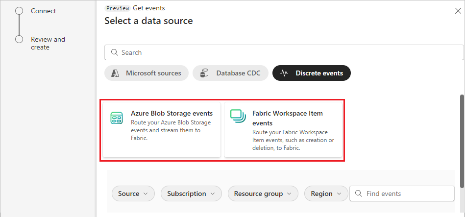
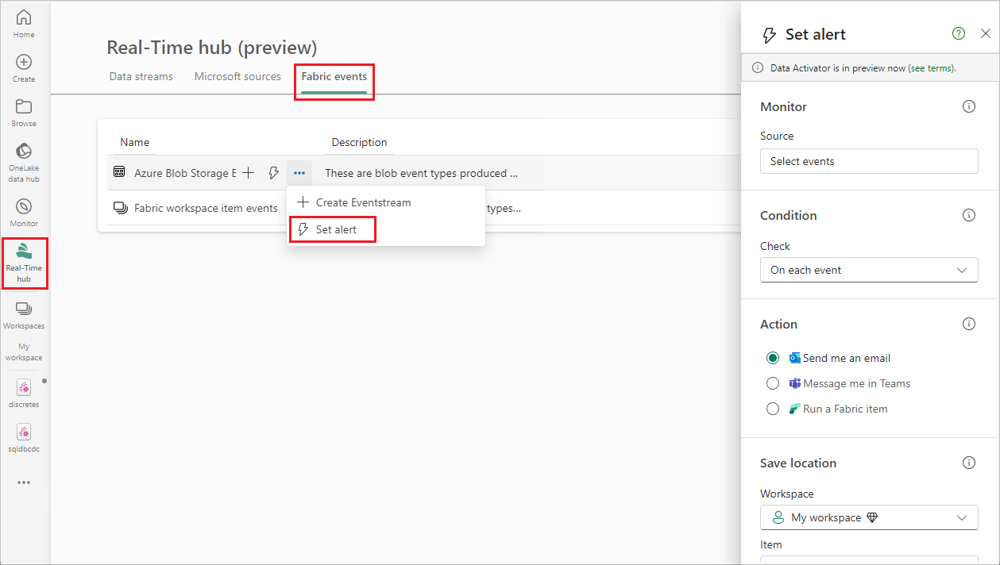

# Create eventstreams for discrete events (preview)

This article shows you how to create Microsoft Fabric eventstreams for discrete events.

When you develop applications for real-time analytics, you commonly encounter two types of events: discrete events and continuous events or streams. Microsoft Fabric event streams can ingest and process both discrete and continuous events.

[!INCLUDE [enhanced-capabilities-preview-note](./includes/enhanced-capabilities-preview-note.md)]

## Understand discrete and continuous events

To build an efficient and scalable eventstream in Fabric, it's important to understand the distinction between discrete events and continuous events or streams.

- **Discrete events**, often referred to as notification events, are individual occurrences that happen at specific points in time. Each event is independent of others and has a clear start and end point. Examples of discrete events include users placing orders on a website or making changes to a database.

- **Continuous events** or streams represent a continuous flow or stream of data over time. Unlike discrete events, continuous events don't have distinct start or end points. Instead, they represent a steady and ongoing stream of data, often with no predefined boundaries. Examples include sensor data from IoT devices, stock market ticker data, or social media posts in a real-time feed.

>[!NOTE]
>It's recommended to have either discrete event sources or continuous event (stream) sources, not a mix of both, in one eventstream.

## Supported discrete events

Fabric event streams enables you to build event-driven solutions for capturing system state changes or events in your Fabric data source. Fabric event streams supports the following types of discrete events:

|Discrete events|Description|
|----|---------|
|[Azure Blob Storage events](add-source-azure-blob-storage.md)|Generated upon any change made to Azure Blob Storage, such as creation, modification, or deletion of records or files.|
|[Fabric Workspace Item events](add-source-fabric-workspace.md)|Generated upon any change made to a Fabric workspace, including creation, update, or deletion of items.|

## Connect discrete events to eventstreams

In Fabric event streams, you can add a discrete event source into an eventstream and route those events to Real-time hub. Then you can either transform these events in Fabric event streams or subscribe to them in Real-time hub. In Real-time hub, further actions include using Data Activator or creating alerts that execute Fabric job items, like Pipeline and Notebook.

### Prerequisite

- Access to the Fabric **premium workspace** with **Contributor** or higher permissions.
- A Fabric workspace for connecting to Fabric Workspace Item events, or access to an Azure Blob Storage account for connecting to Azure Blob Storage events.

### Connect discrete events

To connect discrete events to an eventstream, take the following steps:

1. Under **Real-Time Intelligence**, select **Eventstream** to create a new eventstream. Make sure the **Enhanced Capabilities (preview)** option is enabled.

   

1. On the next screen, select **Add external source**.

   

1. On the **Select a data source** screen, select the type of discrete events you want to add to your eventstream, either **Azure Blob Storage events** or **Fabric Workspace Item events**.

   

1. Add the event source and publish the eventstream by following the instructions in one of the following articles:

   - For Azure Blob Storage events, see [Add Azure Blob Storage events](add-source-azure-blob-storage.md).
   - For Fabric Workspace Item events, see [Add Fabric workspace item events](add-source-fabric-workspace.md).

Once completed, the eventstream starts capturing discrete events as they occur. In **Real-time hub**, you can find the events under **Fabric events**. In the right pane, you can set an alert to take further action.

## Related content

- [Azure Blob Storage events](add-source-azure-blob-storage.md)
- [Add Fabric workspace item events to an eventstream](add-source-fabric-workspace.md)
