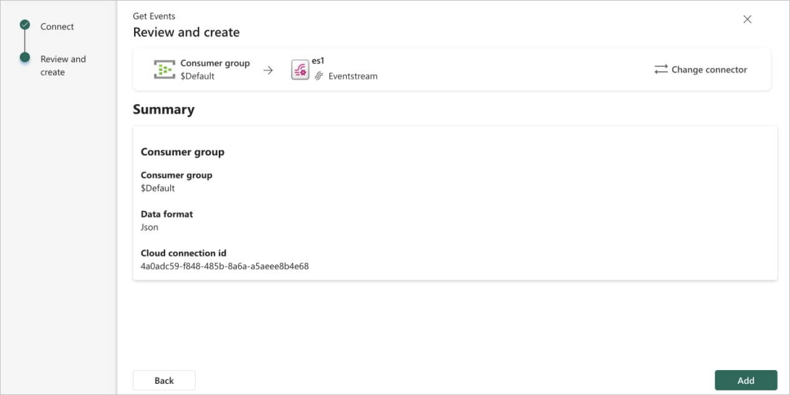
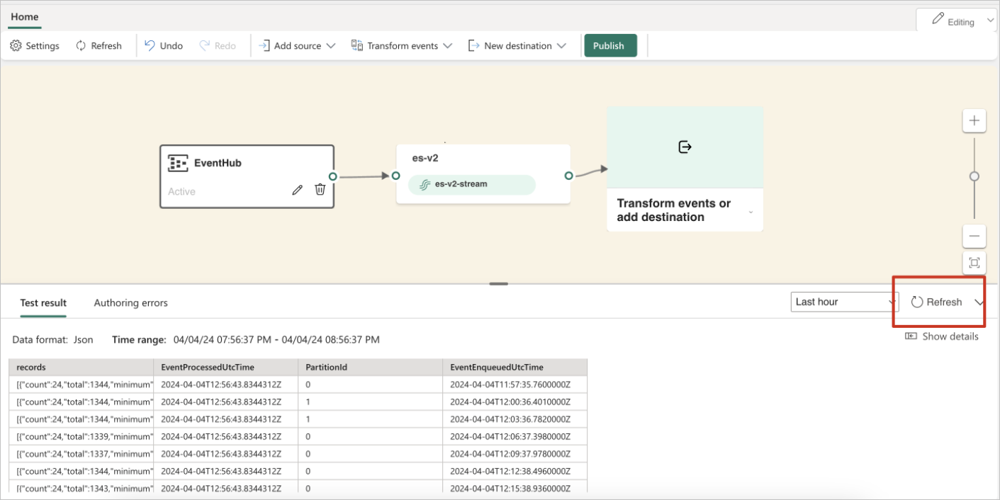
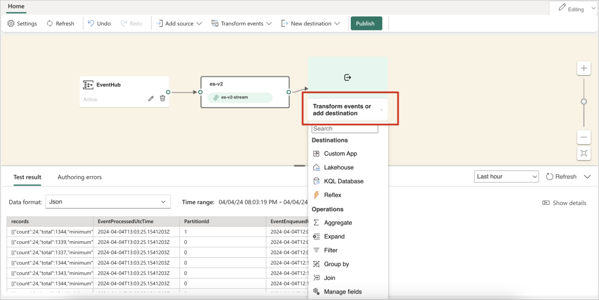
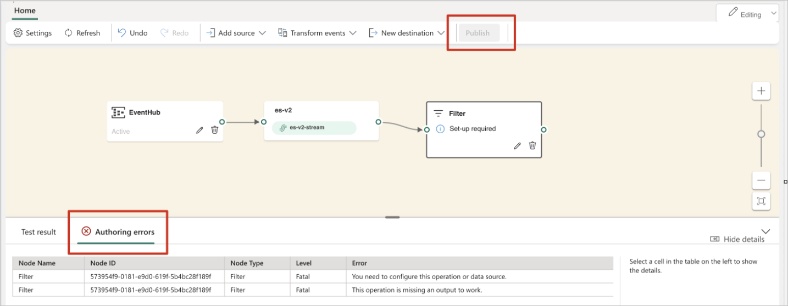
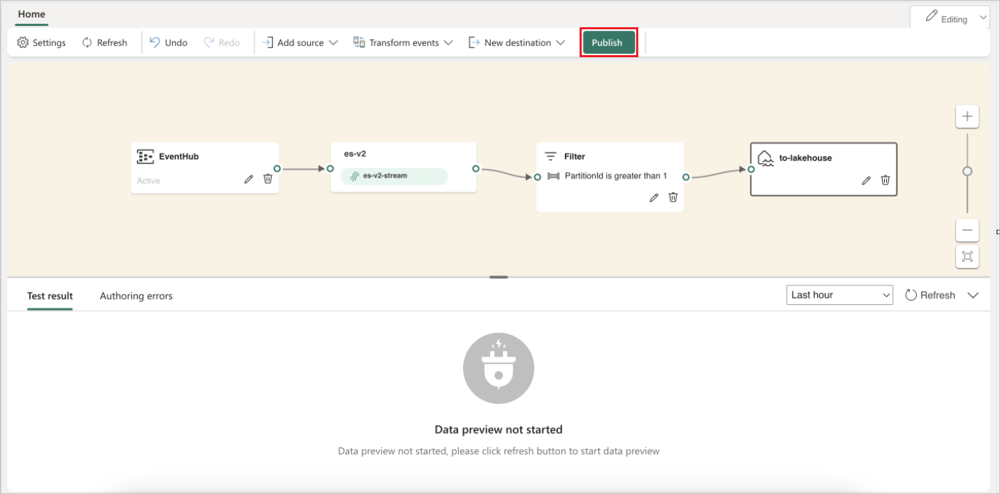
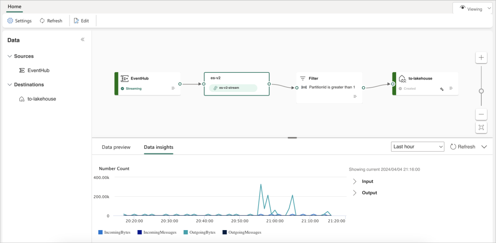

# Edit and publish a Microsoft Fabric eventstream

This article shows you how to edit and publish a Microsoft Fabric eventstream.

## Edit mode and Live view

Fabric eventstreams offers two distinct modes, **Edit mode** and **Live view**, to provide flexibility and control over your data streams. If you create a new eventstream with enhanced capabilities enabled, you can modify your eventstreams in **Edit mode** and design stream processing operations for your data streams by using a no-code editor. Once you're done, you can publish your eventstreams and visualize how your eventstreams start streaming and processing data in **Live view**.

Here's an overview of everything you find in the two different modes:

**Edit mode:**

- Any changes made within Edit mode aren't implemented until you choose to publish them, ensuring you have full control over the development process of your eventstreams.

- There's no risk of test data being streamed to your eventstreams. This mode is designed to provide a secure environment for testing without affecting your actual data streams.

- If you make changes to an existing eventstream, those changes aren't implemented until you publish the eventstream.

**Live view:**

- You can visualize how your eventstreams receive, transform, and route your events to various destinations after you publish the changes.

- You can pause the flow of data on any selected sources and destinations, providing you with more control over your data streams.

## Create a new eventstream

1. Switch your Power BI experience to **Real-Time Intelligence** and select **Eventstream** to create a new eventstream. Make sure the **Enhanced Capabilities (preview)** option is enabled.

   

1. On the next screen, select **Add external source** to stream your data to Fabric eventstreams.

   

1. Select **Azure Event Hub** as your data source and input the necessary event hub details to link it with your Fabric eventstreams.

   

1. When you're done, select **Add** to finish the setup and add the Azure Event Hubs source to your Fabric eventstream.

   

1. You're now in the eventstream **Edit mode**. Select **Refresh** to preview your Azure Event Hubs data.

   

## Publish your eventstream

To publish your eventstream, ensure that your eventstream has both a configured source and destination, and that no authoring errors display.

The following steps show how you can add event processing operations and a destination to your eventstream and then publish it.

1. You can expand the dropdown menu on the editor and choose a **Destination** or **Operation** to add to your eventstream.

   

1. The **Publish** button is disabled if there are any authoring errors. For example, you must add a destination for a **Filter** operation before you can publish it.

   

1. After you configure a Lakehouse destination, select **Publish** to commit your changes.

   

   This action switches your eventstream from **Edit** mode to **Live** view, initiating real-time data processing.

   

## Related content

- [New capabilities in Microsoft Fabric eventstreams](new-capabilities.md)
- [Create default and derived eventstreams](create-default-derived-streams.md)
- [Route data streams based on content](route-events-based-on-content.md)
