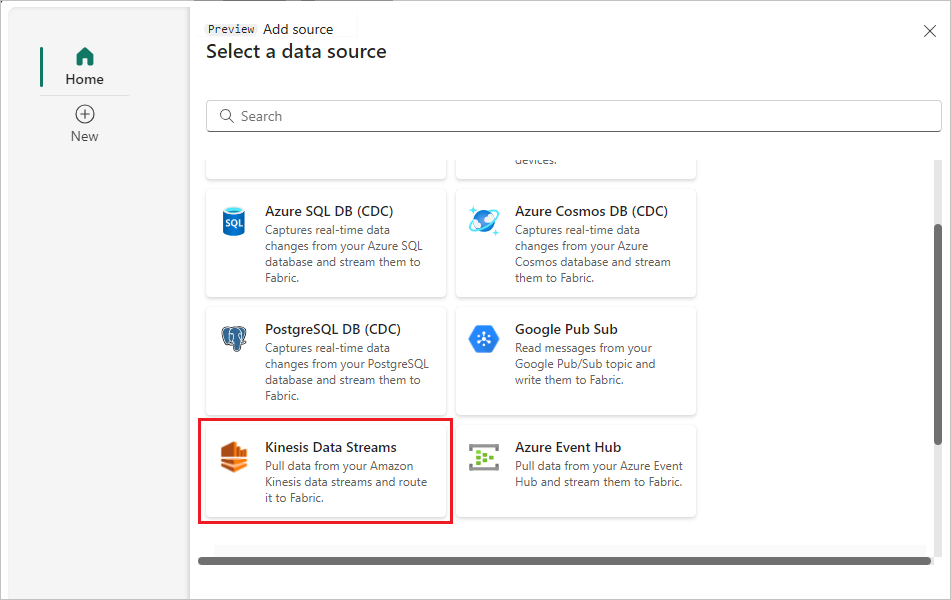
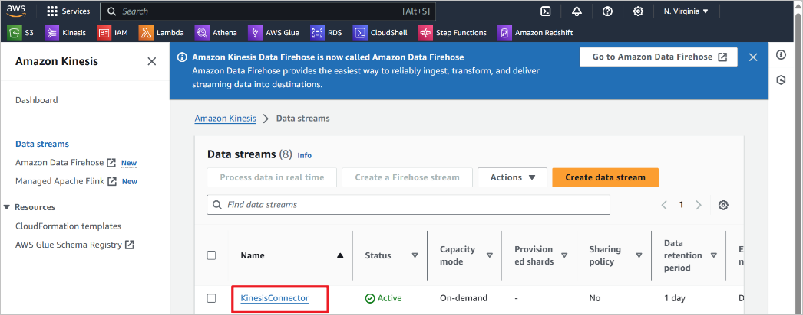

1. On the **Select a data source** screen, select **Kinesis Data Streams**.

   
1. On the **Connect** screen, to create a connection, select **New connection**.

    :::image type="content" source="./media/amazon-kinesis-data-streams-connector/new-connection-link.png" alt-text="Screenshot that shows the Connect page with the New connection highlighted.":::
1. In the **Connection settings** section, for **Data Stream name**, enter the data stream name from Amazon Kinesis.

    
1. In the **Connection credentials** section, do these steps.
    1. For **Connection name**, enter a name for this cloud connection.
    1. For **Authentication kind**, confirm that **Kinesis key** is selected. 
    1. For **API Key** and **API Secret**, enter the credentials you use to access your Kinesis Data Stream. Go to the Amazon IAM console and select **Security credentials**. Copy an **Access Key ID** from the **Access keys** screen and paste it into **API Key** and **API Secret**.

    :::image type="content" source="./media/amazon-kinesis-data-streams-connector/credentials.png" alt-text="A screenshot of how to access the AWS Kinesis security credentials.":::

1. Select **Connect**. 

    :::image type="content" source="./media/amazon-kinesis-data-streams-connector/connect.png" alt-text="A screenshot of the Connect screen.":::

1. Now, on the **Connect** page, for **Source name**, enter a source name for this new eventstream source.
1. Scroll down, and under **Configure Amazon Kinesis data source**, enter a **Region** for the data source. You can find the Amazon region code such as **us-west-2** from the Kinesis **Data stream summary**.

    :::image type="content" source="./media/amazon-kinesis-data-streams-connector/source-name-region.png" alt-text="A screenshot of the Region field for Configure Amazon Kinesis data source.":::

1. Select **Next**.
1. On the **Review and create** screen, review the summary, and then select **Add**.

