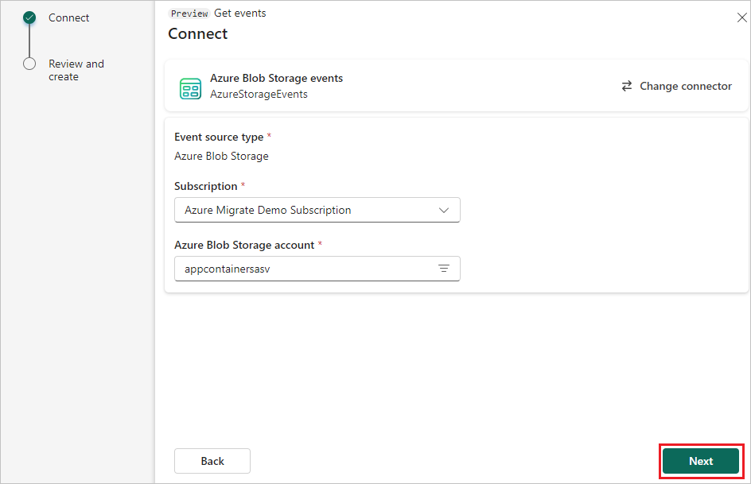

1. On the **Connect** screen, do these steps:
    1. Select the **Azure subscription** that has the storage account.
    1. Select the **Storage account** that you want to capture in the eventstream.
    1. Then, select **Next** at the bottom of the page.

   
1. On the **Review + connect** screen, review the summary, and then select **Connect** to complete the configuration for Azure Blob Storage events.

   
1. Then, on the next page, select **Add** to add the source to the eventstream. 

    

    
