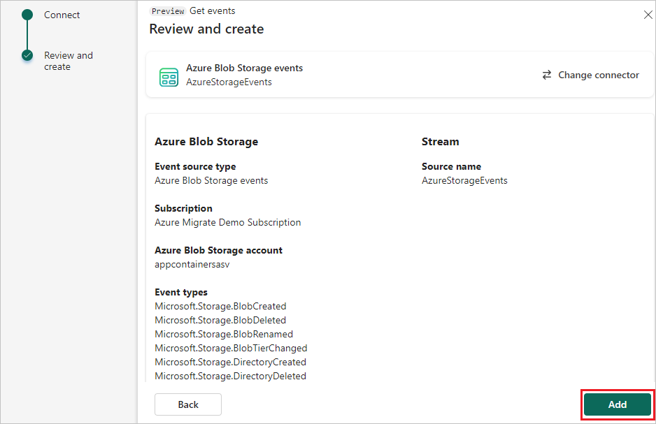

1. On the **Select a data source** screen, select **Azure Blob Storage events**.

   

1. On the **Connect** screen, select the **Subscription** and the **Storage account** that you want to capture in the eventstream.

   

1. Select **Next**.

1. On the **Review and create** screen, review the summary, and then select **Add** to complete the configuration for Azure Blob Storage events.

   
