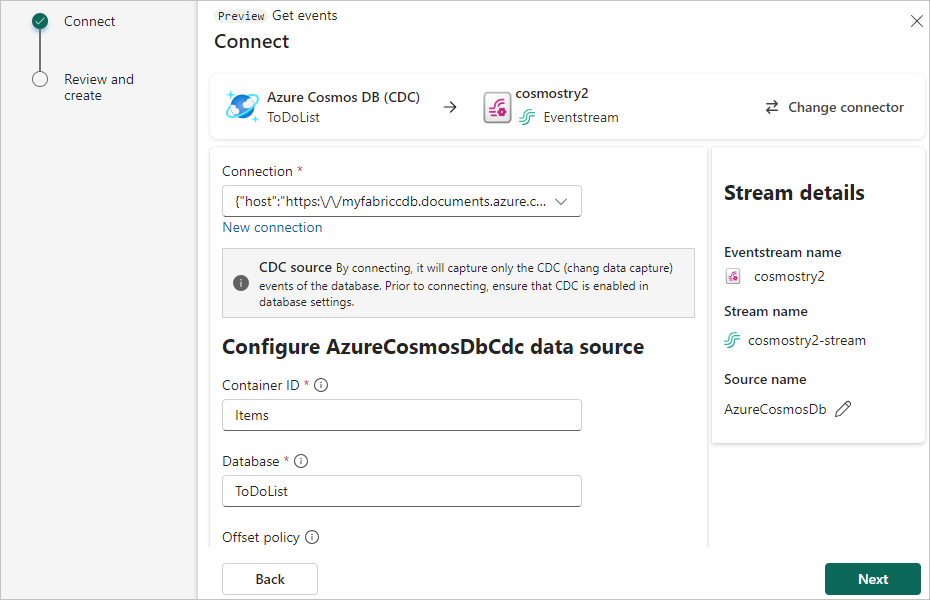

1. On the **Select a data source** screen, select **Azure Cosmos DB (CDC)**.

   

1. On the **Connect** screen, under **Connection**, select **New connection** to create a cloud connection linking to your Azure Cosmos DB database.

1. On the **Connection settings** screen, enter the following information:

   - **Cosmos DB Endpoint:** Enter the URI or Endpoint for your Cosmos DB account that you copied from the Azure portal.
   - **Connection name**: Automatically generated, or you can enter a new name for this connection.
   - **Account key:** Enter the Primary Key for your Azure Cosmos DB account that you copied from the Azure portal.

   

1. Select **Connect**.

1. Provide the following information for your Azure Cosmos DB resources:

   - **Container ID:** Enter the name of the Azure Cosmos DB container or table you want to connect to.
   - **Database:** Enter the name of your Azure Cosmos DB database.
   - **Offset policy:** Select whether to start reading **Earliest** or **Latest** offsets if there's no commit.

   

1. Select **Next**.

1. Review the summary, and then select **Add**.
