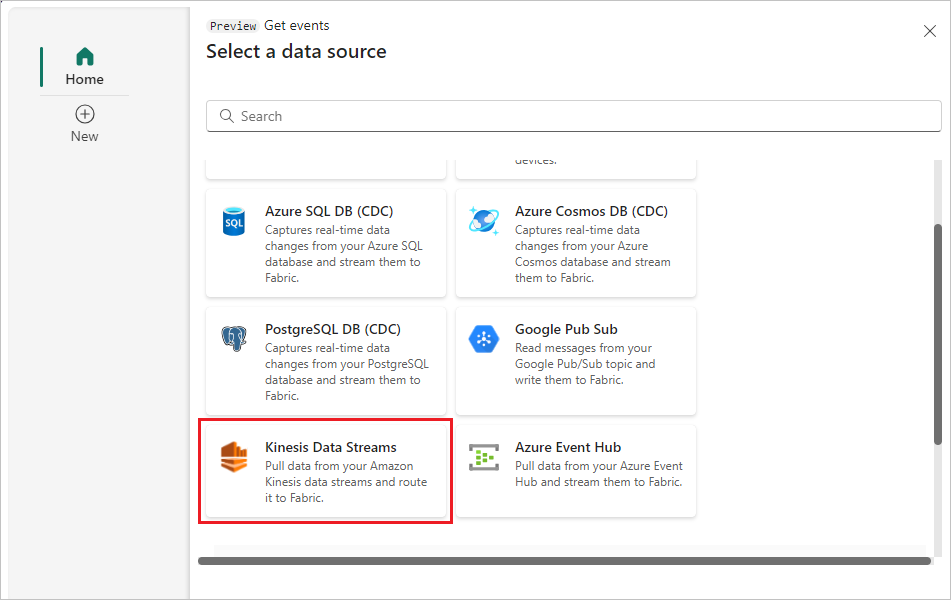
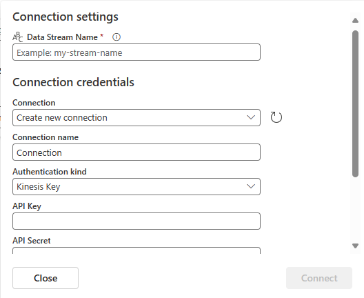

1. On the **Select a data source** screen, select **Azure SQL DB (CDC)**.

   

1. On the **Connect** screen, enter the **Connection settings** and **Connection credentials** for your Azure SQL database.

   

   - **Server:** Enter the Azure SQL server name from the Azure portal.
   - **Database:** Enter the Azure SQL database name from the Azure portal.
   - **Authentication kind:** Currently, Fabric event streams only supports **Basic** authentication.
   - **Username** and **Password**: Enter the username and password for the database.
   - **Table(s)**: Enter the table name for the new source. The table name should be the full name, for example `dbo.demotable`.

1. Select **Connect**.

   

1. Select **Next**. On the **Review and create** screen, review the summary and then select **Add**. You can see the Azure SQL DB (CDC) source added to your eventstream in the editor.

>[!NOTE]
>- Mirroring shouldn't be enabled in your database.
>- Multiple tables CDC isn't supported.

